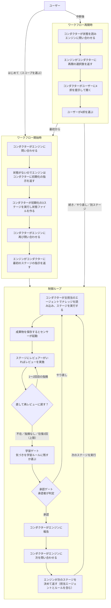
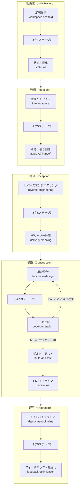
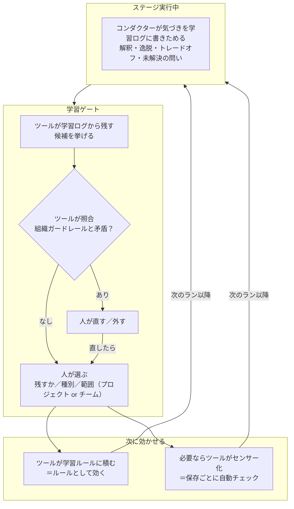

> **本記事の位置づけ** — 本記事は、`awslabs/aidlc-workflows` リポジトリの規範ルールおよび利用ガイドを素材として、筆者が AI を活用して読み解き、まとめた解釈です。AWS が公式に発表した方法論ではなく、一次資料の翻訳・要約でもありません。
>
> **シリーズ** — 本記事は [AIで紐解くAI-DLC v2](https://qiita.com/expensivegasprices/items/2daa87896110603252ad) シリーズの一部です。
>
> **参照した版** — **Claude Code 実装**を対象に、2026 年 6 月時点の v2.1.3（コミット `c95070e`、`core/`）を参照しています。Kiro・Codex 実装は対象外で、記述が異なる場合があります。OSS 実装は更新が続いているため、最新の状態は公式リポジトリをご確認ください。

---

## 概要

AI-DLC v2 は、進行を回すコンダクターとエンジン、工程を担うエージェント、品質を支えるルールやセンサー、学びを次に回す学習ループといった部品が、連携して動きます（各部品はこのあと観点ごとの表で説明します）。

本記事では、その全体像を5つの観点から把握します。

## 5つの観点

| 観点 | 理解すべきこと |
| --- | --- |
| 進行の主体 | 誰が、どう連携して回すか |
| 開発工程 | 何を、どの順で、どの範囲で進めるか（フェーズ・ステージ・スコープ） |
| 規律と検証 | 品質をどう保ち、どう検証するか |
| 学習ループ | 学びをどう次に活かすか |
| 状態・監査 | どう記録し、続きから再開できるか |

## 進行の主体

| 概念 | 説明 | 深掘り |
| --- | --- | --- |
| コンダクター | 全体を回す進行役（＝AI）。エンジンに次の一手を問い合わせ、返ってきた指示に従って動き、結果をエンジンに報告する。多くはエージェントの役でステージを実行し、必要に応じて承認者に承認を求める | [進行の中核](https://qiita.com/expensivegasprices/items/c3ac7c2223e5c7020d82) |
| └ 制御ループ | コンダクターがエンジンに問い合わせ、指示を実行し、結果を報告する。この繰り返しでワークフローが進む。コンダクター任せだと問い合わせを忘れて脱線しうるため、エンジンが「完了」を返すまで仕組みがループを継続させる | [進行の中核](https://qiita.com/expensivegasprices/items/c3ac7c2223e5c7020d82) |
| エンジン | コンダクターの問いを受け、次の指示を決めて返す仕組み（AI ではなく決まった手順で動く）。担当エージェントはステージ定義で決まり、その時点で効くルールを指示に添えて返す | [進行の中核](https://qiita.com/expensivegasprices/items/c3ac7c2223e5c7020d82) |
| └ 指示（directive） | エンジンが返す「次にやること」。多くは「ステージを実行」で、ほかに質問・完了・エラーで停止・状況表示・並列実行・一時停止（park）もある | [進行の中核](https://qiita.com/expensivegasprices/items/c3ac7c2223e5c7020d82) |
| エージェント | 各ステージを担当する専門役。成果物を作る11体と、レビューだけをする2体の計13体。コンダクターがその役を読み込んでステージの作業を行う。ステージごとに主担当と補佐が割り当てられ、エージェント同士は呼び合わない | [工程とエージェント](https://qiita.com/expensivegasprices/items/418d7b9e17192e8add85) |
| 承認者 | 要所で判断を下す人。承認ゲートで承認／やり直しを指示し、質問に答える | [承認ゲート](https://qiita.com/expensivegasprices/items/cd6827700443c9987fd7) |

### ワークフローの動き

## 開発工程

| 概念 | 説明 | 深掘り |
| --- | --- | --- |
| ワークフロー | アイデアから動くシステムまで、開発のライフサイクルをひと通り構造化して進める流れ全体。中身を大きな「フェーズ」と個々の「ステージ」に分けて組み立てる | [工程とエージェント](https://qiita.com/expensivegasprices/items/418d7b9e17192e8add85) |
| フェーズ | ワークフローを「開発の狙い」ごとに区切った大きな段階（初期化→発想→構想→構築→運用） | [工程とエージェント](https://qiita.com/expensivegasprices/items/418d7b9e17192e8add85) |
| ステージ | フェーズの狙いを具体的な成果に落とす作業の単位。担当エージェントが成果物を1つずつ仕上げる | [工程とエージェント](https://qiita.com/expensivegasprices/items/418d7b9e17192e8add85) |
| Bolt | 構築を小さく区切って進める単位。関連する機能をまとめた作業単位（Unit of Work）を1つ以上束ね、機能設計からコード生成までを一通り通す。構築はこれを Bolt 単位で繰り返し、ビルド・テストと CI は全 Bolt 完了後に一度だけ走る。最初の Bolt は機能を絞った最小限の端から端までを通し、土台が成立するかを先に確かめる | [ウォーキングスケルトン](https://qiita.com/expensivegasprices/items/7a24030b9d8905f379ed) |
| スコープ | どんな作業か（新機能・バグ修正・MVP など）をワークフローの最初に人が選ぶ（説明から自動で見当をつけることもある）。これで実行するステージと深さの既定が決まる | [スコープ](https://qiita.com/expensivegasprices/items/c232fb2e994e7b567a5c) |
| 深さ（depth） | 成果物をどこまで作り込むか（最小限〜網羅的の3段階）。深いほど質問も成果物も詳しくなる。既定はスコープで決まり、人が後からでも変えられる | [深さ](https://qiita.com/expensivegasprices/items/f2246466b9e3bdef570b) |

### 工程図

## 規律と検証

| 概念 | 説明 | 深掘り |
| --- | --- | --- |
| ルール | チームやプロジェクトで決めたことから逸脱しないよう、コンダクターがステージ実行時に守る方針・制約。ガードレールを含む。組織全体→チーム→プロジェクト→フェーズと重ねて効く（上書きしない）。事前に定めるだけでなく、学習ループでも増えていく | [ルールとナレッジ](https://qiita.com/expensivegasprices/items/33f3b2b401d4d3c1c266) |
| └ ガードレール | ルールの中でも最も硬い「絶対やるな／必ずやれ」の一線。学習で新しいルールを追加するときは、この一線と矛盾しないか照合してから取り込む | [ルールとナレッジ](https://qiita.com/expensivegasprices/items/33f3b2b401d4d3c1c266) |
| ナレッジ（knowledge） | ステージ実行時に参照する専門分野の手法・考え方（例：ドメイン設計や脅威分析の進め方）。ルールと違い参照用で、従う義務はない。ルールがエンジンから指示に添えられて届くのに対し、ナレッジは指示には載らず、ステージを実行する側が実行時に自分で読みにいく。エージェント別のナレッジと横断のナレッジがある | [ルールとナレッジ](https://qiita.com/expensivegasprices/items/33f3b2b401d4d3c1c266) |
| センサー | 成果物が保存されると自動で走るチェック（コードの書式・型・必須項目・上流の参照など）。引っかかっても作業は止めない。結果は監査ログに残り、承認のタイミングで人が任意で参考にできる | [センサー](https://qiita.com/expensivegasprices/items/5f8dbb62f25c1a09a257) |
| レビュアー | 一部のステージ（11ステージ）で、成果物の完成後・承認ゲートの前に、専任の2体が品質をレビューし、READY／NOT-READY と指摘を添える。コンダクターとは独立して評価する。センサー同様、止めずに判断材料を増やす助言で、最終判断は承認ゲートの人 | [レビュアー](https://qiita.com/expensivegasprices/items/624d83e946e86e4b1553) |
| 承認ゲート | 各ステージ（初期化を除く）の最後のチェックポイント。**ワークフローを止められるのはここだけ**。承認者が「承認／やり直し（差し戻し）」を決める。センサーやレビュアーの指摘はここで人が任意に参考にする | [承認ゲート](https://qiita.com/expensivegasprices/items/cd6827700443c9987fd7) |

## 学習ループ

| 概念 | 説明 | 深掘り |
| --- | --- | --- |
| 学習ループ | コンダクターが作業で得た気づきを、人の承認を経てルールに変え、次の作業に活かす。これを繰り返す仕組み | [学習ループ](https://qiita.com/expensivegasprices/items/dd7f3d034ee2c137cff5) |
| 学習ログ | 作業中に浮かんだ気づきを、消えないうちにその場で書き留めておくメモ。ステージ開始時に自動生成され、実行中にコンダクターが書きためる。状態や監査ログがツール任せなのに対し、コンダクターが手で残す唯一のファイル | [学習ループ](https://qiita.com/expensivegasprices/items/dd7f3d034ee2c137cff5) |
| 学習ゲート | 気づきの中から「次に活かす価値があるもの」を選び取る段階。完了と承認の間に置かれ、ツールが学習ログから候補を出し、人が残すものを選び、ツールが学習ルールに書き込む（学んだチェックはセンサー化されることもある） | [学習ループ](https://qiita.com/expensivegasprices/items/dd7f3d034ee2c137cff5) |
| 学習ルール | 学んだことをその場限りにせず、後の作業に効かせ続けるための保存先（ファイル）。選ばれた気づきを、日付と種別タグをつけて積み上げる。中身は規律の「ルール」そのもの。プロジェクト単位とチーム単位の2つ | [学習ループ](https://qiita.com/expensivegasprices/items/dd7f3d034ee2c137cff5) |

### 学習ループの動き

## 状態・監査

| 概念 | 説明 | 深掘り |
| --- | --- | --- |
| 状態（state） | 今どこまで進んだかを記録した1つのファイル。コンダクターが報告するたびに更新され、記憶を持たないエンジンは毎回これを読み直して判断する。ファイルなので会話（セッション）をまたいでも残り、別の会話からでも続きを再開できる | [状態と監査](https://qiita.com/expensivegasprices/items/72234648bb4400cedf53) |
| 監査ログ（audit） | 何がいつ起きたかを並べた記録。作業の節目ごとに自動で追記され、後から経緯をたどり直せるよう消さずに積み上げる | [状態と監査](https://qiita.com/expensivegasprices/items/72234648bb4400cedf53) |

---

## 関連記事

**前の記事**: [設計思想](https://qiita.com/expensivegasprices/items/4c8c4ae93b4184588ee6)
**次の記事**: [工程とエージェント](https://qiita.com/expensivegasprices/items/418d7b9e17192e8add85)
**目次**: [AIで紐解くAI-DLC v2](https://qiita.com/expensivegasprices/items/2daa87896110603252ad)

