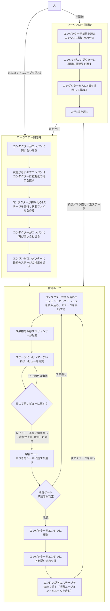
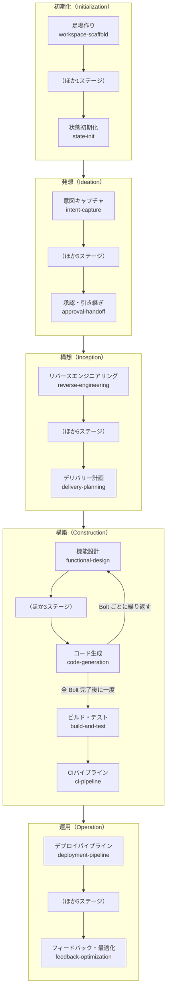
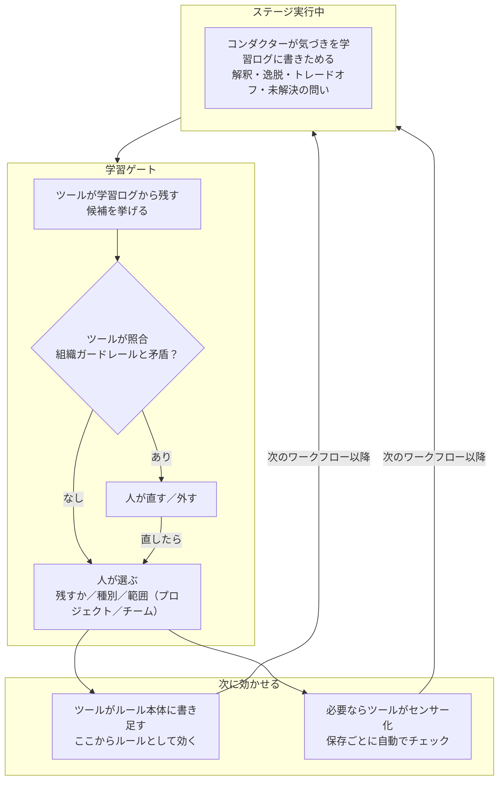

> **本記事の位置づけ** — 本記事は、`awslabs/aidlc-workflows` リポジトリの規範ルールおよび利用ガイドを素材として、筆者が AI を活用して読み解き、まとめた解釈です。AWS が公式に発表した方法論ではなく、一次資料の翻訳・要約でもありません。
>
> **シリーズ** — 本記事は [AIで紐解くAI-DLC v2](https://qiita.com/takeshishimada/items/2daa87896110603252ad) シリーズの一部です。
>
> **参照した版** — **Claude Code 実装**を対象に、2026 年 8 月 4 日時点のコミット `c73ee984`（AIDLC_VERSION 2.5.37、`core/`）を参照しています。Claude Code 以外の実装（Kiro CLI／Kiro IDE／Codex CLI／opencode）は対象外で、記述が異なる場合があります。OSS 実装は更新が続いているため、最新の状態は公式リポジトリをご確認ください。

---

## 概要

AI-DLC v2 では、進行を回すコンダクターと次の一手を決めるエンジン、工程を担うエージェント、品質を支えるルールやセンサー、学びを次に活かす学習ループが連携して動きます。その経過は、状態ファイルと監査ログに残ります。

本記事では、その全体像を5つの観点に分けて示します。

## 5つの観点

| 観点 | 答える問い |
| --- | --- |
| 進行の主体 | 誰が、どう連携して回すか |
| 開発工程 | 何を、どの順で、どの範囲で進めるか（フェーズ・ステージ・スコープ） |
| 規律と検証 | 品質をどう保ち、どう検証するか |
| 学習ループ | 学びをどう次に活かすか |
| 状態・監査 | どう記録し、続きから再開できるか |

## 進行の主体

| 概念 | 説明 | 深掘り |
| --- | --- | --- |
| コンダクター | 全体を回す進行役で、実体は AI。エンジンに次の一手を問い合わせ、返ってきた指示に従って動き、結果をエンジンに報告する。多くはエージェントとしてステージを実行し、必要に応じて承認者に承認を求める | [進行の中核](https://qiita.com/takeshishimada/items/c3ac7c2223e5c7020d82) |
| └ 制御ループ | コンダクターがエンジンに問い合わせ、指示を実行し、結果を報告する。この繰り返しでワークフローが進む。コンダクター任せだと問い合わせを忘れて脱線しかねないため、エンジンが「完了」を返すまで別の仕組みがループを続けさせる | [進行の中核](https://qiita.com/takeshishimada/items/c3ac7c2223e5c7020d82) |
| エンジン | コンダクターの問いを受け、次の指示を決めて返す仕組み（AI ではなく決まった手順で動く）。担当エージェントはステージ定義で決まり、その時点で効くルールを、ステージ実行の指示に先立って本文ごと届ける | [進行の中核](https://qiita.com/takeshishimada/items/c3ac7c2223e5c7020d82) |
| └ 指示（directive） | エンジンが返す「次にやること」。多くは「ステージを実行」で、その手前に「効くルールの本文を届ける」が入る。ほかに質問・完了・エラーで停止・状況表示・並列実行・一時停止（park）もある | [進行の中核](https://qiita.com/takeshishimada/items/c3ac7c2223e5c7020d82) |
| エージェント | 各ステージを担当する専門家。成果物を作る11体、レビューだけをする2体、スコープを組むコンポーザー1体の計14体。コンダクターがその定義を読み込み、そのエージェントとしてステージの作業を行う。ステージごとに主担当が置かれ、必要に応じて補佐が付き、エージェント同士は呼び合わない | [工程とエージェント](https://qiita.com/takeshishimada/items/418d7b9e17192e8add85) |
| 承認者 | 要所で判断を下す人。承認ゲートで承認／やり直しを指示し、質問に答える | [承認ゲート](https://qiita.com/takeshishimada/items/cd6827700443c9987fd7) |

### ワークフローの動き

```mermaid
flowchart TB
  U["人"]
  subgraph START["ワークフロー開始時"]
    direction TB
    s1["コンダクターがエンジンに問い合わせる"] --> s2["状態がないのでエンジンはコンダクターに初期化の指示を返す"] --> s3["コンダクターが初期化の3ステージを実行し状態ファイルを作る"] --> s4["コンダクターがエンジンに再び問い合わせる"] --> s5["エンジンがコンダクターに最初のステージの指示を返す"]
  end
  subgraph RESUME["ワークフロー再開時"]
    direction TB
    r1["コンダクターが状態を読みエンジンに問い合わせる"] --> r2["エンジンがコンダクターに再開の選択肢を返す"] --> r3["コンダクターが人に4択を提示して尋ねる"] --> r4["人が4択を選ぶ"]
  end
  subgraph LOOP["制御ループ"]
    direction TB
    l1["コンダクターが主担当のエージェントとしてナレッジを読み込み、ステージを実行する"] --> S["成果物を保存するとセンサーが起動"]
    S --> RV["ステージにレビュアーがいればレビューを実施"]
    RV --> Q{"直して再レビューに戻す？"}
    Q -->|"1〜2回目の指摘"| RV
    Q -->|"レビュアー不在／指摘なし／往復が上限（2回）に到達"| LG["学習ゲート<br/>気づきをルールに残すか選ぶ"]
    LG --> G{"承認ゲート<br/>承認者が判定"}
    G -->|"やり直し"| l1
    G -->|"承認"| l3["コンダクターがエンジンに報告"]
    l3 --> l4["コンダクターがエンジンに次を問い合わせる"] --> l5["エンジンが次のステージを決めて返す（担当エージェントとルールを含む）"]
    l5 -->|"次のステージを実行"| l1
  end
  U -->|"はじめて（スコープを選ぶ）"| START
  U -->|"中断後"| RESUME
  START --> LOOP
  RESUME -->|"続き／やり直し／別ステージ"| LOOP
  RESUME -->|"最初から"| START
```

## 開発工程

| 概念 | 説明 | 深掘り |
| --- | --- | --- |
| ワークフロー | アイデアから動くシステムまで、開発のライフサイクルをひと通り構造化して進める流れ。中身を大きな「フェーズ」と個々の「ステージ」に分けて組み立てる | [工程とエージェント](https://qiita.com/takeshishimada/items/418d7b9e17192e8add85) |
| フェーズ | ワークフローを「開発の狙い」ごとに区切った大きな段階（初期化→発想→構想→構築→運用） | [工程とエージェント](https://qiita.com/takeshishimada/items/418d7b9e17192e8add85) |
| ステージ | フェーズの狙いを具体的な成果に落とす一つひとつの工程。担当エージェントが成果物を1つずつ仕上げる | [工程とエージェント](https://qiita.com/takeshishimada/items/418d7b9e17192e8add85) |
| Bolt | 構築を小さく区切って進める単位。関連する機能からなる作業単位（Unit of Work）を1つ以上束ね、機能設計からコード生成までをひと通り進める。構築はこれを Bolt 単位で繰り返し、ビルド・テストと CI は全 Bolt 完了後に一度だけ走る。最初の Bolt は、機能を絞ったうえで端から端までを一度通し、土台が成立するかを先に確かめる | [ウォーキングスケルトン](https://qiita.com/takeshishimada/items/7a24030b9d8905f379ed) |
| スコープ | どんな作業か（新機能・バグ修正・MVP など）をワークフローの最初に人が選ぶ（説明から自動で推定することもある）。これで実行するステージと深さの既定が決まる | [スコープ](https://qiita.com/takeshishimada/items/c232fb2e994e7b567a5c) |
| 深さ（depth） | 成果物をどこまで作り込むか（最小限〜網羅的の3段階）。深いほど質問は細かくなり、成果物も詳しくなる。既定はスコープで決まり、人が後からでも変えられる | [深さ](https://qiita.com/takeshishimada/items/f2246466b9e3bdef570b) |

### 工程図

```mermaid
flowchart TB
  subgraph INIT["初期化（Initialization）"]
    direction TB
    i1["足場作り<br/>workspace-scaffold"] --> iX["（ほか1ステージ）"] --> i3["状態初期化<br/>state-init"]
  end
  subgraph IDEA["発想（Ideation）"]
    direction TB
    d1["意図キャプチャ<br/>intent-capture"] --> dX["（ほか5ステージ）"] --> d7["承認・引き継ぎ<br/>approval-handoff"]
  end
  subgraph INCEP["構想（Inception）"]
    direction TB
    c1["リバースエンジニアリング<br/>reverse-engineering"] --> cX["（ほか6ステージ）"] --> c8["デリバリー計画<br/>delivery-planning"]
  end
  subgraph CONST["構築（Construction）"]
    direction TB
    n1["機能設計<br/>functional-design"] --> nX["（ほか3ステージ）"] --> n5["コード生成<br/>code-generation"]
    n5 -->|"全 Bolt 完了後に一度"| n6["ビルド・テスト<br/>build-and-test"] --> n7["CIパイプライン<br/>ci-pipeline"]
  end
  subgraph OPER["運用（Operation）"]
    direction TB
    o1["デプロイパイプライン<br/>deployment-pipeline"] --> oX["（ほか5ステージ）"] --> o7["フィードバック・最適化<br/>feedback-optimization"]
  end
  INIT --> IDEA --> INCEP --> CONST --> OPER
  n5 -->|"Bolt ごとに繰り返す"| n1
```

## 規律と検証

| 概念 | 説明 | 深掘り |
| --- | --- | --- |
| ルール | チームやプロジェクトで決めたことを、コンダクターがステージ実行時に守るための方針・制約。ガードレールを含む。組織全体→チーム→プロジェクト→フェーズと重ねて効く（上書きしない）。事前に定めるだけでなく、学習ループでも増えていく | [ルールとナレッジ](https://qiita.com/takeshishimada/items/33f3b2b401d4d3c1c266) |
| └ ガードレール | 禁止と必須を言い切る形で書かれたルール。組織の方針として置かれ、学習で新しいルールを追加するときは、これと矛盾しないか照合してから取り込む | [ルールとナレッジ](https://qiita.com/takeshishimada/items/33f3b2b401d4d3c1c266) |
| ナレッジ（knowledge） | ステージ実行時に参照する専門分野の手法・考え方（例：ドメイン設計や脅威分析の進め方）。ルールと違い参照用で、従う義務はない。ルールがエンジンから本文ごと届くのに対し、ナレッジは指示にパスが載るだけで、本文は、ステージを実行する側が自分で読みにいく。エージェント別のナレッジと横断のナレッジがある | [ルールとナレッジ](https://qiita.com/takeshishimada/items/33f3b2b401d4d3c1c266) |
| センサー | 成果物が保存されると自動で走るチェック（コードの書式・型・必須項目・上流の参照・主張の出典）。引っかかっても作業は止めない。結果は監査ログに残り、承認のタイミングで人が任意に参考にできる | [センサー](https://qiita.com/takeshishimada/items/5f8dbb62f25c1a09a257) |
| レビュアー | 一部のステージ（12ステージ）で、成果物の完成後・承認ゲートの前に、専任の2体が成果物をレビューし、READY／NOT-READY と指摘を添える。コンダクターとは独立して評価する。センサー同様、進行を止めずに判断材料を増やす助言で、最終判断は承認ゲートの人 | [レビュアー](https://qiita.com/takeshishimada/items/624d83e946e86e4b1553) |
| 承認ゲート | 各ステージ（初期化を除く）の最後に置かれる関門。**成果物の中身を見て止められるのはここだけ**。承認者が「承認／やり直し（差し戻し）」を決め、差し戻しが3周した後は「現状で承認」も選べる（運用フェーズのステージを除く）。センサーやレビュアーの指摘はここで人が任意に参考にする | [承認ゲート](https://qiita.com/takeshishimada/items/cd6827700443c9987fd7) |

## 学習ループ

| 概念 | 説明 | 深掘り |
| --- | --- | --- |
| 学習ループ | コンダクターが作業で得た気づきを、人の承認を経てルールに変え、次の作業に活かす。これを繰り返す仕組み | [学習ループ](https://qiita.com/takeshishimada/items/dd7f3d034ee2c137cff5) |
| 学習ログ | 作業中に浮かんだ気づきを、忘れないうちにその場で書き留めておくメモ。ステージ開始時に自動生成され、実行中にコンダクターが書きためる。状態や監査ログがツール任せなのに対し、コンダクターが自分で書き残す唯一のファイル | [学習ループ](https://qiita.com/takeshishimada/items/dd7f3d034ee2c137cff5) |
| 学習ゲート | 気づきの中から「次に活かす価値があるもの」を選び取る段階。完了と承認の間に置かれ、ツールが学習ログから候補を出し、人が残すものを選び、コンダクターが組織方針と矛盾しないか照合してから、ツールがルール本体に書き込む（学んだチェックはセンサー化されることもある） | [学習ループ](https://qiita.com/takeshishimada/items/dd7f3d034ee2c137cff5) |
| 学習ルール | 学んだことをその場限りにせず、後の作業に効かせ続けるためのルール。中身は規律の「ルール」そのもので、専用ファイルは持たず、ルール本体である `project.md` ／ `team.md` の話題見出しの下に、学んだ日付を添えた1行として書き足される | [学習ループ](https://qiita.com/takeshishimada/items/dd7f3d034ee2c137cff5) |

### 学習ループの動き

```mermaid
flowchart TB
  subgraph RUN["ステージ実行中"]
    a1["コンダクターが気づきを学習ログに書きためる<br/>解釈・逸脱・トレードオフ・未解決の問い"]
  end
  subgraph GATE["学習ゲート"]
    direction TB
    b1["ツールが学習ログから残す候補を挙げる"] --> b2{"ツールが照合<br/>組織ガードレールと矛盾？"}
    b2 -->|"あり"| b3["人が直す／外す"]
    b2 -->|"なし"| b4["人が選ぶ<br/>残すか／種別／範囲（プロジェクト／チーム）"]
    b3 -->|"直したら"| b4
  end
  subgraph KEEP["次に効かせる"]
    direction TB
    c1["ツールがルール本体に書き足す<br/>ここからルールとして効く"]
    c2["必要ならツールがセンサー化<br/>保存ごとに自動でチェック"]
  end
  RUN --> GATE
  b4 --> c1
  b4 --> c2
  c1 -->|"次のワークフロー以降"| RUN
  c2 -->|"次のワークフロー以降"| RUN
```

## 状態・監査

| 概念 | 説明 | 深掘り |
| --- | --- | --- |
| 状態（state） | 今どこまで進んだかを記録した1つのファイル。コンダクターが報告するたびに更新され、記憶を持たないエンジンは毎回これを読み直して判断する。ファイルなので会話をまたいでも残り、別の会話からでも続きを再開できる | [状態と監査](https://qiita.com/takeshishimada/items/72234648bb4400cedf53) |
| 監査ログ（audit） | 何がいつ起きたかを残す記録。作業の節目ごとに自動で追記され、後から経緯をたどり直せるよう消さずに積み上げる | [状態と監査](https://qiita.com/takeshishimada/items/72234648bb4400cedf53) |

---

## 関連記事

**前の記事**: [設計思想](https://qiita.com/takeshishimada/items/4c8c4ae93b4184588ee6)
**次の記事**: [工程とエージェント](https://qiita.com/takeshishimada/items/418d7b9e17192e8add85)
**目次**: [AIで紐解くAI-DLC v2](https://qiita.com/takeshishimada/items/2daa87896110603252ad)

