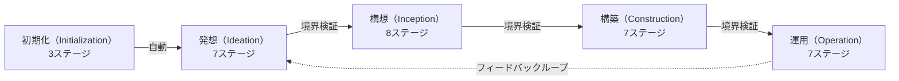

> **本記事の位置づけ** — 本記事は、`awslabs/aidlc-workflows` リポジトリの規範ルールおよび利用ガイドを素材として、筆者が AI を活用して読み解き、まとめた解釈です。AWS が公式に発表した方法論ではなく、一次資料の翻訳・要約でもありません。
>
> **シリーズ** — 本記事は [AIで紐解くAI-DLC v2](https://qiita.com/takeshishimada/items/2daa87896110603252ad) シリーズの一部です。
>
> **参照した版** — **Claude Code 実装**を対象に、2026 年 6 月時点の v2.1.3（コミット `c95070e`、`core/`）を参照しています。Kiro・Codex 実装は対象外で、記述が異なる場合があります。OSS 実装は更新が続いているため、最新の状態は公式リポジトリをご確認ください。

---

## 概要

AI-DLC v2 のワークフローは、開発の狙いで区切ったフェーズと、その下に並ぶ全32ステージで組み立てられます。32は全量で、実際に通る数は案件により絞られます（詳しくは別記事「[スコープ](https://qiita.com/takeshishimada/items/c232fb2e994e7b567a5c)」で扱います）。そして各ステージを実際に動かすのは、成果物を作る11体の専門エージェントと、できあがった成果物をレビューする2体の、合わせて13体です。一つひとつのエージェントは担当範囲を広く取り、フェーズをまたいで複数のステージを受け持ちます。

本記事では、何をどの順で進めるかという「工程」と、それを誰が担うのかという「エージェント」の2つの軸から、ワークフローがどう組み立てられているのかを読み解きます。

## 1コマンドの裏側

AI-DLC v2 は、たった1行で動き出します。

```
/aidlc 在庫管理用の REST API を作って
```

これだけで、要件の整理から設計、実装、テスト、デプロイまでが、ひと続きの構造化されたワークフローとして進みます。ただ、最初は「中で何が順番に起きているのか」「実際に手を動かしているのは誰なのか」が見えにくいものです。本記事は、その中身を2つの軸で解説します。

- **工程** — 何を、どの順で進めるのか
- **エージェント** — その各ステップを、誰が担当するのか

「次にどのステージをやるか」を決めているのは、LLM ではなく決定論的な仕組み（エンジン）です。エージェントの仕事は「任された作業をうまくやること」だけに絞られています。この分離がなぜ効くのかは別記事「[設計思想](https://qiita.com/takeshishimada/items/4c8c4ae93b4184588ee6)」で扱い、ここでは工程とエージェントの中身に集中します。

---

## 工程の3階層

AI-DLC v2 の工程は、3つの階層でできています。

| 階層 | 意味 |
| --- | --- |
| ワークフロー | アイデアから動くシステムまで、ライフサイクル全体を構造化して進める流れ |
| フェーズ | ワークフローを「開発の狙い」ごとに区切った大きな段階。全5フェーズ |
| ステージ | フェーズの狙いを具体的な成果物に落とす作業単位。担当エージェントが成果物を1つずつ仕上げる。全32ステージ[^stages] |

5つのフェーズは、**初期化 → 発想 → 構想 → 構築 → 運用** の順に並び、原則として順番に実行されます。初期化から発想への移行を除く各境目では、**フェーズ境界検証**が走ります。成果物の欠落やトレーサビリティの切れ目を点検し、進行の記録（監査ログ）に `PHASE_VERIFIED` という印を残す仕組みです。これは自動で進行を止めるものではなく、問題があれば承認ゲートで人が判断します。検証の中身は別記事「[フェーズ境界検証](https://qiita.com/takeshishimada/private/f2f4e426dd542c5b6765)」で扱います。



運用は終点ではありません。運用で得た学びは発想フェーズへ戻り（図の点線）、次のサイクルの入力になります。このループまで含めて1つのライフサイクルです。

---

## 5つのフェーズ

フェーズごとに、狙いと主役のエージェントが異なります。

### 初期化（Initialization）

作業場の用意です。ドキュメント用ディレクトリを作り、ワークスペースの種類を判定し、状態ファイルを初期化します。ここだけは承認ゲートがなく、3ステージが1回のツール呼び出しの中で自動的に完了します。人の手は要りません。

### 発想（Ideation）

「そもそもこれを作るべきか」を見極めるフェーズです。何を・なぜ作るかを定め、市場性と実現性を確かめ、作る範囲を絞る、ビジネス寄りの工程です。最後の**承認・引き継ぎ**で構想フェーズへつなぎます。主役は**プロダクトエージェント**で、実現性の評価では**アーキテクトエージェント**が主導します。

### 構想（Inception）

要件と設計を固めるフェーズです。要望を検証できる要件に落とし、ユーザーストーリーと設計へ広げます。核心は**作業単位の生成**（units-generation）で、作業を「作業単位」という塊に分解し、その依存関係を DAG（依存グラフ）として書き出します。最後の**デリバリー計画**が、次の構築の進め方（実行単位 Bolt の並び）を決めます。既存コードがある案件（ブラウンフィールド）では、先頭に**リバースエンジニアリング**が入ります。主役はプロダクトとアーキテクトです。

### 構築（Construction）

実際に作るフェーズです。

構築は一度に最後まで作りきらず、**Bolt**（構築の実行単位）という単位で小さく区切って繰り返します。1つの Bolt は、1つ以上の作業単位を束ねて、機能設計からコード生成までをひと通り通すまとまりです。なかでも最初の Bolt だけは、機能を最小限に絞り、アーキテクチャの全層を端から端まで貫く一本道を先に作ります。土台が本当に成立するかを、機能を加える前に確かめる狙いです。問題がなければ、残りの Bolt で機能を加えていきます。ビルド・テストと CI パイプラインは、各 Bolt の繰り返しとは切り離され、全 Bolt 完了後に一度だけ走ります。

この最初の Bolt のあと、以降を自律で走らせるか Bolt ごとに毎回ゲートを挟むかを一度だけ選びます。最初の Bolt と自律モードの仕組みは別記事「[ウォーキングスケルトン](https://qiita.com/takeshishimada/items/7a24030b9d8905f379ed)」で扱います。設計を担うのは**アーキテクトエージェント**、コード生成は**デベロッパーエージェント**、ビルド・テストは**品質エージェント**です。

### 運用（Operation）

本番へデプロイして、動かし続けるフェーズです。デプロイの自動化・環境構築から、可観測性・インシデント対応・性能検証までを整えます。最後の**フィードバック・最適化**で、運用で得た知見をプロダクトエージェントへ返し、次のサイクルの発想フェーズへつなぎます。主役は**オペレーションエージェント**です。

---

## エージェント

もう1つの軸はエージェントです。AI-DLC v2 のステージを動かすのは、**成果物を作る11体の専門エージェント**と、**レビューだけをする2体のレビュアーエージェント**（計13体）です。

### 担当範囲を広く取る理由

AI-DLC v2 は、担当範囲の狭い専門家を何十体も並べる方式をあえて取っていません。**エージェント同士の境界は、情報が失われるポイントだから**です。担当が変わるたびに引き継ぎ文書が要り、その受け渡しのたびに情報が抜け落ちます。

代わりに、1体のエージェントが複数のステージ・複数のフェーズを横断します。たとえばアーキテクトエージェントは、実現性評価・アプリケーション設計・ユニット生成・機能設計・NFR 要件（非機能要件）・NFR 設計と、3フェーズにまたがる6ステージを担当します。同じエージェントが連続して受け持つため、引き継ぎが要らず、情報がそのまま残ります。人のチームでも、3〜5人で組んで1つの機能をまとめて担当するほうが、大人数のリレーより情報がこぼれません。それと同じ発想です。

### 主担当と補佐

各ステージには、**主担当**（Lead）と**補佐**（Support）が割り当てられます。主担当がそのステージの成果物に責任を持ち、補佐は専門知識で支えます。たとえば NFR 要件のステージはアーキテクトが主担当ですが、セキュリティ観点で DevSecOps エージェントが、規制観点でコンプライアンスエージェントが補佐に入ります。

そして、エージェント同士は直接呼び合いません。委譲はすべて、進行役であるコンダクター（エンジンが決めた手を実行する側）を通します。だから「誰が誰を呼んだか」が常に一本のフラットな線で追え、呼び出しが再帰的に深くなることもありません。

### 成果物を作る11体

| エージェント | ドメイン | 主担当ステージ | 主な活動フェーズ |
| --- | --- | --- | --- |
| プロダクト | 要件・ユーザーストーリー・スコープ | 意図キャプチャ、要件分析、ユーザーストーリー | 発想・構想 |
| デザイン | UX/UI・ワイヤーフレーム | ラフ／洗練モックアップ | 発想・構想 |
| デリバリー | チーム編成・デリバリー順序 | チーム編成、承認・引き継ぎ、デリバリー計画 | 発想・構想 |
| アーキテクト | アプリ設計・ドメイン設計・NFR | 実現性評価、アプリ設計、ユニット生成、機能設計、NFR | 発想・構想・構築 |
| AWSプラットフォーム | インフラ・CDK・コスト最適化 | インフラ設計、環境構築 | 構築・運用 |
| コンプライアンス | 規制・データ分類・リスク評価 | （補佐専任） | 発想・構築・運用 |
| DevSecOps | 脅威分析・セキュリティ・CI/CD | （補佐専任） | 構想・構築・運用 |
| デベロッパー | コード実装・コード解析 | リバースエンジニアリング、コード生成 | 構想・構築・運用 |
| 品質 | テスト戦略・テスト生成・性能検証 | ビルド・テスト、性能検証 | 構築・運用 |
| パイプラインデプロイ | CI/CD・デプロイ戦略・リリース | CIパイプライン、デプロイ実行 | 構想・構築・運用 |
| オペレーション | 可観測性・インシデント対応・SLO | 可観測性、インシデント対応、フィードバック | 運用 |

### レビューを担う2体

成果物を作る11体とは別に、**レビューだけをする2体**がいます。**アーキテクチャレビュアー**（`aidlc-architecture-reviewer-agent`、技術設計をレビュー）と**プロダクトリード**（`aidlc-product-lead-agent`、要件・プロダクトを顧客の視点でレビュー）です。

この2体は一部のステージで、成果物の完成後・承認ゲートの前に独立評価を添えますが、ワークフローを止める権限は持ちません。最終判断は承認ゲートの人に委ねます。成果物を作る11体と同じくコンダクターが起動し、レビュアー同士も呼び合いません。判定の中身は別記事「[レビュアー](https://qiita.com/takeshishimada/private/624d83e946e86e4b1553)」で扱います。

---

## 工程とエージェントの関係

この2つの軸を重ねると、AI-DLC v2 の動きが見えてきます。

- **アーキテクトエージェントの担当範囲が最も広い。** 6ステージ・3フェーズを横断し、設計の中心軸として全体に及びます。
- **デベロッパーエージェントは、構想・構築・運用の3フェーズを縦に貫く。** 既存コードのリバースエンジニアリングからコード生成、デプロイ支援までを1体で担います。
- **コンプライアンスと DevSecOps は補佐専任。** 自分が主担当のステージは持たず、ほかのエージェントが率いるステージに規制・セキュリティの観点を加え続けます。専門の担当を独立させず、必要な場面に加わる形です。
- **オペレーションエージェントが次へつなぐ。** 運用で得た知見をプロダクトエージェントへ返し、次のサイクルの起点を作ります。

工程が「縦」の流れだとすれば、エージェントは複数のステージにまたがって「横」に伸びます。この縦横が噛み合うことで、引き継ぎを最小限にしながらライフサイクル全体が回ります。

---

## まとめ

AI-DLC v2 の工程とエージェントを、2つの軸でたどってきました。

- 工程は **ワークフロー > フェーズ > ステージ** の3階層。5フェーズ32ステージが、初期化から運用、そして次サイクルへとループする
- 実行するのは、担当範囲を広く取った13体のエージェント（成果物を作る11体＋レビューだけをする2体）。主担当と補佐で分担し、コンダクター経由でのみ連携する。レビュアーは止めずに品質判定を添えるだけ

すべての案件が32ステージを通るわけではありません。全32を通るのは機能開発やエンタープライズで、バグ修正なら7ステージ、PoC（概念実証）なら8ステージというように、案件の性質に応じて通るステージが絞り込まれます。エンジンとエージェントは変わらず、変わるのは「どのステージを通るか」と「各ステージでどこまで掘るか」だけです。この絞り込みは別記事「[スコープ](https://qiita.com/takeshishimada/items/c232fb2e994e7b567a5c)」で扱います。

[^stages]: コンパイラ `tools/aidlc-graph.ts` のコメントには "31 YAML stage files" という記述が残っていますが、ステージ `.md` は32本・`stage-graph.json` も32ノードで、実数は32です。

## 参照元

| ファイル | 内容 |
| --- | --- |
| `core/` のステージ `.md`（[32本](https://github.com/awslabs/aidlc-workflows/tree/v2.1.3/core/aidlc-common/stages)）／[`tools/aidlc-graph.ts`](https://github.com/awslabs/aidlc-workflows/blob/v2.1.3/core/tools/aidlc-graph.ts) | 5フェーズ32ステージとその依存グラフ（コンパイラ） |
| [`aidlc-common/protocols/stage-protocol.md`](https://github.com/awslabs/aidlc-workflows/blob/v2.1.3/core/aidlc-common/protocols/stage-protocol.md) | 主担当（Lead）・補佐（Support）の割り当て、フェーズ境界検証、承認ゲート |
| [`core/agents/`](https://github.com/awslabs/aidlc-workflows/tree/v2.1.3/core/agents)（13ファイル） | エージェント13体（成果物を作る11体＋レビュー専任2体） |
| [`agents/aidlc-architecture-reviewer-agent.md`](https://github.com/awslabs/aidlc-workflows/blob/v2.1.3/core/agents/aidlc-architecture-reviewer-agent.md)／[`aidlc-product-lead-agent.md`](https://github.com/awslabs/aidlc-workflows/blob/v2.1.3/core/agents/aidlc-product-lead-agent.md) | レビュー専任の2体 |
| [`aidlc-common/conductor.md`](https://github.com/awslabs/aidlc-workflows/blob/v2.1.3/core/aidlc-common/conductor.md) | 委譲（`Task`）はコンダクター専用・エージェントは互いを呼ばない |

---

## 関連記事

**前の記事**: [概念マップ](https://qiita.com/takeshishimada/items/6391a320609276d0cfb6)
**次の記事**: [進行の中核](https://qiita.com/takeshishimada/items/c3ac7c2223e5c7020d82)
**目次**: [AIで紐解くAI-DLC v2](https://qiita.com/takeshishimada/items/2daa87896110603252ad)

