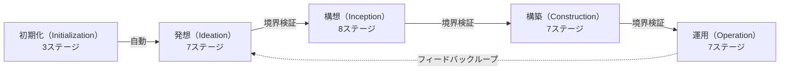

> **本記事の位置づけ** — 本記事は、`awslabs/aidlc-workflows` リポジトリの規範ルールおよび利用ガイドを素材として、筆者が AI を活用して読み解き、まとめた解釈です。AWS が公式に発表した方法論ではなく、一次資料の翻訳・要約でもありません。
>
> **シリーズ** — 本記事は [AIで紐解くAI-DLC v2](https://qiita.com/takeshishimada/items/2daa87896110603252ad) シリーズの一部です。
>
> **参照した版** — **Claude Code 実装**を対象に、2026 年 8 月 4 日時点のコミット `c73ee984`（AIDLC_VERSION 2.5.37、`core/`）を参照しています。Claude Code 以外の実装（Kiro CLI／Kiro IDE／Codex CLI／opencode）は対象外で、記述が異なる場合があります。OSS 実装は更新が続いているため、最新の状態は公式リポジトリをご確認ください。

---

## 概要

AI-DLC v2 のワークフローは、開発の狙いで区切ったフェーズと、その下に並ぶ全32ステージで組み立てられます。32は全量で、実際に通る数は案件により絞られます（詳しくは別記事「[スコープ](https://qiita.com/takeshishimada/items/c232fb2e994e7b567a5c)」で扱います）。そして各ステージを実際に動かすのは、成果物を作る11体の専門エージェントと、できあがった成果物をレビューする2体、それにスコープを組むコンポーザー1体を加えた14体です。どのエージェントも担当範囲を広く取り、フェーズをまたいで複数のステージを受け持ちます。

本記事では、何をどの順で進めるかという「工程」と、それを誰が担うのかという「エージェント」の2つの軸から、ワークフローがどう組み立てられているのかを読み解きます。

## 1コマンドの裏側

AI-DLC v2 は、たった1行で動き出します。

```
/aidlc 在庫管理用の REST API を作って
```

これだけで、要件の整理から設計、実装、テスト、デプロイまでが、ひと続きの構造化されたワークフローとして進みます。ただ、最初は「中で何が順番に起きているのか」「実際に作業しているのは誰なのか」が見えにくいものです。本記事は、その中身を2つの軸で読み解きます。

- **工程** — 何を、どの順で進めるのか
- **エージェント** — その各ステージを、誰が担当するのか

「次にどのステージをやるか」を決めているのは、LLM ではなく決定論的な仕組み（エンジン）です。エージェントの仕事は「任された作業をうまくやること」だけに絞られています。この分離がなぜ効くのかは別記事「[設計思想](https://qiita.com/takeshishimada/items/4c8c4ae93b4184588ee6)」で扱い、ここでは工程とエージェントの中身に集中します。

---

## 工程の3階層

AI-DLC v2 の工程は、3つの階層でできています。

| 階層 | 意味 |
| --- | --- |
| ワークフロー | アイデアから動くシステムまで、ライフサイクル全体を構造化して進める流れ |
| フェーズ | ワークフローを「開発の狙い」ごとに区切った大きな段階。全5フェーズ |
| ステージ | フェーズの狙いを具体的な成果物に落とす一つひとつの工程。担当エージェントが成果物を1つずつ仕上げる。全32ステージ[^stages] |

5つのフェーズは、**初期化 → 発想 → 構想 → 構築 → 運用** の順に並び、原則として順番に実行されます。初期化から発想への移行を除く各境目では、**フェーズ境界検証**が走ります。成果物の欠落やトレーサビリティの切れ目を点検し、進行の記録（監査ログ）に `PHASE_VERIFIED` というマーカーを残す仕組みです。これは自動で進行を止めるものではなく、問題があれば承認ゲートで人が判断します。検証の中身は別記事「[フェーズ境界検証](https://qiita.com/takeshishimada/items/f2f4e426dd542c5b6765)」で扱います。


```mermaid
flowchart LR
  INIT["初期化（Initialization）<br/>3ステージ"]
  IDEA["発想（Ideation）<br/>7ステージ"]
  INCEP["構想（Inception）<br/>8ステージ"]
  CONST["構築（Construction）<br/>7ステージ"]
  OPER["運用（Operation）<br/>7ステージ"]
  INIT -->|自動| IDEA -->|境界検証| INCEP -->|境界検証| CONST -->|境界検証| OPER
  OPER -.->|フィードバックループ| IDEA
```

運用は終点ではありません。運用で得た学びは発想フェーズへ戻り（図の点線）、次のサイクルの入力になります。このループまで含めて1つのライフサイクルです。

---

## 5つのフェーズ

フェーズごとに、狙いと主役のエージェントが異なります。各ステージは「フェーズ番号.連番」で識別され、フェーズは登場順に Initialization=0、Ideation=1、Inception=2、Construction=3、Operation=4 と番号が振られます（たとえば 2.8 は構想フェーズの8番目、デリバリー計画）。本連載は基本的にステージを名前で呼びますが、番号が出てきたらこの対応で読み解けます。

### 初期化（Initialization）

ワークスペースの用意です。ドキュメント用ディレクトリを作り、ワークスペースの種類を判定し、状態ファイルを初期化します。ここだけは承認ゲートがなく、3ステージが1回のツール呼び出しの中で自動的に完了します。人の手は要りません。

### 発想（Ideation）

「そもそもこれを作るべきか」を見極めるフェーズです。何を・なぜ作るかを定め、市場性と実現性を確かめ、作る範囲を絞る、ビジネス寄りの工程です。最後の**承認・引き継ぎ**で構想フェーズへつなぎます。主役は**プロダクトエージェント**で、実現性の評価では**アーキテクトエージェント**が主導します。

### 構想（Inception）

要件と設計を固めるフェーズです。要望を検証できる要件に落とし、ユーザーストーリーと設計へ広げます。核心は**作業単位の生成**（units-generation）で、作業を「作業単位」というまとまりに分解し、その依存関係を DAG（依存グラフ）として書き出します。最後の**デリバリー計画**が、次の構築の進め方（実行単位 Bolt の並び）を決めます。既存コードがある案件（ブラウンフィールド）では、先頭に**リバースエンジニアリング**が入ります。主役はプロダクトとアーキテクトです。

### 構築（Construction）

実際に作るフェーズです。

構築は一度に最後まで作りきらず、**Bolt**（構築の実行単位）ごとに小さく区切って繰り返します。1つの Bolt は、1つ以上の作業単位を束ねて、機能設計からコード生成までをひと通り進めるまとまりです。なかでも最初の Bolt だけは、機能を最小限に絞り、アーキテクチャの全層を端から端まで通す一本道を先に作ります。土台が本当に成立するかを、機能を加える前に確かめる狙いです。問題がなければ、残りの Bolt で機能を加えていきます。ビルド・テストと CI パイプラインは、各 Bolt の繰り返しとは切り離され、全 Bolt 完了後に一度だけ走ります。

最初の Bolt のあと、残りを自律で走らせるか Bolt ごとに毎回ゲートを挟むかを一度だけ選びます。最初の Bolt と自律モードの仕組みは別記事「[ウォーキングスケルトン](https://qiita.com/takeshishimada/items/7a24030b9d8905f379ed)」で扱います。設計を担うのは**アーキテクトエージェント**、コード生成は**デベロッパーエージェント**、ビルド・テストは**品質エージェント**です。

### 運用（Operation）

本番へデプロイして、動かし続けるフェーズです。デプロイの自動化・環境構築から、可観測性・インシデント対応・性能検証までを整えます。最後の**フィードバック・最適化**で、運用で得た知見をプロダクトエージェントへ返し、次のサイクルの発想フェーズへつなぎます。主役は**オペレーションエージェント**です。

---

## エージェント

AI-DLC v2 のステージを動かすのは、**成果物を作る11体の専門エージェント**と、**レビューだけをする2体のレビュアーエージェント**、それに**スコープを組む1体のコンポーザー**（計14体）です。

### 担当範囲を広く取る理由

AI-DLC v2 は、担当範囲の狭い専門家を何十体も並べる方式をあえて取っていません。**エージェント同士の境界は、情報が失われる箇所だから**です。担当が変わるたびに引き継ぎ文書が要り、その受け渡しのたびに情報が抜け落ちます。

代わりに、1体のエージェントが複数のステージ・複数のフェーズを横断します。たとえばアーキテクトエージェントは、実現性評価・アプリケーション設計・作業単位の生成・機能設計・非機能要件・非機能設計と、3フェーズにまたがる6ステージを担当します。同じエージェントが連続して受け持つため、引き継ぎが要らず、情報がそのまま残ります。

### 主担当と補佐

各ステージには**主担当**（Lead）が置かれ、必要に応じて**補佐**（Support）が付きます（32ステージのうち12ステージには補佐が付きません）。初期化の3ステージだけは、主担当もエージェントではなくコンダクター自身です。主担当がそのステージの成果物に責任を持ち、補佐は専門知識を持ち込みます。たとえば非機能要件のステージはアーキテクトが主担当ですが、セキュリティ観点で DevSecOps エージェントが、規制観点でコンプライアンスエージェントが補佐に入ります。

そして、エージェント同士は直接呼び合いません。委譲はすべて、進行役であるコンダクター（エンジンが決めた手を実行する側）を通します。だから「誰が誰を呼んだか」を常に一段の呼び出しとしてたどれ、呼び出しが再帰的に深くなることもありません。

### 協働のかたち

主担当と補佐が**どう協働するか**は、ステージごとに違います。それを決めるのがフロントマターの `mode` で、「ステージ本体を走らせるあいだ、誰が誰と話すか」を指します。4つあります。

| mode | 協働のかたち | 出荷数 |
| --- | --- | :-: |
| `inline` | コンダクターが全員の役を自分で引き受ける。補佐は独立に動かず、観点として持ち込まれる | 28 |
| `subagent` | ハブとスポーク。主担当が下書きを書き、各補佐が**互いを見ない状態で**それを検分し、主担当が統合する | 2 |
| `pipeline` | 流れ作業。補佐が宣言された順に手を入れ、各段が上流の作業をすべて見る。最後の段が仕上げる | 1 |
| `mob` | 一つの部屋。全員が主担当の下書きに並行して意見を出し、残った異議は記録される | 1 |

出荷時点では **32ステージのうち28が `inline`** です。つまりほとんどのステージは「コンダクターが全員の役を引き受ける」形で進みます。残る4つは、ステージ本体そのものを複数のエージェントで回します。リバースエンジニアリングが `pipeline`、ユーザーストーリーが `mob`、作法の発見とコード生成が `subagent` です。

`mob` と、補佐を宣言した `subagent` では、起動された補佐が自分の書いたものを自分のファイルに残し、成果物を編集するのは主担当だけになります。このファイルは完了の証拠にもなります。`pipeline` では流れ作業の各段が成果物を直接書き換えるので、この記録は要りません。4つのかたちの詳細、異議が割れたときの仕分け、並行できない環境での約束は、別記事「[協働のトポロジー](https://qiita.com/takeshishimada/items/47e11209aed038250b7a)」で扱います。

### 成果物を作る11体

| エージェント | 専門領域 | 主担当ステージ | 主な活動フェーズ（補佐も含む） |
| --- | --- | --- | --- |
| プロダクト | プロダクト管理・ビジネス分析 | 意図キャプチャ、市場調査、スコープ定義、要件分析、ユーザーストーリー | 発想・構想 |
| デザイン | UX／UI デザイン・アクセシビリティ | ラフ／詳細モックアップ | 発想・構想 |
| デリバリー | エンジニアリングマネジメント・Bolt 計画 | チーム編成、承認・引き継ぎ、デリバリー計画 | 発想・構想 |
| アーキテクト | ソリューション設計・ドメインモデル・NFR | 実現性評価、アプリケーション設計、作業単位の生成、機能設計、非機能要件、非機能設計 | 発想・構想・構築 |
| AWSプラットフォーム | インフラ設計・クラウド基盤 | インフラ設計、環境プロビジョニング | 発想・構想・構築・運用 |
| コンプライアンス | GRC・規制対応・リスク評価 | （補佐専任） | 発想・構築・運用 |
| DevSecOps | セキュリティ・脅威モデリング | （補佐専任） | 構想・構築・運用 |
| デベロッパー | コード生成・データモデリング | リバースエンジニアリング、コード生成 | 構想・構築・運用 |
| 品質 | QA・テスト戦略 | ビルド・テスト、性能検証 | 構想・構築・運用 |
| パイプラインデプロイ | CI／CD・リリース管理 | 作法の発見、CIパイプライン、デプロイパイプライン、デプロイ実行 | 構想・構築・運用 |
| オペレーション | SRE・信頼性・可観測性 | 可観測性セットアップ、インシデント対応、フィードバック・最適化 | 運用 |

### レビューを担う2体

成果物を作る11体とは別に、**レビューだけをする2体**がいます。**アーキテクチャレビュアー**（`aidlc-architecture-reviewer-agent`、技術設計をレビュー）と**プロダクトリード**（`aidlc-product-lead-agent`、要件・プロダクトを顧客の視点でレビュー）です。

この2体は一部のステージで、成果物の完成後・承認ゲートの前に独立評価を添えますが、判定の中身を理由に進行を止めることはありません。最終判断は承認ゲートの人に委ねます。成果物を作る11体と同じくコンダクターが起動し、レビュアー同士も呼び合いません。判定の中身は別記事「[レビュアー](https://qiita.com/takeshishimada/items/624d83e946e86e4b1553)」で扱います。

### スコープを組む1体

14体目は**コンポーザー**（`aidlc-composer-agent`）です。成果物を作るわけでも、レビューするわけでもありません。この1体がするのは、「**今回どのステージを通すか**」を組み立てる仕事です。

作業内容を書いて `/aidlc` を呼ぶと、キーワードから既存スコープが特定できる場合はそれを名指しして確認を求めます。曖昧な場合や既存のどれにも当てはまらない場合は、スコープを組む提案が出ます。人がそれに応じると、このコンポーザーが起動します。作業内容とワークスペースの走査結果を読み、実行するステージと飛ばすステージの一覧を、飛ばす理由を添えて提案します。人が承認すると、それをスコープとして書き出し、ワークフローが始まります。

ステージを持たないので、先の11体の表には現れません。スコープを組む機構そのものは別記事「[スコープ](https://qiita.com/takeshishimada/items/c232fb2e994e7b567a5c)」で扱います。

---

## 工程とエージェントの関係

この2つの軸を重ねると、AI-DLC v2 の動きが見えてきます。

- **アーキテクトエージェントの担当範囲が最も広い。** 6ステージ・3フェーズを横断し、設計の判断を一貫して受け持ちます。
- **デベロッパーエージェントは、構想・構築・運用の3フェーズにまたがる。** 既存コードのリバースエンジニアリングからコード生成、デプロイ支援までを1体で担います。
- **コンプライアンスと DevSecOps は補佐専任。** 自分が主担当のステージは持たず、ほかのエージェントが率いるステージに規制・セキュリティの観点を加え続けます。専門の担当を独立させず、必要な場面に加わる形です。
- **オペレーションエージェントが次へつなぐ。** 運用で得た知見をプロダクトエージェントへ返し、次のサイクルの起点を作ります。

工程はフェーズの順に一方向へ進み、エージェントはその流れを横切って複数のステージを受け持ちます。この重なりが、引き継ぎを最小限にしながらライフサイクル全体を回します。

---

## まとめ

AI-DLC v2 の工程とエージェントを、2つの軸でたどってきました。

- 工程は **ワークフロー > フェーズ > ステージ** の3階層。5フェーズ32ステージが、初期化から運用、そして次サイクルへとループする
- 実行するのは、担当範囲を広く取った14体のエージェント（成果物を作る11体＋レビュー専任2体＋スコープを組むコンポーザー1体）。主担当と補佐で分担し、その協働のかたちは `mode` が決める（28ステージは `inline`、残る4つはステージ本体を複数のエージェントで回す）。連携は常にコンダクター経由で、レビュアーは進行を止めずに品質判定を添えるだけ

すべての案件が32ステージを通るわけではありません。全32を通るのは機能開発やエンタープライズで、バグ修正なら7ステージ、PoC（概念実証）なら8ステージというように、案件の性質に応じて通るステージが絞り込まれます。この絞り込みは別記事「[スコープ](https://qiita.com/takeshishimada/items/c232fb2e994e7b567a5c)」で扱います。

[^stages]: コンパイラ `tools/aidlc-graph.ts` のコメントには "31 YAML stage files" という記述が残っていますが、ステージ `.md` の実数は32本です。

## 参照元

| ファイル | 内容 |
| --- | --- |
| `core/` のステージ `.md`（[32本](https://github.com/awslabs/aidlc-workflows/tree/c73ee984/core/aidlc-common/stages)）／[`tools/aidlc-graph.ts`](https://github.com/awslabs/aidlc-workflows/blob/c73ee984/core/tools/aidlc-graph.ts) | 5フェーズ32ステージとその依存グラフ（コンパイラ） |
| [`aidlc-common/protocols/stage-protocol.md`](https://github.com/awslabs/aidlc-workflows/blob/c73ee984/core/aidlc-common/protocols/stage-protocol.md) | 主担当（Lead）・補佐（Support）の割り当て、フェーズ境界検証、承認ゲート |
| [`core/agents/`](https://github.com/awslabs/aidlc-workflows/tree/c73ee984/core/agents)（14ファイル） | エージェント14体（成果物を作る11体＋レビュー専任2体＋コンポーザー1体） |
| [`agents/aidlc-architecture-reviewer-agent.md`](https://github.com/awslabs/aidlc-workflows/blob/c73ee984/core/agents/aidlc-architecture-reviewer-agent.md)／[`aidlc-product-lead-agent.md`](https://github.com/awslabs/aidlc-workflows/blob/c73ee984/core/agents/aidlc-product-lead-agent.md) | レビュー専任の2体 |
| [`aidlc-common/conductor.md`](https://github.com/awslabs/aidlc-workflows/blob/c73ee984/core/aidlc-common/conductor.md) | 委譲（`Task`）はコンダクター専用・エージェントは互いを呼ばない |

---

## 関連記事

**前の記事**: [概念マップ](https://qiita.com/takeshishimada/items/6391a320609276d0cfb6)
**次の記事**: [進行の中核](https://qiita.com/takeshishimada/items/c3ac7c2223e5c7020d82)
**目次**: [AIで紐解くAI-DLC v2](https://qiita.com/takeshishimada/items/2daa87896110603252ad)

