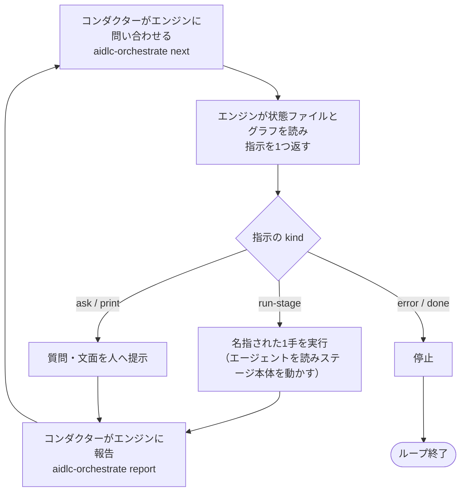
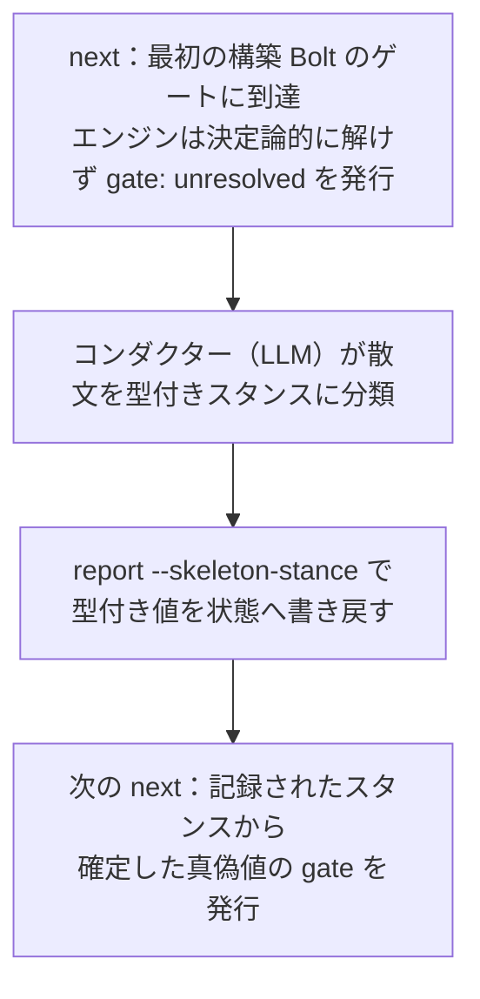

> **本記事の位置づけ** — 本記事は、`awslabs/aidlc-workflows` リポジトリの規範ルールおよび利用ガイドを素材として、筆者が AI を活用して読み解き、まとめた解釈です。AWS が公式に発表した方法論ではなく、一次資料の翻訳・要約でもありません。
>
> **シリーズ** — 本記事は [AIで紐解くAI-DLC v2](https://qiita.com/expensivegasprices/items/2daa87896110603252ad) シリーズの一部です。
>
> **参照した版** — **Claude Code 実装**を対象に、2026 年 6 月時点の v2.1.3（コミット `c95070e`、`core/`）を参照しています。Kiro・Codex 実装は対象外で、記述が異なる場合があります。OSS 実装は更新が続いているため、最新の状態は公式リポジトリをご確認ください。

---

## 概要

AI-DLC v2 の進行は、性質の異なる2つの主体が分担して回します。状態を読んで次の一手を決める決定論的なエンジンと、その一手を実際に動かす AI のコンダクターです。エンジンは「次に何をすべきか」を1つの型付き指示（directive）として返すだけで、エージェントを起動することも人に問うこともしません。実行はすべてコンダクターが引き受けます。

この分離があるからこそ、進行は会話の揺れに左右されず、同じ状態なら同じ順序で再現し、セッションが切れても続きから再開できます。本記事では、指示の全体像と、問い合わせと報告を往復する制御ループ、そして決定論を貫く設計が唯一ゆるむ一点を読み解きます。

## エンジンとコンダクターの分離

進行の中核には、性質の異なる2つの主体がいます。

| | エンジン | コンダクター |
|---|---|---|
| 正体 | 決定論的なコード（`aidlc-orchestrate.ts`） | LLM（実際に動く AI） |
| 役割 | 「次に何をすべきか」を型付き指示1つで答える | 指示の種類（kind）を読み、それが名指す1手だけを実行する |
| 状態 | 持たない。毎回ファイルを読み直す | 会話の文脈を持つ |
| やらないこと | エージェントを起動しない・人に直接質問しない・逸脱を生まない | 次の手を自分で決めない |

エンジンは状態ファイル（`aidlc-state.md`）とコンパイル済みのステージグラフ（`stage-graph.json`）を読み、1つの指示（JSON）を返して止まります。問い合わせコマンド `next` は状態を一切書き換えない読み取り専用です。エンジンは人に問う道具を持たず、エージェントも起動しません。判断だけを返し、実行はすべてコンダクターに委ねます。

### 判断を毎回エンジンに依頼する理由

コンダクターは賢い LLM です。ならば「次は要件分析、その次は設計」と自分で進めればよさそうに見えます。それをあえて毎回エンジンに聞きに行かせるのは、3つの保証のためです。

- **逸脱の防止** — LLM 任せにすると、長い会話の途中で手順を一段飛ばしたり、頼まれてもいないステージへ脱線したりします。次の一手を決定論的なコードに固定すれば、進行が会話の揺れに左右されません。
- **再現性** — エンジンは同じ状態と同じグラフなら必ず同じ指示を返します。判断に LLM の非決定性が混じらないので、進行を再現できます。
- **セッションをまたぐ再開** — エンジンはセッションの記憶を持ちません。進行状況はすべて状態ファイルにあり、エンジンは毎回それを読み直して判断します。会話が切れても、別の会話からでも、状態ファイルさえあれば続きから正しく再開できます。

「記憶を持たない」ことは弱点ではなく、再現性と再開可能性を成り立たせる前提です。状態がコードの中ではなくファイルに外在化されているからこそ、エンジンは使い捨てにでき、何度呼んでも同じ答えを返せます。（状態ファイルと監査ログの中身は別記事「[状態と監査](https://qiita.com/expensivegasprices/items/72234648bb4400cedf53)」で扱います。）

### エンジン固有の2つの仕事

エンジンの中身のほとんどは、既存の決定論的なツールを組み合わせているだけです。グラフの読み込み、次ステージの算出、スコープ名の検証。どれも既存のツール関数を呼んでいます。エンジンが独自に担っているのは2つだけです。

1. **決定ルール** — 「観測した状態とグラフ」を「指示の種類」へ写す判断
2. **成果物パスの解決** — グラフが持つ語彙名を、アクティブ intent の記録ディレクトリ配下の実パスへ変換する文字列の組み立て

どちらも純粋な決定論的コードです。ソースのコメント（`aidlc-orchestrate.ts`）は、この線引きをこう言い切ります。

> routing string-building to an LLM would invert the whole thesis
> （ルーティングの文字列組み立てを LLM にやらせたら、この思想全体がひっくり返る）

何をすべきかという知識作業はコンダクター（LLM）が、どのステージを次にやるかというルーティングはエンジン（ツール）が担います。この役割分担が設計思想の核心です。

## 9種の指示

エンジンとコンダクターをつなぐのが指示（directive）です。`aidlc-directive.ts` に定義された固定のインターフェースで、エンジンとコンダクターが同じ1つのファイルを import します。だから両者の間で「やり取りの形」がズレようがありません。指示の定義そのものは状態を持たず、何も発行（emit）せず、I/O もしない純粋な契約です。エンジンは指示を組み立てて検証してから出力し、コンダクターは受け取って検証してから読みます。壊れた指示は黙って見過ごされず、その場でエラーになります。

指示の種類は全9種です。各々が「何を指示するか」を、ソースの型定義から起こします。

| kind | 何を指示するか |
|---|---|
| `run-stage` | lead・support エージェントを読み込み、`consumes`（入力成果物）を読み、ステージ本体を実行し、`produces`（出力）を書き、`memory.md` を保つ |
| `dispatch-subagent` | `run-stage` と同じだが、ステージを Task で名前付きの worker に投げて実行する |
| `invoke-swarm` | 構築のバッチを、N 個の作業コピー（worktree）に N 人の worker として並列展開する |
| `present-gate` | 学習ゲートを回してから承認ゲートを描画する |
| `ask` | 構造化された質問を描画する（再開の選択・スコープ確認・自律ラダー） |
| `print` | 文面を逐語で表示して止まる（状況表示やヘルプ） |
| `error` | エラーを表示して止まる |
| `done` | ループを止める（ワークフロー完了、または単一ステージ完了） |
| `parked` | 長尺ワークフローを現在のステージ境界で一時停止（park）して終える（後述） |

この9種のうち、現行エンジンが実際に発行するのは7種です。`next` のハンドラは `run-stage` / `invoke-swarm` / `ask` / `print` / `error` / `done` ＋ `parked` を発行し、残る `present-gate` / `dispatch-subagent` の2種は「後続の実装段階（wave）で実装する」と明言して除外します。2種は欠落ではなく、型としては固定の契約に含めつつ段階的に実装する途中という位置づけです。

### run-stage が運ぶもの

発行される指示の圧倒的多数を占めるのが `run-stage` です。これは単に「このステージをやれ」ではなく、ステージ実行に必要なルーティング一式を、コンダクターが再導出せずに済む形で運びます。

- `lead_agent` / `support_agents` — 主担当（Lead）と補佐のエージェント
- `mode` — `inline` / `subagent` / `agent-team`
- `gate` — 承認ゲートを敷くか（後述の例外を除き真偽値）
- `rules_in_context` — このステージで効くルールの解決済みパス
- `sensors_applicable` — 適用されるセンサーの ID
- `consumes` / `produces` — 入出力成果物の解決済み `<record>/...` パス
- `reviewer?` / `reviewer_max_iterations?` — レビュアーを宣言するステージにだけ付く
- `conductor_persona?` — ワークフロー最初の `run-stage` にだけ埋め込まれる実行品質の人格（後述）
- `unit?` — per-unit 構築ステージでエンジンが解決した具体的な作業単位名。作業単位ごとに `run-stage` を回す反復の1イテレーションである目印で、未カバーの作業単位ではゲートが抑止される

ルール（従う義務のある制約）は指示に同梱されて届く一方、ナレッジ（参照用の手法）は指示に載らず、コンダクターが実行時に自分で読みに行きます。この非対称も `run-stage` の設計に表れています。ルールとナレッジの違いは別記事「[ルールとナレッジ](https://qiita.com/expensivegasprices/items/33f3b2b401d4d3c1c266)」で、`unit?` の per-unit 解決は別記事「[成果物の流れ](https://qiita.com/expensivegasprices/items/46feb553f907f9eedd14)」で扱います。

### 一度だけ渡される実行人格

コンダクターの「ステージをうまく回すための実行品質」の心得は、`aidlc-common/conductor.md` に一度だけ書かれています。スキルはこのファイルをパス参照しません。代わりにエンジンが中身を読み、ワークフロー最初の `run-stage` 指示に埋め込んで届けます。以降の指示には付きません（人格はセッション内で持続するため）。どこから始めても、同じコンダクター人格が追加の設定なしで行き渡る仕組みです。

## 制御ループ

これらをつなぐと、進行は次の制御ループになります。

コンダクター任せだと問い合わせ自体を忘れて脱線しうるため、`done` が返るまでこのループを続けさせる仕組み（フォワーディングループの Stop フック）が別にあります。エンジンが返す指示は「まだ負っている作業」としてしか表現されないので、仮にエンジンが壊れても、認可された作業を続けることしかできず、セッションを乗っ取ることはできません。

## 報告サイクル

エンジンへの問い合わせ `next` が状態を読むのに対し、`report` は結果を書き戻します。コンダクターが指示の一手を実行し終えたら `report` で結果を報告し、それによって状態が前進して、次の `next` が新しい状態を読む。これが報告サイクルです。

`report` 自身は遷移ロジックを持ちません。`aidlc-state.ts` の遷移サブコマンドへのディスパッチャに徹し、「ゲート状態 → 終端かどうか」の順で、どのサブコマンドに委ねるかを選びます。

| 報告したステージの状態 | 委ねる先 | 何が起きるか |
|---|---|---|
| ゲートあり | `approve` | `GATE_APPROVED` と `STAGE_COMPLETED` を出し、`approve` が前進（非終端なら `advance`、終端なら `complete-workflow`）まで呼び切る |
| ゲートなし・非終端 | `advance` | 次の進行中ステージへ前進する |
| ゲートなし・終端 | `complete-workflow` | `PHASE_COMPLETED` と `PHASE_VERIFIED` と `WORKFLOW_COMPLETED` を出して締める |

ゲートの有無は、`next` が `run-stage` の `gate` を決めるのと同じ軸です。ブートストラップの初期化ステージだけが自動で進み、それ以外の全ステージはゲートを敷きます。

`approve` は遷移の全体を所有します。承認は監査イベントを出してから前進まで一手でまとめて担うので、承認のあとに `advance` を別途呼んではいけません。もし承認の前にゲート開始の記録が漏れていても、`report` が欠けたゲートを補ってから承認します。監査ログの発行はツールが所有し、状態遷移サブコマンドが正しい監査イベントを内部で発行します。コンダクターが手で監査行を書くことはありません。承認ゲートの人側の手順（差し戻しの往復や「現状で承認」）は別記事「[承認ゲート](https://qiita.com/expensivegasprices/items/cd6827700443c9987fd7)」で、監査イベントの体系は別記事「[状態と監査](https://qiita.com/expensivegasprices/items/72234648bb4400cedf53)」で扱います。

> **`park` — エンジンの第3のサブコマンド。** `next`（読む）/ `report`（書く）に加わったのが `park` です。長尺（enterprise スコープなど）のワークフローを、ステージを空承認で消化して `done` に到達させずに、現在のステージ境界で一時停止します。`aidlc-orchestrate.ts park` は `aidlc-state.ts park` に委ねて一時停止のマーカーを置き（変異はツール側＝エンジンは読み取り専用を保つ）、終端の `parked` 指示を出します。以降の素の `next` は `parked` を返し、Stop フックがそれを許可してターンを綺麗に終えます。`/aidlc --resume` で再開します。なお自律モードの構築では `park` は拒否されます（無人ループは止めない）。あわせて、宣言した成果物がディスクに無いステージを完了にできないアーティファクト・ガードもあります（空承認の防止。詳細は別記事「[承認ゲート](https://qiita.com/expensivegasprices/items/cd6827700443c9987fd7)」）。

## 次のステージの決まり方

`next` が「次は何か」を答える土台がステージグラフです。グラフは構造的な真実で、ステージ定義の全体と、それらが宣言する `requires_stage` / `produces` / `consumes` のエッジを合わせたものが、完全な DAG（閉路のない有向グラフ）になります。これは YAML から `stage-graph.json` へコンパイルされます。

- **スコープはサブ DAG** — スコープ（feature・bugfix・poc など）は、グラフから切り出した部分グラフです。各ステージのフロントマター（ファイル冒頭のメタ情報）の `scopes:` を転置した EXECUTE グリッドのうち、EXECUTE に該当するステージと、その間の `requires_stage` エッジを切り出します。スコープが「どのステージを実行するか」を決めます。
- **直列ランタイムは番号順に線形化** — 各サブ DAG を番号順に並べて反復します。この番号順は、依存の前後関係を崩さない並べ方（トポロジカルソート）として妥当になっています。
- **次ステージの算出** — `nextInScopeStage` が、スコープ内で現ステージの次に来る EXECUTE ステージを返します。状態ファイルの上書き（個別の EXECUTE/SKIP 指定や既存のチェックボックス）も加味します。

5フェーズ32ステージとスコープごとの実行範囲は別記事「[工程とエージェント](https://qiita.com/expensivegasprices/items/418d7b9e17192e8add85)」で、スコープの仕組みは別記事「[スコープ](https://qiita.com/expensivegasprices/items/c232fb2e994e7b567a5c)」で扱います。

### 成果物パスの解決

コンパイル済みグラフは、成果物を語彙名で持ちます（`produces` は素の名前の配列、`consumes` は条件付きの配列）。コンダクターは実パスで動く必要があるので、エンジンが発行時に名前からパスを解決し、コンダクターに再導出させません。ここがエンジンが独自に担うもう1つの仕事です。解決の規約そのもの（消費物は生産者ディレクトリに住む、`conditional_on` を Project Type で落とす、per-unit ステージに作業単位名を注入する）は別記事「[成果物の流れ](https://qiita.com/expensivegasprices/items/46feb553f907f9eedd14)」で扱います。本記事は「エンジンが決定論的に解決する」という分担だけに絞ります。

## 決定論の唯一の例外

ここまでの原則は「次の一手はすべてエンジンが決定論的に決める」でした。この原則が唯一きれいに破れる一点があり、それがこの設計思想を最もよく映します。

`gate` はほぼ常に真偽値です。スコープのステージマップが「このステージはゲートを敷くか」を決定論的に答えるので、エンジンは素の真偽値を発行します。ただ1つの例外が、構築の最初の Bolt（最小限の端から端までを通す最初の実行単位）のゲートです。これはチームの自由記述の散文から「スタンス」を読み取って決まりますが、英語の散文をスタンスへ変換するパーサは存在しません。エンジンはこれを決定論的には解けません。

そこでエンジンは保留します。`gate: "unresolved"` という番兵値（決定不能の印）を出して止まり、コンダクターが散文を分類して型付きのスタンスを `report --skeleton-stance` で返し、次の `next` が確定したゲートを発行します。

決め手は、戻ってくるのが型付きのスタンスだけであることです。エンジンは遷移の所有権を手放さず、自由な英語が判断としてエンジンに流れ込むことはありません。この設計が決定論的なのは「真偽値が分かれること」ではなく「散文を型付きのスタンスに分類したこと」の側です。スタンスの3値とその意味、散文の分類手順、practices による上書きは別記事「[ウォーキングスケルトン](https://qiita.com/expensivegasprices/items/7a24030b9d8905f379ed)」で扱います。本記事が立ち入るのは、エンジンが保留して型付き値だけを受け取る機構までです。

これは中核の設計思想の縮図です。知識作業（自由な散文の解釈）は LLM が、ルーティング（次に何を実行するか）はツールが担い、両者の境界を型付きの値1つだけが越える。判断を毎回エンジンに依頼するのも、この一点で例外的に LLM へ判断を渡すのも、同じ一本の線引きの裏表です。

## 参照元

| ファイル | 内容 |
| --- | --- |
| [`tools/aidlc-directive.ts`](https://github.com/awslabs/aidlc-workflows/blob/v2.1.3/core/tools/aidlc-directive.ts) | 指示の凍結契約。9種の kind の判別共用体・各フィールド・ランタイム検証。「engine↔conductor の凍結インターフェース」「状態なし・I/O なしの純粋な契約」、`GATE_UNRESOLVED` 番兵の定義 |
| [`tools/aidlc-orchestrate.ts`](https://github.com/awslabs/aidlc-workflows/blob/v2.1.3/core/tools/aidlc-orchestrate.ts) | エンジン本体。`next`（読み取り専用の問い合わせ）・`report`（遷移のコミット）・`park`。「足すのは決定ルールとパス解決の2つ」、`present-gate`/`dispatch-subagent` を発行しないハンドラ、skeleton round-trip、`report` のゲート→終端ディスパッチ |
| [`tools/aidlc-graph.ts`](https://github.com/awslabs/aidlc-workflows/blob/v2.1.3/core/tools/aidlc-graph.ts) | ステージグラフのライブラリ。「グラフは構造的真実＝DAG」「スコープはサブ DAG（EXECUTE スライス＋`requires_stage` エッジ）」「直列ランタイムは番号順に線形化」 |
| [`tools/aidlc-state.ts`](https://github.com/awslabs/aidlc-workflows/blob/v2.1.3/core/tools/aidlc-state.ts) | 状態の読み書きと遷移サブコマンド（`advance`/`approve`/`reject`/`complete-workflow`/`park` 等）。`report` が委ねる先。監査発行はこれらが内部で所有 |
| [`aidlc-common/conductor.md`](https://github.com/awslabs/aidlc-workflows/blob/v2.1.3/core/aidlc-common/conductor.md) | コンダクターの実行品質の人格。エンジンが最初の `run-stage` 指示に埋め込んで届ける |
| [`aidlc-common/protocols/stage-protocol.md`](https://github.com/awslabs/aidlc-workflows/blob/v2.1.3/core/aidlc-common/protocols/stage-protocol.md) | 承認ゲート・完了メッセージと `report` フロー・状態追跡（監査はツール所有・追記専用） |
| [`CHANGELOG.md`](https://github.com/awslabs/aidlc-workflows/blob/v2.1.3/CHANGELOG.md) | 型付き指示契約・`report`・conductor.md 人格の埋め込み（受け渡し）・skeleton round-trip・`parked`／`park` とアーティファクト・ガードの導入 |

---

## 関連記事

**前の記事**: [工程とエージェント](https://qiita.com/expensivegasprices/items/418d7b9e17192e8add85)
**次の記事**: [スコープ](https://qiita.com/expensivegasprices/items/c232fb2e994e7b567a5c)
**目次**: [AIで紐解くAI-DLC v2](https://qiita.com/expensivegasprices/items/2daa87896110603252ad)

