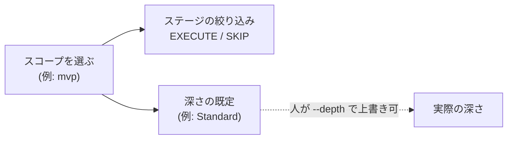

> **本記事の位置づけ** — 本記事は、`awslabs/aidlc-workflows` リポジトリの規範ルールおよび利用ガイドを素材として、筆者が AI を活用して読み解き、まとめた解釈です。AWS が公式に発表した方法論ではなく、一次資料の翻訳・要約でもありません。
>
> **シリーズ** — 本記事は [AIで紐解くAI-DLC v2](https://qiita.com/takeshishimada/items/2daa87896110603252ad) シリーズの一部です。
>
> **参照した版** — **Claude Code 実装**を対象に、2026 年 6 月時点の v2.1.3（コミット `c95070e`、`core/`）を参照しています。Kiro・Codex 実装は対象外で、記述が異なる場合があります。OSS 実装は更新が続いているため、最新の状態は公式リポジトリをご確認ください。

---

## 概要

スコープ（scope）は、ワークフローでどのステージを実行し、どれをスキップするかを決める選択です。AI-DLC v2 の工程は全32ステージありますが、案件によって必要な工程は違います。バグ修正に市場調査はいらず、PoC（概念実証）に運用設計もいりません。スコープは「今回はどんな作業か」を一語で宣言し、それに応じて工程を絞り込みます。`poc` から `enterprise` まで9種が用意され、いずれもコードではなくファイルで定義されます。

スコープは、工程の絞り込みと深さの既定を決める起点です。本記事では、9種のカタログ、各スコープが実行／スキップするステージ、自由文からの自動推定、そしてコード変更なしで増やせるファイル定義という仕組みを読み解きます。

## スコープとは

AI-DLC v2 の工程は全32ステージありますが、毎回その全部を通すわけではありません。スコープは「今回の作業はどういう種類か」を一語で宣言し、それに応じて工程を絞り込む軸です。

AI-DLC v2 には、ワークフローの振る舞いを調整する独立した軸が3つあります。スコープはその一番外側で、「どこを実行するか」を受け持ちます。

| 軸 | 決めること |
| --- | --- |
| スコープ | どのステージを実行するか（＋深さの既定） |
| 深さ（depth） | 各ステージをどこまで作り込むか |
| テスト戦略（test strategy） | テストをどこまで作り込むか |

深さとテスト戦略の段階そのものは別記事「[深さ](https://qiita.com/takeshishimada/items/f2246466b9e3bdef570b)」で扱います。各ステージが何をするかは別記事「[工程とエージェント](https://qiita.com/takeshishimada/items/418d7b9e17192e8add85)」で扱います。スコープの全体像での位置づけは別記事「[概念マップ](https://qiita.com/takeshishimada/items/6391a320609276d0cfb6)」で扱います。本記事は、そのうち**どれを実際に走らせるか**に集中します。

---

## スコープが決める2つのこと

スコープを1つ選ぶと、連鎖して2つが決まります。

1. **EXECUTE / SKIP の絞り込み** ― 全ステージのうち、どれを走らせ、どれをスキップするか。
2. **深さの既定** ― 走らせるステージをどこまで作り込むかの初期値。これは**人が後から `--depth` で上書きできます**。

---

## 9種のスコープ・カタログ

スコープは `core/scopes/aidlc-<name>.md` として**9本**定義されています。各ファイルのフロントマター（ファイル冒頭のメタ情報）が、その名前・深さの既定・自動推定に使うキーワードを持ちます。

| スコープ | 深さの既定 | キーワード（自動推定のトリガ） | 用途 |
| --- | --- | --- | --- |
| `bugfix` | Minimal | `fix`, `bug`, `broken` | 既存コードの特定バグを直す |
| `refactor` | Minimal | `refactor`, `clean up`, `simplify` | 振る舞いを変えずに整理する |
| `poc` | Minimal | `proof of concept`, `prototype`, `poc`, `spike` | 実現可能性を素早く確かめる |
| `security-patch` | Minimal | `security`, `CVE`, `vulnerability`, `patch` | 脆弱性に急いで対応し、デプロイまで通す |
| `mvp` | Standard | `mvp`, `minimum viable` | 運用を省き、コアを最短で出す |
| `infra` | Standard | `infrastructure`, `deploy`, `infra` | インフラ変更 |
| `feature` | Standard | （なし） | 新機能の既定。実務的な深さ |
| `workshop` | Standard（テストは Minimal） | `workshop`, `lab`, `training` | ゲート付きの集合演習 |
| `enterprise` | Comprehensive | （なし） | 規制対応。全工程＋完全な監査証跡 |

`feature` と `enterprise` だけキーワードを持ちません。`enterprise` は「速さと引き換えに省く」ことをしない、意図的に手で選ぶスコープだからです。`feature` は後述するとおりキャッチオール（取りこぼしの受け皿）で、どのキーワードにも当たらなかった入力が最後に落ちてくる既定値です。

---

## 実行するステージと削るステージ

スコープ別に、32ステージのうち何本を EXECUTE するか、そして**何を削るか・なぜ削るか**を一次資料の説明文から要約したのが次の表です。全32×9のマトリクスは末尾の付録に置きました。

| スコープ | EXECUTE | 何を削るか／残すか（なぜ） |
| --- | :-: | --- |
| `enterprise` | **32 / 32** | 何も飛ばさない。未文書化の判断のコストが、ステージを走らせるコストより高いため全工程を保持 |
| `feature` | **32 / 32** | 実行範囲は enterprise と同一。違いは深さ（Standard）だけ。作法は軽いが端から端まで通す |
| `workshop` | **25 / 32** | 発想（ideation）を**7ステージすべて SKIP**。題材はファシリテーターが事前に決めるため。設計から運用まではそのまま見せ、テストだけ Minimal |
| `mvp` | **22 / 32** | 発想の市場調査・チーム編成・承認引き継ぎ、および**運用フェーズ全7ステージ**を SKIP。MVP は製品を証明するが、まだ運用は背負わない |
| `infra` | **13 / 32** | 製品機能側（発想すべて・アプリ設計・コード生成）を SKIP。NFR（非機能要件）／インフラ設計とデプロイ・可観測性を実行。**9種で唯一 `reverse-engineering` を SKIP**（インフラはデプロイ構成から始まり、アプリのソースから始まらないため） |
| `security-patch` | **9 / 32** | 設計の手順はほぼ全 SKIP。ただし `bugfix` と違い `deployment-pipeline`／`deployment-execution` は EXECUTE（デプロイされない修正は脆弱性を塞がない）。要件は `requirements-analysis` でなく `nfr-requirements` で記録 |
| `poc` | **8 / 32** | 動くコードまでの細い道だけ。`bugfix` の構成に `intent-capture`（仮説の意図をとらえる）を足した形。設計・運用・計画は省く（スパイクは使い捨て） |
| `refactor` | **8 / 32** | `bugfix` とほぼ同じ＋`functional-design`（保つべき振る舞いの目標形を描く）。新製品も新デプロイ面もないので発見・運用はスキップする |
| `bugfix` | **7 / 32** | 最小。初期化＋`reverse-engineering`／`requirements-analysis`／`code-generation`／`build-and-test`。既知システムへの増分作業なので、それ以外は不要 |

`bugfix`・`refactor`・`security-patch` の3つは「ブートストラップするものが無い」増分系で、いずれも最初の試作（別記事「[ウォーキングスケルトン](https://qiita.com/takeshishimada/items/7a24030b9d8905f379ed)」で扱います）の手順をスキップする点が共通します。

> **補足（一次資料内の食い違い）**
> `core/scopes/aidlc-enterprise.md` の説明文は「全32ステージを EXECUTE するのは enterprise **だけ**」と書いていますが、実際には `feature` も 32/32 です（`aidlc-feature.md` 自身が "runs every stage" と明言）。両者の差は**実行範囲ではなく深さだけ**、というのが実ファイルから読める正確な姿です。
> また `stage-protocol.md` §8 のスコープ表は概数（"~25" など）で、実数とわずかにズレます（`mvp` は実22、`bugfix` は7、`refactor` は8、`security-patch` は9、`workshop` は表に未掲載）。本記事の数値は**各ステージのフロントマターの `scopes:` を全数集計した実数**です。

---

## スコープの決まり方

スコープの確定には「自動で見当をつける」段と「最終的にどの値を採用するか」の段があります。

### キーワードによる自動推定

ユーザーが `/aidlc 〜を直して` のように自由文で頼んだとき、`aidlc-utility.ts` の `inferScopeFromText()` が各スコープの `keywords` を照合して見当をつけます。ルールは決定論的です。

- **単語境界マッチ**。`bug` は `debug` や `fixture` には当たりません。
- **スコープをアルファベット順に走査し、最初に当たったものを採用**（呼ぶたびに結果が同じになるよう）。
- **入力文がキーワードを含んでいても5語を超える（6語以上の）場合、またはどのキーワードにも当たらない場合は `feature` にフォールバック**。説明文に偶然キーワードが混ざっただけのプロジェクト記述を、誤って狭いスコープに落とさないための保険です。

こうして自動推定は出発点の提案にとどまり、迷ったら一番広い `feature` に寄せる設計になっています。

### 最終的に採用される値

実行時に実際のスコープを決めるのは `aidlc-orchestrate.ts` の `resolveScope()` で、優先順位は次のとおりです。

1. **state ファイルに記録済みのスコープ**（ワークフロー進行中はこれ）
2. `--scope` フラグ
3. 環境変数 `AWS_AIDLC_DEFAULT_SCOPE`
4. 既定値 `DEFAULT_SCOPE = "feature"`

### 人が最初に選ぶ流れ

新規プロジェクトでスコープを明示するとワークフローが作成されます。

- `/aidlc --scope <name>`（または `/aidlc <name>`）でそのスコープのワークフローを開始。
- `bugfix` / `feature` / `mvp` / `security-patch` にはキーワードの自動推定を挟まず固定で走る専用ランナー `/aidlc-<scope>` があります。それ以外のスコープは `--scope` で到達します。

人が `--scope` や専用ランナーで明示すれば、自動推定よりそちらが優先されます。

---

## 深さの既定値との関係

スコープが決めるもう一方が、深さの**既定値**です。`stage-protocol.md` §8「Depth Guidance」が scope→depth の対応を定めています。

| 深さの既定 | スコープ |
| --- | --- |
| Minimal | `poc`, `bugfix`, `refactor`, `security-patch` |
| Standard | `feature`, `mvp`, `infra`, `workshop` |
| Comprehensive | `enterprise` |

スコープが決めるのは深さの「既定値」までで、深さの段階そのもの（質問量や成果物の作り込み）には踏み込みません。その中身は別記事「[深さ](https://qiita.com/takeshishimada/items/f2246466b9e3bdef570b)」で扱います。本記事に関わるのは、次のとおりです。

- 深さはスコープで初期値が決まるが、**人が `--depth` で後から上書きできる**。
- テスト戦略は通常は深さに従うが、**スコープが独自の既定を宣言していればそれが優先**される（`workshop` は深さが Standard でもテストは Minimal）。`--test-strategy` で独立に上書きもできる。
- だから「Standard の作り込み＋Minimal のテスト」のような組み合わせも作れる。

---

## スコープのファイル定義

スコープの実装は、「スコープを増やすのがどれだけ簡単か」に直結します。

スコープは他の部品（センサーやエージェント）と同じ**ファイル定義**です（追加にコードは要りません）。定義は2か所に分かれます。

- **アイデンティティ** … `core/scopes/aidlc-<name>.md` 1ファイル（深さ／キーワード／説明＋説明文）。
- **メンバーシップ** … 全32ステージそれぞれのフロントマターにある `scopes:` リスト。「このステージはどのスコープで走るか」を各ステージ側が宣言する。

ビルド時に `aidlc-graph.ts compile` が**各ステージの `scopes:` を転置**して EXECUTE/SKIP グリッド（`scope-grid.json`）を生成します。実行時はこのグリッドと `.md` のフロントマターを合成して、スコープ定義を復元します。結果として、

> **スコープを増やすのは「`aidlc-<name>.md` を1つ置き、対象ステージに `scopes:` タグを足す」だけ。コード変更は不要。**

新しいスコープを足すと `/aidlc --scope <name>`・`--doctor`・キーワード自動推定がすべて自動的に拾います。本記事の EXECUTE/SKIP 数値が「スコープ定義ファイルの説明文」ではなく「各ステージのフロントマターの集計」を真とするのは、まさにそこが唯一の源泉だからです。

---

## EXECUTE / SKIP フルマトリクス

全ステージ × 9種。● = EXECUTE、・ = SKIP。各ステージのフロントマターの `scopes:` を集計したものです。列はおおむね広い順。

| フェーズ | ステージ | ent | feat | work | mvp | infra | sec | poc | ref | bug |
|---|---|:-:|:-:|:-:|:-:|:-:|:-:|:-:|:-:|:-:|
| initialization | state-init | ● | ● | ● | ● | ● | ● | ● | ● | ● |
|  | workspace-detection | ● | ● | ● | ● | ● | ● | ● | ● | ● |
|  | workspace-scaffold | ● | ● | ● | ● | ● | ● | ● | ● | ● |
| ideation | approval-handoff | ● | ● | ・ | ・ | ・ | ・ | ・ | ・ | ・ |
|  | feasibility | ● | ● | ・ | ● | ・ | ・ | ・ | ・ | ・ |
|  | intent-capture | ● | ● | ・ | ● | ・ | ・ | ● | ・ | ・ |
|  | market-research | ● | ● | ・ | ・ | ・ | ・ | ・ | ・ | ・ |
|  | rough-mockups | ● | ● | ・ | ● | ・ | ・ | ・ | ・ | ・ |
|  | scope-definition | ● | ● | ・ | ● | ・ | ・ | ・ | ・ | ・ |
|  | team-formation | ● | ● | ・ | ・ | ・ | ・ | ・ | ・ | ・ |
| inception | application-design | ● | ● | ● | ● | ・ | ・ | ・ | ・ | ・ |
|  | delivery-planning | ● | ● | ● | ● | ・ | ・ | ・ | ・ | ・ |
|  | practices-discovery | ● | ● | ● | ● | ● | ・ | ・ | ・ | ・ |
|  | refined-mockups | ● | ● | ● | ● | ・ | ・ | ・ | ・ | ・ |
|  | requirements-analysis | ● | ● | ● | ● | ● | ・ | ● | ● | ● |
|  | reverse-engineering | ● | ● | ● | ● | ・ | ● | ● | ● | ● |
|  | units-generation | ● | ● | ● | ● | ・ | ・ | ・ | ・ | ・ |
|  | user-stories | ● | ● | ● | ● | ・ | ・ | ・ | ・ | ・ |
| construction | build-and-test | ● | ● | ● | ● | ・ | ● | ● | ● | ● |
|  | ci-pipeline | ● | ● | ● | ● | ● | ・ | ・ | ・ | ・ |
|  | code-generation | ● | ● | ● | ● | ・ | ● | ● | ● | ● |
|  | functional-design | ● | ● | ● | ● | ・ | ・ | ・ | ● | ・ |
|  | infrastructure-design | ● | ● | ● | ● | ● | ・ | ・ | ・ | ・ |
|  | nfr-design | ● | ● | ● | ● | ● | ・ | ・ | ・ | ・ |
|  | nfr-requirements | ● | ● | ● | ● | ● | ● | ・ | ・ | ・ |
| operation | deployment-execution | ● | ● | ● | ・ | ● | ● | ・ | ・ | ・ |
|  | deployment-pipeline | ● | ● | ● | ・ | ● | ● | ・ | ・ | ・ |
|  | environment-provisioning | ● | ● | ● | ・ | ● | ・ | ・ | ・ | ・ |
|  | feedback-optimization | ● | ● | ● | ・ | ・ | ・ | ・ | ・ | ・ |
|  | incident-response | ● | ● | ● | ・ | ・ | ・ | ・ | ・ | ・ |
|  | observability-setup | ● | ● | ● | ・ | ● | ・ | ・ | ・ | ・ |
|  | performance-validation | ● | ● | ● | ・ | ・ | ・ | ・ | ・ | ・ |
| **計** | **EXECUTE / 32** | **32** | **32** | **25** | **22** | **13** | **9** | **8** | **8** | **7** |

略号：ent=enterprise／feat=feature／work=workshop／mvp=mvp／infra=infra／sec=security-patch／poc=poc／ref=refactor／bug=bugfix。

---

## 参照元

| ファイル | 内容 |
| --- | --- |
| [`core/scopes/`](https://github.com/awslabs/aidlc-workflows/tree/v2.1.3/core/scopes)（9ファイル） | 9種のスコープ定義。各フロントマター（name / depth / keywords / description / testStrategy）と「なぜそのステージを EXECUTE/SKIP するか」の説明文 |
| [`core/aidlc-common/stages/`](https://github.com/awslabs/aidlc-workflows/tree/v2.1.3/core/aidlc-common/stages)（32ファイル） | 全32ステージ。各フロントマターの `scopes:` リストが EXECUTE/SKIP の唯一の源泉（付録マトリクスはこれを集計） |
| [`core/aidlc-common/protocols/stage-protocol.md`](https://github.com/awslabs/aidlc-workflows/blob/v2.1.3/core/aidlc-common/protocols/stage-protocol.md) | §8 Depth Guidance に scope→depth 既定の対応表、テスト戦略の既定・上書きルール |
| [`core/tools/aidlc-utility.ts`](https://github.com/awslabs/aidlc-workflows/blob/v2.1.3/core/tools/aidlc-utility.ts) | `inferScopeFromText()`：キーワードの単語境界マッチ・アルファベット順 first-match・5語超→`feature` フォールバック |
| [`core/tools/aidlc-orchestrate.ts`](https://github.com/awslabs/aidlc-workflows/blob/v2.1.3/core/tools/aidlc-orchestrate.ts) | `resolveScope()`：state → `--scope` → 環境変数 → 既定 `feature` の優先順位 |
| [`core/tools/aidlc-lib.ts`](https://github.com/awslabs/aidlc-workflows/blob/v2.1.3/core/tools/aidlc-lib.ts) | `loadScopeMapping()`：グリッド（`.stages`）＋ `.md` フロントマターを合成してスコープ定義を復元 |
| [`CHANGELOG.md`](https://github.com/awslabs/aidlc-workflows/blob/v2.1.3/CHANGELOG.md) | 0.5 系：`scope-mapping.json` 廃止 → `scopes/*.md` ＋各ステージ `scopes:` タグの file-authored 化、`compile` での転置、`/aidlc-<scope>` ランナー |

---

## 関連記事

**前の記事**: [進行の中核](https://qiita.com/takeshishimada/items/c3ac7c2223e5c7020d82)
**次の記事**: [深さ](https://qiita.com/takeshishimada/items/f2246466b9e3bdef570b)
**目次**: [AIで紐解くAI-DLC v2](https://qiita.com/takeshishimada/items/2daa87896110603252ad)
