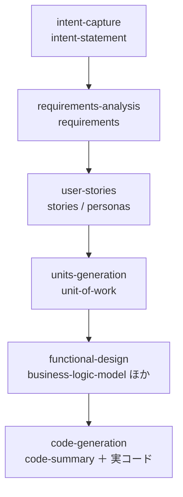
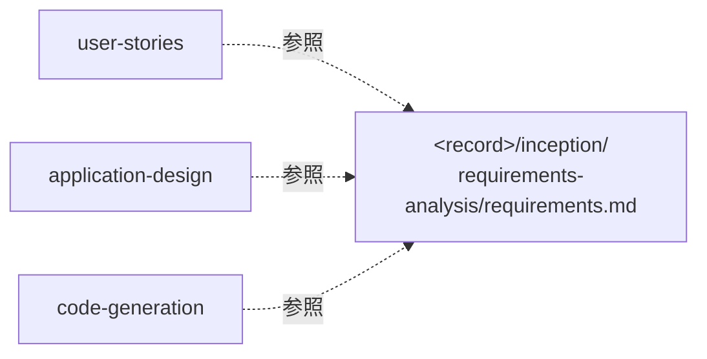

> **本記事の位置づけ** — 本記事は、`awslabs/aidlc-workflows` リポジトリの規範ルールおよび利用ガイドを素材として、筆者が AI を活用して読み解き、まとめた解釈です。AWS が公式に発表した方法論ではなく、一次資料の翻訳・要約でもありません。
>
> **シリーズ** — 本記事は [AIで紐解くAI-DLC v2](https://qiita.com/expensivegasprices/items/2daa87896110603252ad) シリーズの一部です。
>
> **参照した版** — **Claude Code 実装**を対象に、2026 年 6 月時点の v2.1.3（コミット `c95070e`、`core/`）を参照しています。Kiro・Codex 実装は対象外で、記述が異なる場合があります。OSS 実装は更新が続いているため、最新の状態は公式リポジトリをご確認ください。

---

## 概要

AI-DLC v2 の各ステージは、版管理された markdown の成果物を1つずつ作ります。意図（intent）から始まり、要件・ストーリー・作業単位・設計を経てコードへ。フェーズが進むほど成果物の抽象度は下がり、解像度が上がっていきます。この段階的な詳細化が、成果物の流れの骨格をかたちづくります。

成果物どうしは、安定IDを振って複写する方式ではつながりません。各ステージは上流の成果物を語彙名で名指しし、実体ファイルはそれを作った生産者のディレクトリに1か所だけ住みます。本記事では、名指しの連結・1成果物＝1生産者の不変条件・生産者ディレクトリへの配置・作業単位ごとのパス解決といった、成果物がどう作られ、どこに置かれ、どう名前でつながるかを読み解きます。

## 抽象度の勾配

AI-DLC v2 の5フェーズは、それぞれ固有の狙いと主要な成果（key outcome）を持ちます。方法論の原則ファイルがこれを表にしています。

| フェーズ | 狙い | 主要な成果（原文） |
| --- | --- | --- |
| 初期化（Initialization） | ブートストラップ | Configured workspace ready for workflow<br>（ワークフロー向けに構成済みのワークスペース） |
| 発想（Ideation） | 構想を検証する | **Approved initiative brief**<br>（承認された構想ブリーフ） |
| 構想（Inception） | 詳細化する | **Detailed execution plan**<br>（詳細な実行計画） |
| 構築（Construction） | 作る | **Working tested code**<br>（動作するテスト済みコード） |
| 運用（Operation） | デプロイ・運用する | Production system with monitoring<br>（監視付きの本番システム） |

「承認された構想 → 詳細な実行計画 → 動作するテスト済みコード」という並びが、そのまま抽象度の勾配になっています。各ステージが実際に作る成果物（フロントマターの `produces`）を順に並べると、勾配が見えてきます。



意図が要件になり、要件がストーリーになり、ストーリーが作業単位に分割され、設計を経てコードになる。原則ファイルが掲げる原則3が、この核を方法論自身の言葉で宣言しています。各ステージは版管理された markdown を記録として残し、完全な決定記録（complete decision record）をつくる、と。各段は前段を素材にして作られます。

## 名指しの連結と唯一の生産者

ステージのフロントマター（ファイル冒頭のメタ情報）には、成果物を扱う2つのフィールドがあります。`produces` はそのステージが作る成果物で、素の名前の配列です（例: `["requirements", "requirements-analysis-questions"]`）。`consumes` は必要とする上流成果物で、`{artifact, required, conditional_on?}` のオブジェクト配列です。

```yaml
produces:
  - requirements
consumes:
  - artifact: intent-statement
    required: false
```

`requirements-analysis` は `intent-statement`（発想フェーズの `intent-capture` が作った成果物）を**名前で**消費します。`required: false` は「あれば使う、なくても止めない」の意味です。なお、ここまでの2つは成果物の依存を表すフィールドですが、これとは別に順番の依存を表す `requires_stage` というフィールドもあります。この `produces` / `consumes` / `requires_stage` の宣言が、そのまま DAG（ステージを点、依存を矢印で表す、循環しない地図）のエッジになります。コンパイル済みのグラフは成果物をファイルパスではなく**語彙名**で保持し、生産者・消費者を引く関数も名前ベースです。

この連結が成り立つ前提が、**1つの成果物を `produces` するステージはちょうど1つ**という不変条件です。消費側はこの 1:1 を前提に、消費した成果物の生産者を一意に特定します（`producersOf(name)[0]` で確定）。実データでも確かめられ、全ステージの `produces` を集計すると**122個の成果物があり、同じ成果物を複数のステージが作る例は1つもありません**。グラフの検査（`validateScope`）は、生産者のいない consumes をエラーとして検出し、この 1:1 を守らせています。

連結の起点は `intent-capture` です。このステージの `consumes` は空配列で、何も消費しません。ここから下流のすべての成果物が、名指しの連鎖でつながっていきます。

## 生産者ディレクトリへの配置

語彙名だけでは、ファイルを開く側のコンダクター（LLM）は実体にたどり着けません。決定論的なエンジンが run-stage の指示（directive）を組むとき、名前を**実パス**に解決します。解決先は、アクティブな intent の記録ディレクトリ `aidlc/spaces/<space>/intents/<YYMMDD>-<label>/`（以下 `<record>`）の配下です。**消費される成果物は、それを消費するステージではなく、それを作ったステージのディレクトリに住む**。

- 非 per-unit（作業単位ごとに分かれない）の成果物: `<record>/<phase>/<slug>/<name>.md`
- 例: `application-design` が `requirements` を消費しても、パスは自分の下ではなく `<record>/inception/requirements-analysis/requirements.md`（生産者 `requirements-analysis` の下）に解決される



`requirements` を消費するステージが複数あっても、実体ファイルは生産者ディレクトリの1つだけ。消費側は全員その住所を名指しします。コピーは作られません。

AI-DLC v2 には「成果物に安定IDを振り、フェーズごとに複写（copy-forward）して履歴を残す」といった仕組みは**ありません**。`core/` と `CHANGELOG.md` を `copy-forward` / `stable id` / `provenance` で検索しても、該当する実装は出てきません。連結の実体は複写ではなく、**1か所に住み、語彙名で参照される**という、この物理配置と名指しの組み合わせそのものです。

## 作業単位ごとのパス解決

構築フェーズの一部のステージは、作業単位（Unit of Work）ごとに1回ずつ走ります。per-unit かどうかの判定の拠り所は、ノードのフロントマターの **`for_each: unit-of-work`** です。該当するのは5ステージ（`nfr-requirements` / `nfr-design` / `functional-design` / `infrastructure-design` / `code-generation`）。これらの成果物は、`construction/<unit>/` を挟んだパスに解決されます。

```
<record>/construction/<unit>/<slug>/<name>.md
```

`<unit>` というセグメントは、構造化された `produces` / `consumes` には一切現れません。フロントマターの配列はどこまでも素の名前で、作業単位のセグメントはエンジンがパスを組む瞬間に差し込まれます。

**この差し込みを、エンジンは作業単位ごとに回しながら行います。** コンパイル済みの作業単位 DAG があれば、エンジンは問い合わせのたびに**まだ成果物が揃っていない最初の作業単位**を選び、その**実名**を produces / consumes / memory のパスに差し込んだ run-stage を1つ発行します（解決済みの名前は `directive.unit` にも載ります）。「どこまで終わったか」の台帳は状態の追加フィールドではなく、ディスク上の成果物の有無で判定されるため、エンジンは読み取りのみ（read-only）のままです。リテラルのプレースホルダ `{unit-name}` が発行されるのは、作業単位 DAG が無いスコープやコンパイル前などの**フォールバックの場合だけ**に降格しました。

per-unit かどうかは、消費するステージではなく**所有者（生産者）の属性**で決まります。`functional-design`（per-unit）が `units-generation`（非 per-unit）の作った `unit-of-work` を消費するときは、所有者が per-unit でないため接頭辞は付かず `<record>/inception/units-generation/unit-of-work.md` に解決されます。住所はいつも所有者が決めるので、作業単位をまたいでも連結は壊れません。

なお、各ステージの `.md` が持つ `outputs:` フロントマターは、ランタイムでは**非 load-bearing**（実行時には参照されない＝パス契約ではなく説明用）です。エンジンは `outputs:` を読まず、`produces[]` の名前を記録ディレクトリへ解決します。`outputs:` はパス契約ではなくドキュメントだ、と core 自身が明記しています。解説 docs に残る旧 `aidlc-docs/...` 形式の配置説明と食い違う場合は、実装を正としてください。

> 作業単位ごとに run-stage を発行するあいだ、ステージの承認ゲートは全作業単位が揃うまで抑止されます。最後の作業単位の成果物が出そろった再入で初めて、ステージ単一の承認ゲートが1回提示されます。早期承認の拒否を含むこの挙動は、別記事「[承認ゲート](https://qiita.com/expensivegasprices/items/cd6827700443c9987fd7)」で扱います。

## リバースエンジニアリングの例外

「消費される成果物は生産者のディレクトリに住む」という規約には、ただ1つの例外があります。リバースエンジニアリングが作る9つの成果物だけは、記録ディレクトリではなく**空間レベルの codekb** `aidlc/spaces/<space>/codekb/<repo>/` に住みます。記録ディレクトリは1つの intent に紐づくのに対し、codekb は intent をまたいで永続するコードベースの知識ベースだからです。既存コードを下敷きにするときだけ消費される条件付き連結（`conditional_on: brownfield`）を含め、ブラウンフィールド固有の成果物群は別記事「[ブラウンフィールド](https://qiita.com/expensivegasprices/items/0a22742c273797429aee)」で扱います。

## ここまでの連結と、その先の検証

ここまで組んだ連なり（名指しの連結と生産者ディレクトリへの配置）は、フェーズの境界で「鎖」として検証されます。意図 → 要件 → ストーリー → 設計 → コード → テストが切れ目なくつながっているか。ただし、その**検証**自体は別記事「[フェーズ境界検証](https://qiita.com/expensivegasprices/items/f2f4e426dd542c5b6765)」で扱います。本記事が集中したのは、鎖の**素材**、すなわち成果物がどう作られ、どこに置かれ、どう参照されるかでした。素材が正しく連結されているからこそ、境界で鎖として検証できます。

名前からパスへの解決は、すべて決定論的なエンジンの仕事で、コンダクター（LLM）に再導出させません。`aidlc-orchestrate.ts` のコメントいわく、パスの組み立ては教科書的なツールの仕事であり、それを LLM に回すのは設計の主旨そのものを反転させてしまう。本記事が扱ったのはその解決の**結果**＝何がどこに住むかの規約で、解決の機構そのもの（問い合わせ・指示・報告）は別記事「[進行の中核](https://qiita.com/expensivegasprices/items/c3ac7c2223e5c7020d82)」で扱います。連結を保つ働きは保存のたびにもあり、上流成果物が本文で実際に参照されているかを助言として拾う仕組みは別記事「[センサー](https://qiita.com/expensivegasprices/items/5f8dbb62f25c1a09a257)」で、成果物の作成・更新の記録は別記事「[状態と監査](https://qiita.com/expensivegasprices/items/72234648bb4400cedf53)」で扱います。

## 参照元

| ファイル | 内容 |
| --- | --- |
| [`core/knowledge/aidlc-shared/ai-dlc-principles.md`](https://github.com/awslabs/aidlc-workflows/blob/v2.1.3/core/knowledge/aidlc-shared/ai-dlc-principles.md) | 5フェーズの狙いと主要な成果。原則3「Traceable artifacts」 |
| [`core/tools/aidlc-orchestrate.ts`](https://github.com/awslabs/aidlc-workflows/blob/v2.1.3/core/tools/aidlc-orchestrate.ts) | 成果物パスの解決。`resolveArtifactPath`（住所＝所有者の下）・`resolveConsumePath`（生産者は 1:1 で `[0]` 確定）・`isPerUnit`／`{unit-name}` の差し込み・`buildRunStageDirective`（発行時に名前→パス） |
| [`core/tools/aidlc-graph.ts`](https://github.com/awslabs/aidlc-workflows/blob/v2.1.3/core/tools/aidlc-graph.ts) | グラフは成果物を語彙名で保持。`producersOf`／`consumersOf`（名前で引く）・`validateScope`（生産者のいない consumes をエラー化し 1:1 を守らせる） |
| [`core/aidlc-common/stages/inception/requirements-analysis.md`](https://github.com/awslabs/aidlc-workflows/blob/v2.1.3/core/aidlc-common/stages/inception/requirements-analysis.md) | `produces`／`consumes`（`conditional_on: brownfield` 付き）の実例 |
| [`core/aidlc-common/stages/ideation/intent-capture.md`](https://github.com/awslabs/aidlc-workflows/blob/v2.1.3/core/aidlc-common/stages/ideation/intent-capture.md) | 鎖の起点。`consumes: []`（何も消費しない） |
| [`core/aidlc-common/stages/construction/functional-design.md`](https://github.com/awslabs/aidlc-workflows/blob/v2.1.3/core/aidlc-common/stages/construction/functional-design.md) | per-unit ステージ（`for_each: unit-of-work`）の実例 |
| [`core/aidlc-common/stages/construction/code-generation.md`](https://github.com/awslabs/aidlc-workflows/blob/v2.1.3/core/aidlc-common/stages/construction/code-generation.md) | per-unit の終端。`outputs:` が記録ディレクトリ相対で engine-resolved である旨を明記 |
| [`core/sensors/aidlc-upstream-coverage.md`](https://github.com/awslabs/aidlc-workflows/blob/v2.1.3/core/sensors/aidlc-upstream-coverage.md) | `consumes:` の上流成果物が出力本文で参照されているかを保存ごとに検査 |
| [`CHANGELOG.md`](https://github.com/awslabs/aidlc-workflows/blob/v2.1.3/CHANGELOG.md) | 語彙名→記録ディレクトリ解決、生産者が住所を持つ規約、per-unit `for_each` のエンジン駆動（2.1.2）、codekb 配置の導入経緯 |

---

## 関連記事

**前の記事**: [深さ](https://qiita.com/expensivegasprices/items/f2246466b9e3bdef570b)
**次の記事**: [ウォーキングスケルトン](https://qiita.com/expensivegasprices/items/7a24030b9d8905f379ed)
**目次**: [AIで紐解くAI-DLC v2](https://qiita.com/expensivegasprices/items/2daa87896110603252ad)
