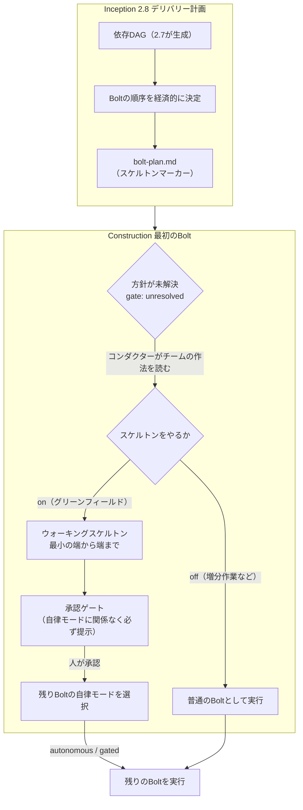

> **本記事の位置づけ** — 本記事は、`awslabs/aidlc-workflows` リポジトリの規範ルールおよび利用ガイドを素材として、筆者が AI を活用して読み解き、まとめた解釈です。AWS が公式に発表した方法論ではなく、一次資料の翻訳・要約でもありません。
>
> **シリーズ** — 本記事は [AIで紐解くAI-DLC v2](https://qiita.com/takeshishimada/items/2daa87896110603252ad) シリーズの一部です。
>
> **参照した版** — **Claude Code 実装**を対象に、2026 年 8 月 4 日時点のコミット `c73ee984`（AIDLC_VERSION 2.5.37、`core/`）を参照しています。Claude Code 以外の実装（Kiro CLI／Kiro IDE／Codex CLI／opencode）は対象外で、記述が異なる場合があります。OSS 実装は更新が続いているため、最新の状態は公式リポジトリをご確認ください。

---

## 概要

ウォーキングスケルトンは、Construction（構築）フェーズの最初の Bolt を、すべてのアーキテクチャ層にまたがる、最小の端から端までの一本にする手順です。機能を足し始める前に、表示からデータまで全層を縦に通す実装を先に1本作り、各層のつなぎ目が正しく働くことを確かめます。

AI-DLC v2 では、これは設計上の推奨にとどまらず、ワークフローに組み込まれた手順になっています。最初の Bolt は自律モードの設定に関わらず必ず人の承認ゲートを通り、その直後に残りの進め方を人が選びます。本記事では、最初の Bolt がいつ計画され、どう判定され、どこで人の判断が入るのかを読み解きます。

## ウォーキングスケルトンとは

新しいシステムを層ごとに作り込んでから最後にまとめて結合すると、各層のつなぎ目の不具合が終盤まで表に出ません。ウォーキングスケルトンはこの順序を逆にします。機能は最小限でも、全層をつないだ実装を最初に1本通し、すべてのつなぎ目（integration point）が正しく働くことを先に確かめます。土台が端から端まで動くことを確認してから、残りの機能を後続の Bolt で足していきます。考え方の出典は Alistair Cockburn の『Crystal Clear』です。

ここでいう Bolt（構築の実行単位）とは、Construction の設計からコード生成までのステージ（3.1〜3.5）を、1つの作業単位（Unit of Work）または依存でつながった小群について1回通す、デプロイ可能なまとまりです。ビルド・テスト（3.6）と CI パイプライン（3.7）は Bolt ごとではなく、全 Bolt が終わったあとに1回だけ走ります。最初の Bolt が、このウォーキングスケルトンにあたります。

## 全体像

```mermaid
flowchart TD
    subgraph INC["Inception 2.8 デリバリー計画"]
        direction TB
        DAG["依存DAG（2.7が生成）"] --> SEQ["Boltの順序を経済的に決定"]
        SEQ --> PLAN["bolt-plan.md<br/>（スケルトンマーカー）"]
    end
    INC --> CON
    subgraph CON["Construction 最初のBolt"]
        direction TB
        UNRES{"方針が未解決<br/>gate: unresolved"}
        UNRES -->|"コンダクターがチームの作法を読む"| STANCE{"スケルトンをやるか"}
        STANCE -->|"off（増分作業など）"| NORMAL["普通のBoltとして実行"]
        STANCE -->|"on（グリーンフィールド）"| SKEL["ウォーキングスケルトン<br/>最小の端から端まで"]
        SKEL --> GATE["承認ゲート<br/>（自律モードに関係なく必ず提示）"]
        GATE -->|"人が承認"| LADDER["残りBoltの自律モードを選択"]
    end
    LADDER -->|"autonomous / gated"| REST["残りのBoltを実行"]
    NORMAL --> REST
```

## 計画が決まるタイミング

どの Bolt をウォーキングスケルトンにするかは、Inception（構想）フェーズの最後のステージ、**デリバリー計画**（2.8）で決まります。ここで Bolt の実行順序が組まれ、最初に置く Bolt にスケルトンマーカーが付けられます。

Bolt をどの順で作るかは、**依存関係を満たす範囲で、価値やリスクの優先度から決まります**。作業単位の生成（2.7）が依存関係の DAG（作業単位どうしの前後関係を矢印でつないだ図）を作り、デリバリー計画（2.8）がそこを通る経路を選びます。依存の前後だけで機械的に並ぶ順（トポロジカルソート）ではなく、DAG からは導けない人の判断が入るところです。順序の決め方は複数あり、その一つが walking-skeleton-first です（ほかに risk-first、value-first、WSJF（重み付き最短ジョブ優先）、これらを組み合わせる形）。

決定はデリバリー計画の成果物に記録されます。スケルトンと順序づけに直接効くのは、次の表の上2つです。

| 成果物 | 内容 |
| --- | --- |
| `bolt-plan.md` | Bolt の順序。スケルトンにあたる Bolt にはスケルトンマーカーが付き、Definition of Done と確信仮説を併記する |
| `risk-and-sequencing-rationale.md` | なぜその順序かの根拠。依存だけで決まる順序から外す場合はその正当化を必ず書く |
| `team-allocation.md` | どの Bolt をどのチーム（共同で担当する少人数のまとまり）が担当するか |
| `external-dependency-map.md` | 外部依存の地図 |

ここでいう確信仮説（confidence hypothesis）とは、その Bolt を出荷すると検証または反証できる、観測可能な振る舞いです（例「1k-rps の負荷でレイテンシ 200ms 未満」）。スケルトンマーカーの付いた Bolt には、何を証明する1本なのかがこの形で添えられます。

## 最初の Bolt のゲート通過

Construction に入ると、最初の Bolt（ウォーキングスケルトン）には特別な承認ゲートが置かれます。このゲートは、後続の Bolt を自律で走らせる設定にしていても、**最初の Bolt では必ず人の承認を求めます**。

ゲートは、その Bolt の **設計成果物と生成コードをまとめて** 対象にします。機能を足し始める前に、土台の形を人の目で確かめておくためです。このゲートを自動で通す手段はありません。ゲートでの差し戻しや「現状で承認」といった判断の仕組みは、別記事「[承認ゲート](https://qiita.com/takeshishimada/items/cd6827700443c9987fd7)」で扱います。

## 自律モードの選択

ウォーキングスケルトンのゲートが承認された **直後に1回だけ**、コンダクターは「残りの Bolt をどう走らせるか」を問います。答えは自律モード（autonomy mode）として `aidlc-state.md` の `Construction Autonomy Mode` に記録され、以降の進め方を決めます。選択肢は2つです。

- **autonomous（自律）** — 残りの Bolt をゲートなしで走らせる
- **gated（毎 Bolt 承認）** — Bolt ごと（並列バッチならバッチごと）に承認ゲートを置く

`gated` ならスケルトン以後の Bolt にもゲートが出て、`autonomous` ならゲートは省かれます。ただし **コード生成が失敗したときは、モードに関わらず必ず停止して人に問い合わせます**（halt-and-ask）。autonomous を選んでも、この停止だけは省けません。

最初の1本は必ず人が確認し、その経験を踏まえてどこまで自律に任せるかを選びます。ゲートと選択を直後に組み合わせているのは、この二段構えを成り立たせるためです。autonomous モードで独立した Bolt を並列に走らせる仕組みは別記事「[並列実行](https://qiita.com/takeshishimada/items/d179ca1bde4b047adf6f)」で、どこまで自律に寄せるかという運用上の見極めは別記事「[導入判断](https://qiita.com/takeshishimada/items/cef6755e8e23a557f4de)」で扱います。

## スタンスの判定

最初の Bolt をスケルトンにするかどうかは、コードからは決められません。「このチームはウォーキングスケルトンをやるのか」というスケルトンのスタンス（skeleton stance）に属する判断だからです。スタンスは `on` / `off` / `scope-dependent` の3値のいずれかを取り、状態ファイル `aidlc-state.md` の `Skeleton Stance` フィールドに記録されます。チームが自由記述で書いた作法を、システムが扱えるこの3値に対応づけたものです。

判定の流れはこうです。

1. エンジンは最初の Bolt の指示（directive）に真偽値を入れず、`gate: "unresolved"` を付けて判断を保留する。機械的な解析では決められないことを明示する。
2. コンダクターが `## Walking Skeleton` の記述を、解決順 `memory/org.md → memory/team.md → memory/project.md`（最も具体的な層の、空でない記述が勝つ）で読み、スタンスを分類する。「always」「グリーンフィールドでは毎回」は `on`、「never」は `off`、「未指定」「team 層が空」は `scope-dependent`（スコープ別の既定にフォールバック）。
3. `report --skeleton-stance <on|off|scope-dependent>` でエンジンに返す。エンジンが記録し、確定したゲート付きで同じ Bolt を再発行する。

決定論的に動くエンジンが自分では決めず、コンダクターに判断を委ねるのは、このスタンスの判定だけです。エンジンとコンダクターの分担という観点での位置づけは、別記事「[進行の中核](https://qiita.com/takeshishimada/items/c3ac7c2223e5c7020d82)」で扱います。

`scope-dependent` のときに使うスコープ別の既定（`memory/org.md`）は次のとおりです。

| スコープ | 既定のスタンス |
| --- | --- |
| `skeleton: on`（`mvp` / `enterprise` / `feature` / `poc` / `workshop` / `infra`） | スケルトンを最初に走らせる（単独・ゲート付き） |
| `skeleton: off`（`bugfix` / `refactor` / `security-patch`） | スケルトンの手順をスキップ（最初の Bolt も普通の Bolt として実行） |

`skeleton: off` の3つが既存コードへの増分作業で、スキップするのは、ゼロから立ち上げる対象が無いからです。既存のコードはすでに各層がつながって動いているので、スケルトンを通し直す意味がありません。

方針が競合したときは、チームが定めた作法（practices。後述）が勝ちます。`bolt-plan.md` がある Bolt にスケルトンマーカーを付けていても、チームの作法が現在のスコープで skeleton-off と言っているなら、コンダクターはマーカーではなく作法からスタンスを判定し、`PRACTICES_OVERRIDE` を監査イベントに記録します。作法はチームが恒常的に定めたものであり、bolt-plan のマーカーは一回のワークフローの解釈にすぎないからです。

なお上表は、各スコープのファイルが持つ `skeleton:` フィールドを集計したものです。スケルトンを敷くかどうかは、コード側がスコープ名を列挙して決めるのではなく、スコープ定義の側が持つデータで決まります。スコープを増やしても、そのファイルに `skeleton:` を書けばこの表に加わります。

## スタンスの出どころ

判定の材料になる `## Walking Skeleton` の記述自体は、Inception の practices-discovery（作法の発見）ステージで埋まります。これはチームの5つの実践領域（`Way of Working`／`Walking Skeleton`／`Testing Posture`／`Deployment`／`Code Style`）の一つで、承認ゲートを経て `memory/team.md` と `memory/project.md` に書き込まれます。

ウォーキングスケルトンのスタンスは、テスト姿勢やコードスタイルと違ってコードからはほぼ読み取れません（チームの判断事項だからです）。そのため既存コードベースを扱う場合でも、証拠で埋まらないギャップとして明示的に質問される項目になっています。ブラウンフィールドでの扱いは別記事「[ブラウンフィールド](https://qiita.com/takeshishimada/items/0a22742c273797429aee)」で扱います。

## 参照元

| ファイル | 内容 |
| --- | --- |
| [`aidlc-common/stages/inception/delivery-planning.md`](https://github.com/awslabs/aidlc-workflows/blob/c73ee984/core/aidlc-common/stages/inception/delivery-planning.md) | デリバリー計画。ウォーキングスケルトンの定義、経済的な Bolt 順序、`bolt-plan.md` のマーカーと確信仮説 |
| [`aidlc-common/protocols/stage-protocol.md`](https://github.com/awslabs/aidlc-workflows/blob/c73ee984/core/aidlc-common/protocols/stage-protocol.md) | ステージプロトコル。ウォーキングスケルトン・ゲート、自律モードの選択、halt-and-ask |
| [`aidlc-common/conductor.md`](https://github.com/awslabs/aidlc-workflows/blob/c73ee984/core/aidlc-common/conductor.md) | コンダクターの行動規範。`gate: "unresolved"` の分類手順と `PRACTICES_OVERRIDE` |
| [`aidlc-common/stages/inception/practices-discovery.md`](https://github.com/awslabs/aidlc-workflows/blob/c73ee984/core/aidlc-common/stages/inception/practices-discovery.md) | 作法の発見。`## Walking Skeleton` のスタンスの収集と承認ゲート |
| [`memory/org.md`](https://github.com/awslabs/aidlc-workflows/blob/c73ee984/core/memory/org.md) | 組織レベルの既定値。スコープ別のスタンス |
| [`knowledge/aidlc-delivery-agent/workflow-planning-guide.md`](https://github.com/awslabs/aidlc-workflows/blob/c73ee984/core/knowledge/aidlc-delivery-agent/workflow-planning-guide.md) | デリバリーエージェントの計画ガイド。walking-skeleton-first の順序づけ（Cockburn） |

---

## 関連記事

**前の記事**: [成果物の流れ](https://qiita.com/takeshishimada/items/46feb553f907f9eedd14)
**次の記事**: [ブラウンフィールド](https://qiita.com/takeshishimada/items/0a22742c273797429aee)
**目次**: [AIで紐解くAI-DLC v2](https://qiita.com/takeshishimada/items/2daa87896110603252ad)
