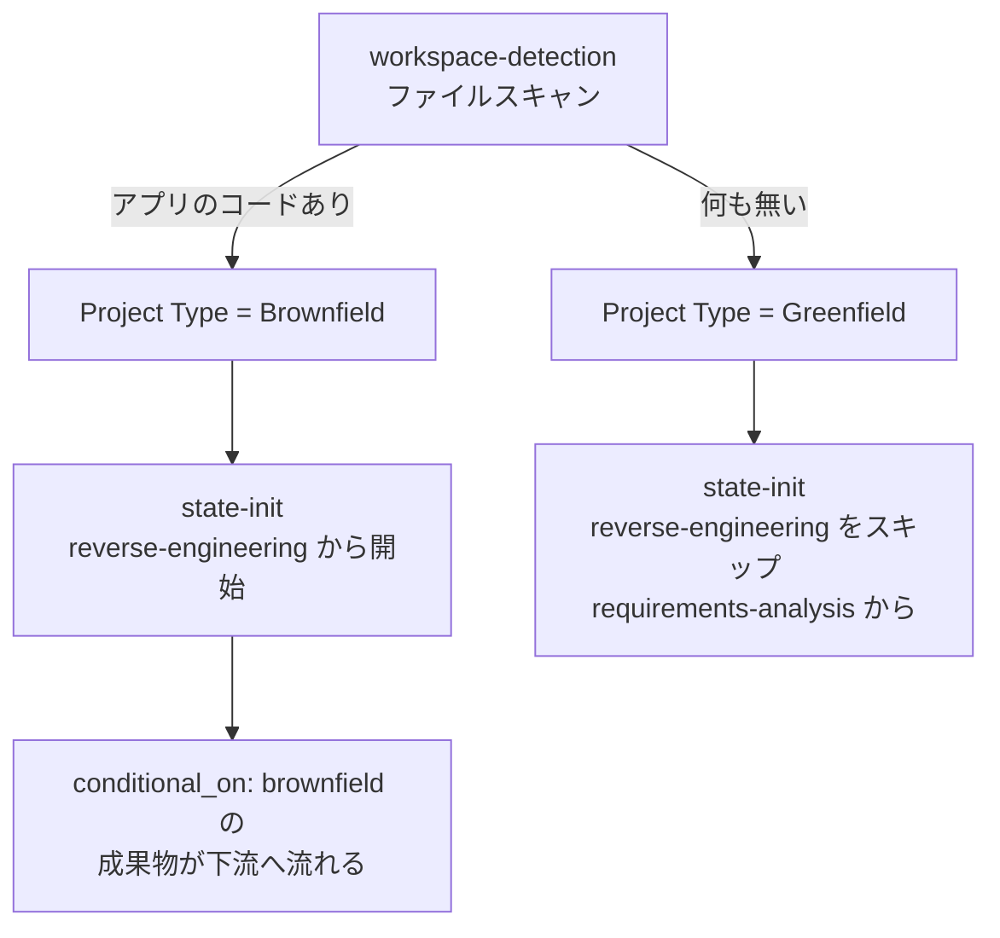
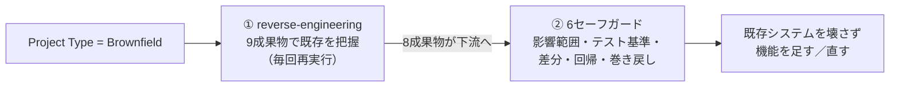

> **本記事の位置づけ** — 本記事は、`awslabs/aidlc-workflows` リポジトリの規範ルールおよび利用ガイドを素材として、筆者が AI を活用して読み解き、まとめた解釈です。AWS が公式に発表した方法論ではなく、一次資料の翻訳・要約でもありません。
>
> **シリーズ** — 本記事は [AIで紐解くAI-DLC v2](https://qiita.com/takeshishimada/items/2daa87896110603252ad) シリーズの一部です。
>
> **参照した版** — **Claude Code 実装**を対象に、2026 年 6 月時点の v2.1.3（コミット `c95070e`、`core/`）を参照しています。Kiro・Codex 実装は対象外で、記述が異なる場合があります。OSS 実装は更新が続いているため、最新の状態は公式リポジトリをご確認ください。

---

## 概要

ブラウンフィールドとは、すでに動いているコードベースを起点にする工程です。AI-DLC v2 はまっさらな新規開発（グリーンフィールド）だけでなく、既存システムへの機能追加や修正も正面から扱い、その分岐を状態ファイルの `Project Type` という1フィールドで決めます。ブラウンフィールドと判定されると、既存コードを理解し直すリバースエンジニアリングと、動いているものを壊さずに改変するためのセーフガードが、ワークフローへ自動で組み込まれます。

本記事では、この分岐がどう決まり、ブラウンフィールドのときに何が足されるのかを、リバースエンジニアリングとセーフガードという二本柱に沿って読み解きます。

## ブラウンフィールドとは

新規開発なら「ゼロから作る」だけで済みます。一方、既存システムでは「今あるものを正しく把握する」「それを壊さない」という2つの仕事が先に加わります。AI-DLC v2 はこの2つを、ワークフローの分岐として組み込んでいます。

ブラウンフィールドで足される仕事は、次の二本柱に集約されます。

1. **既存コードを理解し直す** — リバースエンジニアリング
2. **既存コードを壊さず改変する** — 6つのセーフガード

どちらも、新規開発には存在しない既存システム特有の前提です。

## 切り替えの決まり方

ブラウンフィールドかどうかは、人が宣言するのではなく決定論的に判定されます。鍵を握るのは状態ファイルの `Project Type` フィールドで、`Greenfield` か `Brownfield` のいずれかが入ります。この1フィールドが、以降の分岐をすべて決めます。決まり方は3段階です。

**ファイルスキャンで判定する。** 初期化フェーズの workspace-detection ステージがファイルシステムをスキャンし、分類します。ソースコードファイル（`.ts`／`.py`／`.java` …）、アプリのフレームワーク設定、アプリ依存を含むパッケージマニフェスト（非 dev 依存のある package.json、requirements.txt …）の**いずれか**があればブラウンフィールド、すべて無ければグリーンフィールドです。README、`.gitignore`、LICENSE、CI 雛形、ハーネスディレクトリ（`.claude/` など）、ワークスペースの記録ツリー `aidlc/` は、あってもブラウンフィールドにはしません。判定基準は「アプリのコードがあるか」の一点です。

**判定結果でルーティングする。** state-init ステージが判定を受けて、最初の構想ステージを分岐させます。ブラウンフィールドなら reverse-engineering から始め、グリーンフィールドなら reverse-engineering をスキップして requirements-analysis から始めます。

**エンジンが消費を絞り込む。** 下流ステージが読み込む成果物（consumes）には、`conditional_on: brownfield` という印が付いたものがあります。エンジンは状態ファイルの `Project Type` と一致する印のエントリだけを取り込みます。つまり「ブラウンフィールドのときだけ既存理解の成果物を読む」が、プロンプトではなく決定論的なツールで保証されます。

この条件分岐は「プロジェクトタイプで切り替わる」もので、案件の重さに応じて工程を出し入れするスコープとは別軸の制御です。スコープによる工程の選択は別記事「[スコープ](https://qiita.com/takeshishimada/items/c232fb2e994e7b567a5c)」で扱います。

## ① 既存理解の再構築

ブラウンフィールドで最初に走るのが reverse-engineering（リバースエンジニアリング）ステージです。既存コードを読み解き、「このシステムは何で、どう作られているか」を成果物として書き起こします。

### 毎回やり直す理由

このステージの定義ファイル冒頭は、実行条件を `execution: CONDITIONAL` と宣言し、その条件を「ブラウンフィールドのときだけ実行し、鮮度のため毎回再実行し、グリーンフィールドではスキップする」と記しています。一度作った理解の文書をキャッシュとして使い回さず、走るたびに作り直すのがこのステージの特徴です。既存コードは人の手で変わり続けるため、古い理解のまま設計を進めると判断を誤るからです。主担当はデベロッパー、補佐はアーキテクトで、コードを読む役と設計に翻訳する役の2段構えになっています。

### 作る成果物

デベロッパーがコードベース全体をスキャンし、その結果をアーキテクトが**9つの成果物**へ統合します。

| # | 成果物 | 中身 |
| --- | --- | --- |
| 1 | business-overview | 業務ドメイン・目的・主要機能 |
| 2 | architecture | システム構成・パターン・部品関係（相互作用図を含む）|
| 3 | code-structure | パッケージ／モジュール構成・ファイル分類・コードパターン |
| 4 | api-documentation | 外部／内部 API の表面・エンドポイント・契約 |
| 5 | component-inventory | 全コンポーネントの責務と依存 |
| 6 | technology-stack | 言語・フレームワーク・ライブラリ（バージョン付き）|
| 7 | dependencies | 外部依存・パッケージ間の内部依存 |
| 8 | code-quality-assessment | テストカバレッジ・lint・CI／CD・技術的負債 |
| 9 | reverse-engineering-timestamp | いつ実行したか（日付・コミットハッシュ・解析範囲）|

9番目の timestamp は、中身の知識ではなく「この理解はいつ時点のものか」を記録するメタ成果物で、先述の「毎回再実行で鮮度を保つ」運用を支える裏側の仕掛けです。

作るのは9件ですが、下流に流れるのは8件です。timestamp はメタ情報なので下流ステージは消費せず、後続の practices-discovery などが受け取るのは「reverse-engineering の8成果物」です。下流はこれらを `conditional_on: brownfield` で受け取り、ブラウンフィールドのときだけ既存理解を踏まえた要件・設計へ進みます。

なお、これら9成果物は、ほかの成果物と違って、intent（作業の記録単位）をまたいで共有される空間レベルの codekb（コードの知識ベース、`aidlc/spaces/<space>/codekb/<repo>/`）に住みます。成果物レイアウトの唯一の例外にあたるこの扱いは、別記事「[成果物の流れ](https://qiita.com/takeshishimada/items/46feb553f907f9eedd14)」で扱います。reverse-engineering が工程カタログ上のどこに位置するかは別記事「[工程とエージェント](https://qiita.com/takeshishimada/items/418d7b9e17192e8add85)」で扱います。

## ② 既存コード改変のセーフガード

既存システムへの改変は「動いているものを壊す」リスクと隣り合わせです。AI-DLC v2 は、既存コードや基盤を変更するステージに対して**6つのセーフガード**を定義しています。権威ある定義は `brownfield.md` の Safeguard Matrix にあり、各ステージ本文とナレッジが運用面の詳細を補います。

### セーフガードのマトリクス

| セーフガード | 何をするか | 効く段階 |
| --- | --- | --- |
| Blast Radius Analysis | 影響を受けるファイル／部品と、その下流依存を特定する | コード生成前（code-generation, 3.5）|
| Diff Preview | 適用前に、提案する変更差分そのものを見せる | あらゆるファイル変更の前 |
| Test Baseline | 変更前に既存テストを走らせ、基準値を取る | コード生成前（code-generation, 3.5）|
| Test Validation | 変更後に既存テストを再実行し、壊れていないか確認する | コード生成後（build-and-test, 3.6）|
| Impact Analysis | 影響を受ける API・部品・依存を文書化する | reverse-engineering（2.1）と code-generation（3.5）|
| Rollback Plan | 必要なら変更をどう巻き戻すかを文書化する | デプロイ前（deployment-execution, 4.3）|

このマトリクスは、6つのセーフガードを工程のタイムライン上に配置しています。理解の段階（2.1）で影響範囲を文書化し、コード生成の前（3.5）で爆発半径とテスト基準を確認し、生成の後（3.6）で回帰がないか確かめ、デプロイ前（4.3）で巻き戻し手順を用意する。変更の前・最中・後・デプロイ前のそれぞれに確認点（チェックポイント）を置く設計です。

### 手順テンプレート

6つのうち2つは、マトリクスに手順テンプレートまで添えられています。

**Blast Radius Analysis**（爆発半径分析）は、既存コードを変更する前に、変更されるファイルをすべて列挙し、各ファイルの imports／consumers・テストファイル・設定参照を洗い出します。影響を **low**（孤立した変更）／**medium**（2〜3の依存先に波及）／**high**（横断的）に分類し、着手前に影響サマリを人へ提示します。

**Test Baseline Protocol**（テスト基準プロトコル）は、どんな変更よりも先にテストスイート全体を走らせ、総数・成功・失敗・スキップ・カバレッジを記録します。コード生成後に再実行し、新たな失敗を今回の変更が入れた回帰とみなして、先に進む前に直します。

この2つは「変更前のスナップショット」を取るセーフガードです。Blast Radius が空間的な影響範囲を、Test Baseline が時間的な前後比較を記録し、改変の影響を「どこまで広がるか」と「壊していないか」の両面から確認します。なお、Blast Radius という観点は設計レビュアーのコア質問にも登場しますが、その詳細は別記事「[レビュアー](https://qiita.com/takeshishimada/private/624d83e946e86e4b1553)」で扱います。

## 二本柱としての全体像

ブラウンフィールドで AI-DLC v2 が足す仕事は、結局このひと組に集約されます。

新規開発が「ゼロから作る」だけなのに対し、既存システムでは理解し直し（①）と壊さず改変（②）が前段に入ります。`Project Type` がブラウンフィールドと判定された瞬間に、この二本柱が、AI-DLC v2 のブラウンフィールド対応として自動で工程に組み込まれます。

## 参照元

| ファイル | 内容 |
| --- | --- |
| [`core/knowledge/aidlc-shared/brownfield.md`](https://github.com/awslabs/aidlc-workflows/blob/v2.1.3/core/knowledge/aidlc-shared/brownfield.md) | 6セーフガードの権威ある定義（Safeguard Matrix・Blast Radius テンプレート・Test Baseline プロトコル）|
| [`aidlc-common/stages/inception/reverse-engineering.md`](https://github.com/awslabs/aidlc-workflows/blob/v2.1.3/core/aidlc-common/stages/inception/reverse-engineering.md) | リバースエンジニアリングステージ。CONDITIONAL 実行条件・lead/support・9成果物 |
| [`core/knowledge/aidlc-developer-agent/re-artifacts.md`](https://github.com/awslabs/aidlc-workflows/blob/v2.1.3/core/knowledge/aidlc-developer-agent/re-artifacts.md) | RE 成果物のナレッジ。9成果物の定義とスキャン／統合テンプレート |
| [`core/knowledge/aidlc-shared/state-template.md`](https://github.com/awslabs/aidlc-workflows/blob/v2.1.3/core/knowledge/aidlc-shared/state-template.md) | 状態ファイルの雛形。`Project Type`（Greenfield/Brownfield）フィールド |
| [`aidlc-common/stages/initialization/workspace-detection.md`](https://github.com/awslabs/aidlc-workflows/blob/v2.1.3/core/aidlc-common/stages/initialization/workspace-detection.md) | greenfield／brownfield の決定論的な判定基準 |
| [`aidlc-common/stages/initialization/state-init.md`](https://github.com/awslabs/aidlc-workflows/blob/v2.1.3/core/aidlc-common/stages/initialization/state-init.md) | プロジェクトタイプによる最初の構想ステージのルーティング |
| [`aidlc-common/stages/inception/practices-discovery.md`](https://github.com/awslabs/aidlc-workflows/blob/v2.1.3/core/aidlc-common/stages/inception/practices-discovery.md) | 下流が RE の8成果物を `conditional_on: brownfield` で消費する例 |
| [`aidlc-common/stages/construction/code-generation.md`](https://github.com/awslabs/aidlc-workflows/blob/v2.1.3/core/aidlc-common/stages/construction/code-generation.md) | ブラウンフィールドはその場での改変（in-place）・重複コピー禁止 |
| [`core/agents/aidlc-architecture-reviewer-agent.md`](https://github.com/awslabs/aidlc-workflows/blob/v2.1.3/core/agents/aidlc-architecture-reviewer-agent.md) | Blast Radius が設計レビュアーのコア質問にも現れる点 |
| [`CHANGELOG.md`](https://github.com/awslabs/aidlc-workflows/blob/v2.1.3/CHANGELOG.md) | エンジンが `conditional_on: brownfield/greenfield` を Project Type で絞り込む |

---

## 関連記事

**前の記事**: [ウォーキングスケルトン](https://qiita.com/takeshishimada/items/7a24030b9d8905f379ed)
**次の記事**: [承認ゲート](https://qiita.com/takeshishimada/private/cd6827700443c9987fd7)
**目次**: [AIで紐解くAI-DLC v2](https://qiita.com/takeshishimada/items/2daa87896110603252ad)
