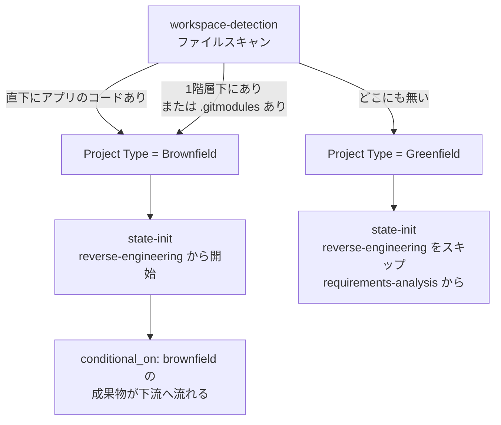
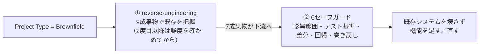

> **本記事の位置づけ** — 本記事は、`awslabs/aidlc-workflows` リポジトリの規範ルールおよび利用ガイドを素材として、筆者が AI を活用して読み解き、まとめた解釈です。AWS が公式に発表した方法論ではなく、一次資料の翻訳・要約でもありません。
>
> **シリーズ** — 本記事は [AIで紐解くAI-DLC v2](https://qiita.com/takeshishimada/items/2daa87896110603252ad) シリーズの一部です。
>
> **参照した版** — **Claude Code 実装**を対象に、2026 年 8 月 4 日時点のコミット `c73ee984`（AIDLC_VERSION 2.5.37、`core/`）を参照しています。Claude Code 以外の実装（Kiro CLI／Kiro IDE／Codex CLI／opencode）は対象外で、記述が異なる場合があります。OSS 実装は更新が続いているため、最新の状態は公式リポジトリをご確認ください。

---

## 概要

ブラウンフィールドとは、すでに動いているコードベースを起点にする工程です。AI-DLC v2 は新規開発（グリーンフィールド）だけでなく、既存システムへの機能追加や修正も正面から扱い、その分岐を状態ファイルの `Project Type` フィールドで決めます。ブラウンフィールドと判定されると、既存コードを理解し直すリバースエンジニアリングと、動いているものを壊さずに改変するためのセーフガードが、ワークフローへ自動で組み込まれます。

本記事では、この分岐がどう決まり、ブラウンフィールドのときに何が足されるのかを、リバースエンジニアリングとセーフガードという二本柱に沿って読み解きます。

## ブラウンフィールドとは

新規開発なら「ゼロから作る」だけで済みます。一方、既存システムでは「今あるものを正しく把握する」「それを壊さない」という2つの仕事が先に加わります。AI-DLC v2 はこの2つを、ワークフローの分岐として組み込んでいます。

ブラウンフィールドで足される仕事は、次の二本柱に集約されます。

1. **既存コードを理解し直す** — リバースエンジニアリング
2. **既存コードを壊さず改変する** — 6つのセーフガード

どちらも、新規開発には存在しない既存システム特有の仕事です。

## 切り替えの決まり方

ブラウンフィールドかどうかは、人が宣言するのではなく決定論的に判定されます。鍵を握るのは状態ファイルの `Project Type` フィールドで、`Greenfield` か `Brownfield` のいずれかが入ります。この1フィールドが、以降の分岐をすべて決めます。決まり方は3段階です。

**ファイルスキャンで判定する。** 初期化フェーズの workspace-detection ステージがファイルシステムをスキャンし、分類します。ソースコードファイル（`.ts`／`.py`／`.java` …）、アプリのフレームワーク設定、アプリ依存を含むパッケージマニフェスト（非 dev 依存のある package.json、requirements.txt …）、`src/` や `app/` のようなソース置き場のディレクトリ。この**いずれか**があればブラウンフィールドです。README、`.gitignore`、LICENSE、CI 雛形、ハーネスディレクトリ（`.claude/` など）、ワークスペースの記録ツリー `aidlc/` は、あってもブラウンフィールドにはしません。判定基準は「アプリのコードがあるか」の一点です。

見に行くのは直下と、`src/` や `app/` といった既知のソース置き場です。**それでも終わりではありません**。どの手がかりも無いときは、**サブディレクトリを1階層だけ見に行きます**。ソースが `backend/` のような入れ子に置かれたプロジェクトを、空だと誤判定しないためです。見つかった場所は `Nested Root` として監査に残ります。

もう1つ、**`.gitmodules` があってサブモジュールの登録が読み取れれば、それだけでブラウンフィールド**です。サブモジュール未取得の状態はディレクトリが空になるため、中身だけを見ているとグリーンフィールドと誤判定され、既存コードの理解がまるごと飛ばされます。登録の有無で判定するのはこれを避けるためです。未取得のときは取得を促す警告が出ます（言語の判定は取得するまで不明のままで、そこは正直に不明と報告されます）。

**判定結果でルーティングする。** state-init ステージが判定を受けて、最初の構想ステージを分岐させます。ブラウンフィールドなら reverse-engineering から始め、グリーンフィールドなら reverse-engineering をスキップして requirements-analysis から始めます。

**エンジンが消費を絞り込む。** 下流ステージが読み込む成果物（consumes）には、`conditional_on: brownfield` という条件が付いたものがあります。エンジンは状態ファイルの `Project Type` と一致する条件のエントリだけを取り込みます。つまり「ブラウンフィールドのときだけ既存理解の成果物を読む」が、プロンプトではなく決定論的なツールで保証されます。

```mermaid
flowchart TD
    A[workspace-detection<br/>ファイルスキャン] -->|直下にアプリのコードあり| B[Project Type = Brownfield]
    A -->|1階層下にあり<br/>または .gitmodules あり| B
    A -->|どこにも無い| C[Project Type = Greenfield]
    B --> D[state-init<br/>reverse-engineering から開始]
    C --> E[state-init<br/>reverse-engineering をスキップ<br/>requirements-analysis から]
    D --> F[conditional_on: brownfield の<br/>成果物が下流へ流れる]
```

この条件分岐は「プロジェクトタイプで切り替わる」もので、案件の重さに応じて工程を出し入れするスコープとは別軸の制御です。スコープによる工程の選択は別記事「[スコープ](https://qiita.com/takeshishimada/items/c232fb2e994e7b567a5c)」で扱います。

## ① 既存理解の再構築

ブラウンフィールドで最初に走るのが reverse-engineering（リバースエンジニアリング）ステージです。既存コードを読み解き、「このシステムは何で、どう作られているか」を成果物として書き起こします。

### 作り直すか、使い回すかを決める

このステージの定義ファイルは、冒頭で実行条件を `execution: CONDITIONAL` と宣言しています。走るのはブラウンフィールドのときだけで、グリーンフィールドではスキップします。そして条件はもう1つ、**再実行のときの振る舞い**まで書いています。手元の理解の鮮度を確かめ、確認できたものは人の選択で使い回してよく、それ以外は読み直す、というものです。

この最後の1つが、このステージの勘所です。既存コードは人の手で変わり続けるため、古い理解のまま設計を進めると判断を誤ります。かといって、読み直すたびに前の理解を捨ててよいわけでもありません。既にある理解は、あとで見るとおり、この一度の作業だけのものではないからです。

そこで2度目以降は、いきなりスキャンし直すのではなく、**手元の理解がまだ通用するかを先に確かめます**。読み取り専用のツールが、前回どこを読んだかの記録を頼りに、その範囲のコードが変わっていないかを判定します。変わっておらず、前回読んだ範囲が今回の関心も覆っていそうなら、進め方を人に尋ねます。そのまま使い回すか、全体を読み直すか、今回の関心の範囲だけを読むか。変わっていたとき、範囲の記録が読み取れないとき、記録はあっても照合しようがないとき、そして前回の範囲が今回の関心から外れているときは、使い回す選択肢を外して読み直し方だけを尋ねます。そもそも手元に何も無い初回は、尋ねずにそのままスキャンへ進みます。

主担当はデベロッパー、補佐はアーキテクトで、コードを読む役と設計に翻訳する役の2段構えになっています。

### 作る成果物

デベロッパーがコードベースをスキャンし、その結果をアーキテクトが**9つの成果物**へ統合します。そのリポジトリを読むのが2度目以降なら、どこまで読むかが先ほどの選択で決まっていて、デベロッパーへの指示にはその範囲が明示されます。スキャン結果には、深く読んだ範囲と流し読みにとどめた範囲を分けて書かせます。

| # | 成果物 | 中身 |
| --- | --- | --- |
| 1 | business-overview | 業務ドメイン・目的・主要機能 |
| 2 | architecture | システム構成・パターン・部品関係（相互作用図を含む）|
| 3 | code-structure | パッケージ／モジュール構成・ファイル分類・コードパターン |
| 4 | api-documentation | 外部／内部 API の表面・エンドポイント・契約 |
| 5 | component-inventory | 全コンポーネントの責務と依存 |
| 6 | technology-stack | 言語・フレームワーク・ライブラリ（バージョン付き）|
| 7 | dependencies | 外部依存・パッケージ間の内部依存 |
| 8 | code-quality-assessment | テストカバレッジ・lint・CI／CD・文書の質・技術的負債 |
| 9 | reverse-engineering-timestamp | いつ実行したか（日付・コミットハッシュ）と、どこを読んだか（機械可読な解析範囲）|

9番目の timestamp は、中身の知識ではなく「この理解はいつ・どこまでのものか」を記録するメタ成果物です。末尾には、決まった形式で解析範囲が書かれます。深く読んだディレクトリとファイル、把握したコンポーネント名、流し読みにとどめた範囲、そしてその範囲の内容から計算した指紋です。**この成果物だけは、人ではなく次回の実行が読む**もので、先ほどの判定はこの記録を読み、指紋を計算し直して突き合わせます。

そのため、ここに書く範囲は「読もうとした範囲」ではなく「実際に深く読んだ範囲」でなければなりません。リポジトリ全体を深く読んだときだけ `full` を名乗れます。コンポーネント名は component-inventory の見出しと一字一句そろえます。判定が文字列として突き合わせるからです。

作るのは9件ですが、下流のステージが `consumes` に宣言しているのは7件です。timestamp はメタ情報なので消費されず、`api-documentation` も現状どの下流も宣言していません（作られるが参照されない成果物です）。残る7件を下流は `conditional_on: brownfield` で受け取り、ブラウンフィールドのときだけ既存理解を踏まえた要件・設計へ進みます。

なお、これら9成果物は、ほかの成果物と違って、空間レベルの codekb（コードの知識ベース）に住みます。codekb は intent（作業の記録単位）をまたいで共有される場所で、パスは `aidlc/spaces/<space>/codekb/<repo>/` です。成果物レイアウトの唯一の例外にあたるこの扱いは、別記事「[成果物の流れ](https://qiita.com/takeshishimada/items/46feb553f907f9eedd14)」で扱います。

共有されるということは、上書きの影響も共有されるということです。だから書き出す直前にもう一度、今回の範囲が前回の範囲を覆っているかを確かめます。狭ければ、承認を求める前に「どこの理解が失われるか」を名指しで警告し、承認の選択肢にもその旨を書きます。**それでも人は承認できます。** 止めるのではなく、何を捨てるのかを見えるようにしてから決めさせます（捨てた分は git の履歴から拾い直せます）。

reverse-engineering が工程カタログ上のどこに位置するかは別記事「[工程とエージェント](https://qiita.com/takeshishimada/items/418d7b9e17192e8add85)」で扱います。

## ② 既存コード改変のセーフガード

既存システムへの改変は「動いているものを壊す」リスクと隣り合わせです。AI-DLC v2 は、既存コードや基盤を変更するステージに対して**6つのセーフガード**を定義しています。正本は `brownfield.md` の Safeguard Matrix で、各ステージ本文とナレッジが運用面の詳細を補います。

### セーフガードのマトリクス

| セーフガード | 何をするか | 効く段階 |
| --- | --- | --- |
| Blast Radius Analysis | 影響を受けるファイル／部品と、その下流依存を特定する | コード生成前（code-generation, 3.5）|
| Diff Preview | 適用前に、提案する変更差分そのものを見せる | あらゆるファイル変更の前 |
| Test Baseline | 変更前に既存テストを走らせ、基準値を取る | コード生成前（code-generation, 3.5）|
| Test Validation | 変更後に既存テストを再実行し、壊れていないか確認する | コード生成後（build-and-test, 3.6）|
| Impact Analysis | 影響を受ける API・部品・依存を文書化する | reverse-engineering（2.1）と code-generation（3.5）|
| Rollback Plan | 必要なら変更をどう巻き戻すかを文書化する | デプロイ前（deployment-execution, 4.3）|

このマトリクスは、6つのセーフガードを工程のタイムライン上に配置しています。理解の段階（2.1）で影響範囲を文書化し、コード生成の前（3.5）で爆発半径とテスト基準を確認し、生成の後（3.6）で回帰がないか確かめ、デプロイ前（4.3）で巻き戻し手順を用意する。変更の前・最中・後・デプロイ前のそれぞれに確認の場を置く設計です。

### 手順テンプレート

6つのうち2つは、マトリクスに手順テンプレートまで添えられています。

**Blast Radius Analysis**（爆発半径分析）は、既存コードを変更する前に、変更されるファイルをすべて列挙し、各ファイルの imports／consumers・テストファイル・設定参照を洗い出します。影響を **low**（孤立した変更）／**medium**（2〜3の依存先に波及）／**high**（横断的）に分類し、着手前に影響サマリを人へ提示します。

**Test Baseline Protocol**（テスト基準プロトコル）は、どんな変更よりも先にテストスイート全体を走らせ、総数・成功・失敗・スキップ・カバレッジを記録します。コード生成後に再実行し、新たな失敗を今回の変更が入れた回帰とみなして、先に進む前に直します。

この2つは「変更前のスナップショット」を取るセーフガードです。Blast Radius が空間的な影響範囲を、Test Baseline が時間的な前後比較を記録し、改変の影響を「どこまで広がるか」と「壊していないか」の両面から確認します。なお、Blast Radius という観点は設計レビュアーのコア質問にも登場しますが、その詳細は別記事「[レビュアー](https://qiita.com/takeshishimada/items/624d83e946e86e4b1553)」で扱います。

## 二本柱としての全体像

ブラウンフィールドで AI-DLC v2 が足す仕事は、結局このひと組に集約されます。

```mermaid
flowchart LR
    Type[Project Type = Brownfield] --> RE["① reverse-engineering<br/>9成果物で既存を把握<br/>（2度目以降は鮮度を確かめてから）"]
    RE -->|7成果物が下流へ| SG["② 6セーフガード<br/>影響範囲・テスト基準・<br/>差分・回帰・巻き戻し"]
    SG --> OK[既存システムを壊さず<br/>機能を足す／直す]
```

新規開発にはこの前段がありません。既存システムでは、理解し直し（①）と壊さず改変（②）が先に入ります。`Project Type` がブラウンフィールドと判定された瞬間に、この二本柱が、AI-DLC v2 のブラウンフィールド対応として自動で工程に組み込まれます。

## 参照元

| ファイル | 内容 |
| --- | --- |
| [`core/knowledge/aidlc-shared/brownfield.md`](https://github.com/awslabs/aidlc-workflows/blob/c73ee984/core/knowledge/aidlc-shared/brownfield.md) | 6セーフガードの正本（Safeguard Matrix・Blast Radius テンプレート・Test Baseline プロトコル）|
| [`aidlc-common/stages/inception/reverse-engineering.md`](https://github.com/awslabs/aidlc-workflows/blob/c73ee984/core/aidlc-common/stages/inception/reverse-engineering.md) | リバースエンジニアリングステージ。CONDITIONAL 実行条件・lead/support・9成果物。再実行時にまず鮮度を判定し、確認できたときだけ人の選択で使い回せること。書き出す直前の範囲比較と、狭いときの警告 |
| [`core/knowledge/aidlc-developer-agent/re-artifacts.md`](https://github.com/awslabs/aidlc-workflows/blob/c73ee984/core/knowledge/aidlc-developer-agent/re-artifacts.md) | RE 成果物のナレッジ。9成果物の定義とスキャン／統合テンプレート。スキャン結果に深く読んだ範囲と流し読みの範囲を分けて書かせること、timestamp 末尾に置く解析範囲の書式（`full`/`partial`・パス・コンポーネント名・指紋）とその記入規律 |
| [`core/knowledge/aidlc-shared/state-template.md`](https://github.com/awslabs/aidlc-workflows/blob/c73ee984/core/knowledge/aidlc-shared/state-template.md) | 状態ファイルの雛形。`Project Type`（Greenfield/Brownfield）フィールド |
| [`aidlc-common/stages/initialization/workspace-detection.md`](https://github.com/awslabs/aidlc-workflows/blob/c73ee984/core/aidlc-common/stages/initialization/workspace-detection.md) | greenfield／brownfield の決定論的な判定基準 |
| [`aidlc-common/stages/initialization/state-init.md`](https://github.com/awslabs/aidlc-workflows/blob/c73ee984/core/aidlc-common/stages/initialization/state-init.md) | プロジェクトタイプによる最初の構想ステージのルーティング |
| [`aidlc-common/stages/inception/practices-discovery.md`](https://github.com/awslabs/aidlc-workflows/blob/c73ee984/core/aidlc-common/stages/inception/practices-discovery.md) | 下流の一例。このステージが RE の6成果物を `conditional_on: brownfield` で消費する |
| [`aidlc-common/stages/construction/code-generation.md`](https://github.com/awslabs/aidlc-workflows/blob/c73ee984/core/aidlc-common/stages/construction/code-generation.md) | ブラウンフィールドはその場での改変（in-place）・重複コピー禁止 |
| [`core/agents/aidlc-architecture-reviewer-agent.md`](https://github.com/awslabs/aidlc-workflows/blob/c73ee984/core/agents/aidlc-architecture-reviewer-agent.md) | Blast Radius が設計レビュアーのコア質問にも現れる点 |
| [`core/tools/aidlc-utility.ts`](https://github.com/awslabs/aidlc-workflows/blob/c73ee984/core/tools/aidlc-utility.ts) | 鮮度を判定する読み取り専用の `codekb-scope-diff`。記録された解析範囲をもとに5つの判定を返すこと（記録そのものが無い・範囲の記録が読めないの2つは指紋の計算前に返る）、`--compare` が今回の範囲と前回の範囲を比べて失われる分を名指しすること、判定は拒否ではなく出力に載せて正常終了すること（引数が足りない・比較先が無いときだけエラー終了） |
| [`core/tools/aidlc-orchestrate.ts`](https://github.com/awslabs/aidlc-workflows/blob/c73ee984/core/tools/aidlc-orchestrate.ts) | エンジンが `conditional_on: brownfield/greenfield` の消費物を Project Type で絞り込む（`resolveConsumes`） |

---

## 関連記事

**前の記事**: [ウォーキングスケルトン](https://qiita.com/takeshishimada/items/7a24030b9d8905f379ed)
**次の記事**: [承認ゲート](https://qiita.com/takeshishimada/items/cd6827700443c9987fd7)
**目次**: [AIで紐解くAI-DLC v2](https://qiita.com/takeshishimada/items/2daa87896110603252ad)
