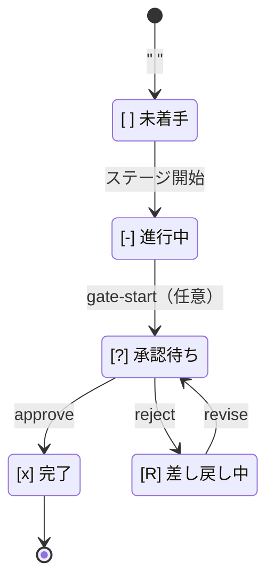

> **本記事の位置づけ** — 本記事は、`awslabs/aidlc-workflows` リポジトリの規範ルールおよび利用ガイドを素材として、筆者が AI を活用して読み解き、まとめた解釈です。AWS が公式に発表した方法論ではなく、一次資料の翻訳・要約でもありません。
>
> **シリーズ** — 本記事は [AIで紐解くAI-DLC v2](https://qiita.com/takeshishimada/items/2daa87896110603252ad) シリーズの一部です。
>
> **参照した版** — **Claude Code 実装**を対象に、2026 年 6 月時点の v2.1.3（コミット `c95070e`、`core/`）を参照しています。Kiro・Codex 実装は対象外で、記述が異なる場合があります。OSS 実装は更新が続いているため、最新の状態は公式リポジトリをご確認ください。

---

## 概要

承認ゲートは、各ステージ（初期化を除く）の末尾でワークフローをいったん止め、承認者に「承認するか、やり直す（差し戻す）か」を尋ねます。AI-DLC v2 でワークフローを止められるのは、この承認ゲートだけです。成果物の保存ごとに走るセンサーも、ステージを独立評価するレビュアーも、進行を止める権限は持ちません。止める力は承認ゲートに一点だけ集約されています。

本記事では、その「止める」がプロンプト規則とフックの両側からどう担保され、承認・差し戻し・再入がどんな状態マシンとして動くのかを読み解きます。あわせて、差し戻しが続いたときの逃げ道や、証拠のない完了を拒むアーティファクト・ガードまで見ていきます。

## 承認ゲートとは

承認ゲートには、専用の常駐プロセスやサービスがあるわけではありません。その実体は、ステージごとのチェックリストに書き込まれた状態と、それを書き換える規則です。ステージの成果物が承認待ちの状態になると、ワークフローはそこで止まり、承認者の選択がその状態を次へ進めます。

止める権限はこのゲートだけに集約されている、というのが要点です。本記事では、その「止める」が一次資料のなかでどう実装されているかを掘り下げます。中心になる規則は `stage-protocol.md` の §1 Approval Gates で、状態の遷移は `aidlc-state.ts` のサブコマンドが担い、各遷移は監査ログにイベントを残します。

---

## 「止める」とは何か

承認ゲートが本当に止まるのは、§1 冒頭の **HARD STOP RULE**（non-negotiable＝交渉の余地なし）があるからです。承認ゲートの質問を出したら、コンダクターはその場でターンを終了し、承認者が新しいメッセージで選択を返すまで、いかなるツールも呼びません。推測・自動承認・スキップはいずれも禁じられ、唯一の例外が後述の `--test-run` モードです。

この「止める」は二段で担保されています。

1. **プロンプトの規則** … HARD STOP RULE が、コンダクター（LLM）にターンを手放させる。
2. **フックの挙動** … 転送ループの `Stop` フック（`aidlc-stop.ts`）が、現ステージのチェックボックスが `[?]`（承認待ち）または `[R]`（差し戻し中）なら停止を許可（allow）する。

AI-DLC v2 には、コンダクターが勝手に止まらないよう「まだ作業が残っている」と差し戻す転送ループがあります。これが承認待ちのステージにも働けば、人が選択を返すまでの間ずっと「作業を続けろ」と促されてしまいます。そこで `Stop` フックは、チェックボックスが `[?]`／`[R]`（ワークフローが人を待っているからこそ存在する状態）のときだけは、例外的に停止を通します。LLM 側の規則とフック側の挙動が組み合わさって、初めてゲートは人の選択を待てる状態になります。

---

## 状態マシン

承認ゲートの本体は、ステージのチェックボックスを書き換える状態マシンです。記号は6種あり、正本は別記事「[状態と監査](https://qiita.com/takeshishimada/private/72234648bb4400cedf53)」で扱います（マッピング実装は `aidlc-lib.ts` の `CHECKBOX_MAP`）。

| 記号 | 状態名 | 意味 |
|------|--------|------|
| `[ ]` | pending | 未着手 |
| `[-]` | in-progress | 進行中（成果物を作っている最中・未承認） |
| `[?]` | awaiting-approval | 承認待ち（ゲートが開いている） |
| `[R]` | revising | 差し戻し中（やり直しを指示された） |
| `[x]` | completed | 完了（承認された） |
| `[S]` | skipped | スキップ（スコープ外などで実行されない） |

承認ゲートが扱うのは、このうち `[-]`・`[?]`・`[R]`・`[x]` の4つです。遷移はすべて `aidlc-state.ts` のサブコマンドが起こし、それぞれ監査イベントを発火します。

<!-- Text fallback: 未着手[ ] からステージ開始で進行中[-] へ。gate-start（任意）で承認待ち[?] へ。承認待ち[?] から approve で完了[x]、reject で差し戻し中[R] へ。差し戻し中[R] から revise で承認待ち[?] に再入する。 -->

各遷移には、対応するサブコマンドと発火イベントがあります。

- **`gate-start <slug>`** … `[-]`→`[?]`。`STAGE_AWAITING_APPROVAL` を発火し、ステータスを「承認待ち」に変える。§2 の手順上は任意で、省いてもかまわない（省いた場合は、次の承認／差し戻しが欠けたゲート行を埋める）。
- **承認（approve）** … `[?]`→`[x]`。`GATE_APPROVED`（人の判断）と `STAGE_COMPLETED`（状態遷移）を発火し、次のステージへ自動で前進する。コンダクターは実際には `aidlc-orchestrate.ts report --result approved` を呼び、その背後でエンジン（状態遷移を駆動する実行系。詳しくは別記事「[進行の中核](https://qiita.com/takeshishimada/items/c3ac7c2223e5c7020d82)」）が遷移と前進をまとめて行う。
- **差し戻し（reject）** … `[?]`→`[R]`。`GATE_REJECTED` と `STAGE_REVISING` を発火し、差し戻し回数（Revision Count）を1つ増やす。
- **再入（revise）** … `[R]`→`[?]`。やり直しの作業を終えたあと、`STAGE_AWAITING_APPROVAL` を再発火してゲートに戻る。

人の判断はゲートで終わり、その後は結果が一意に決まる機械的な記録処理になります。承認の `approve` は `[?]`→`[x]` と次ステージへの前進を一つの不可分な処理として持ち、コンダクターが「承認したのに前進を忘れる」事故を構造的に防ぎます。なお `gate-start` を省いたまま差し戻しや承認が来た場合は、欠けている `STAGE_AWAITING_APPROVAL` を `Recovered: true` タグ付きで先に補ってから記録します。これで「人の判断のために開かれたゲート」と「あとから帳尻を合わせて補われたゲート」が監査ログ上で区別できます。

---

## 止めない検証と止める承認ゲート

承認ゲートの輪郭は、止められない仕組みとの対比でもっともはっきりします。承認ゲートの前には、止めない検証が2つあります。

- センサー … 成果物の保存ごとに走る決定論的なチェック。引っかかっても止まらない。詳しくは別記事「[センサー](https://qiita.com/takeshishimada/private/5f8dbb62f25c1a09a257)」で扱います。
- レビュアー … 一部のステージで成果物を独立評価し、READY／NOT-READY を返す。NOT-READY でも止める権限はない。詳しくは別記事「[レビュアー](https://qiita.com/takeshishimada/private/624d83e946e86e4b1553)」で扱います。

どちらも結果を監査ログに積むだけで、ワークフローを止める権限は持ちません。レビュアーは承認ゲートの前に走りますが、上限まで往復しても NOT-READY のままなら、未解決の指摘を添えてそのまま人に渡されます。これらはあくまで助言（strictly advisory）で、最終判断は承認ゲートの人に残ります。

センサーやレビュアーの指摘は、承認ゲートで人が任意に参考にする材料です。止める判断を下せるのは、その材料を見た人だけです。だから、ワークフローを止められるのは承認ゲートだけなのです。

---

## 空承認を拒むアーティファクト・ガード

承認ゲートは「人が止められる」仕組みですが、裏を返せば「中身を見ずに承認を連打すれば、成果物ゼロのまま全ステージを `[x]` にできてしまう」余地があります（長尺の enterprise スコープで顕在化した空承認の罠）。これを決定論的なガードで塞ぎます。

ステージを完了させる遷移（`approve`／`advance`／`finalize`／`complete-workflow`）は、`[x]` を付ける前にディスク上の証拠を検査します（`aidlc-state.ts` の `verifyStageArtifacts`）。

1. **宣言した成果物の存在** … そのステージの `produces[]` のうち少なくとも1つが記録ディレクトリ 配下に実在しないと拒否（`produces` が空の初期化ステージは免除）。
2. **`workspace_requires` ステージの実作業** … `workspace_requires: true` を持つステージ（現状 code-generation のみ）は、`aidlc/` ワークスペース外に実ソースの作業があることも要求する。計画 markdown だけ書いてコードが無い、という状態を弾く。

これは「レビューして止める仕組み」ではありません。中身の良し悪しは判定せず、「宣言した出力が実在するか」という整合性のプリコンディションを課すだけです。空承認を拒むためのもので、止めるのは承認ゲートだけ、という構図そのものは変わりません。CI・自動テストでは `--test-run` か環境変数 `AIDLC_SKIP_ARTIFACT_GUARD=1` で外せます。

空承認で `done` まで一気に進ませない仕組みが、もう一つあります。一時停止（park）です。長尺ワークフローを現在のステージ境界で一時停止し、別セッションから続けられます。`WORKFLOW_PARKED` を残し、`parked` 指示で `Stop` フックがターンを綺麗に終えます。ただし自律 Construction では park は拒否されます（無人ループは止めない）。機構の詳細は別記事「[進行の中核](https://qiita.com/takeshishimada/items/c3ac7c2223e5c7020d82)」で扱います。

---

## 例外となる初期化3ステージ

§1 は冒頭で、ゲートを必要としない例外を明記しています。初期化フェーズの3ステージ、すなわち workspace-scaffold（作業ツリーの生成）／workspace-detection（既存プロジェクトの検出）／state-init（状態ファイルの作成）だけは、承認ゲートを持ちません。土台を組む作業に人の承認を挟む意味がない（作業ツリーを半分だけ作ることはできない）ためです。実際、`core/aidlc-common/stages/initialization/` のステージファイルもこの3本だけです。それ以外の全ステージは、成果物を作るたびに承認ゲートで止まります。

---

## ゲートを通過する2つの抜け道

人が必ず止まる仕組みには、2つの抜け道が用意されています。1つは自動テスト・CI のため、もう1つは差し戻しが続いたときのためです。

### CIの自動承認

`--test-run` フラグが有効なとき、承認ゲートは振る舞いを変えます（§1 Test-Run Mode Override）。承認のための構造化質問を出さず、代わりに `report --result approved --test-run` を呼んで自動で承認し、次へ進みます。発火する `GATE_APPROVED` には `Test-Run: true` タグが付くので、あとで監査ログから区別・除外できます。差し戻し（Request Changes）のループはまるごとスキップされます。完了メッセージ（アナウンスと要約）は通常どおり生成されます。テストがその成果物を検証するためです。止まるのは承認の問い合わせだけで、これが HARD STOP RULE の認める唯一の例外です。

### 差し戻しの無限ループ回避

人が差し戻しを繰り返すと、ステージは `[?]`↔`[R]` を延々と往復しかねません。これを断つのが escape hatch（緊急脱出口）です（§1 Revision loop escape hatch）。同じステージで「Request Changes」が3周すると、以降の承認ゲートに第3の選択肢「Accept as-is（現状のまま受け入れる）」が現れます。選ぶと、監査ログに「N 周の差し戻しの末に現状で受け入れた」と記録し、ステージを完了扱いにして先へ進みます。2周目の時点で「あと1回やり直すと Accept as-is が出る」と予告も入ります。

ここに細かな例外があります。Construction（構築）と Operation（運用）のステージは、**NO EMERGENT BEHAVIOR RULE** により承認ゲートを「承認／やり直し」の2択固定に縛られています。escape hatch の「Accept as-is」は、構築ステージに限って、差し戻し3周という閾値に達したときだけこの2択固定を外します。

---

## 構築フェーズのゲートの違い

これまで見たのは、全ステージ共通のステージ単位（per-stage）のゲートです。Construction フェーズだけは、ゲートの形が変わります。ゲートの単位がステージではなく Bolt（成果物と生成コードをまとめた単位）になり、最初の Bolt は自律モードの設定によらず常にゲートで止まります。コード生成が失敗したときは、自律モードでも必ず止まる halt-and-ask が働きます。

もう一つ、作業単位（Unit of Work）ごとに走る per-unit ステージには、「全作業単位が揃ってから1回だけ承認」という規則があります。エンジンが per-unit の反復を駆動し、各作業単位の `run-stage` は承認ゲートを抑止（`gate: false`）したまま発行されます。最後の作業単位の成果物がディスクに出そろった再入で初めて、ステージ単一の承認ゲートが1回だけ提示されます。途中で早期に承認しようとしても、残っている作業単位名を挙げて決定論的に拒否されます。

これらは構築フェーズ固有の機構なので、本記事では深追いせず、別記事「[ウォーキングスケルトン](https://qiita.com/takeshishimada/items/7a24030b9d8905f379ed)」「成果物の流れ」で扱います。本記事の主役はあくまで、初期化を除く全ステージに共通するステージ単位の承認ゲートです。フェーズの節目で要件から設計へ鎖が通っているかを確かめるフェーズ境界検証や、この仕組みの限界・導入判断は、それぞれ別記事「[フェーズ境界検証](https://qiita.com/takeshishimada/private/f2f4e426dd542c5b6765)」「限界と注意点」「導入判断」で扱います。

ゲートが残す4つのイベント（`STAGE_AWAITING_APPROVAL`／`GATE_APPROVED`／`GATE_REJECTED`／`STAGE_REVISING`）は、本記事が機構として扱いました。監査ログ全体のイベント体系（全69種）は別記事「[状態と監査](https://qiita.com/takeshishimada/private/72234648bb4400cedf53)」で、各ステージの並びと担当エージェントは別記事「[工程とエージェント](https://qiita.com/takeshishimada/items/418d7b9e17192e8add85)」で扱います。

## 参照元

| ファイル | 内容 |
| --- | --- |
| [`core/aidlc-common/protocols/stage-protocol.md`](https://github.com/awslabs/aidlc-workflows/blob/v2.1.3/core/aidlc-common/protocols/stage-protocol.md) | §1 Approval Gates（HARD STOP RULE・Test-Run Override・NO EMERGENT・escape hatch・構築 Bolt ゲート）、§2 Completion Messages（Part 0 のゲート手順・gate-start 任意）、初期化3ステージ除外 |
| [`core/tools/aidlc-state.ts`](https://github.com/awslabs/aidlc-workflows/blob/v2.1.3/core/tools/aidlc-state.ts) | gate-start／approve／reject／revise の各サブコマンド、チェックボックス遷移・Revision Count・Recovered バックフィル・承認時の自動前進、`verifyStageArtifacts`（アーティファクト・ガード） |
| [`core/tools/aidlc-lib.ts`](https://github.com/awslabs/aidlc-workflows/blob/v2.1.3/core/tools/aidlc-lib.ts) | `CHECKBOX_MAP`／`CHECKBOX_REVERSE`（`[ ]`/`[-]`/`[?]`/`[R]`/`[x]`/`[S]` の正本マッピング） |
| [`core/knowledge/aidlc-shared/audit-format.md`](https://github.com/awslabs/aidlc-workflows/blob/v2.1.3/core/knowledge/aidlc-shared/audit-format.md) | ゲート関連4イベントの発火条件・発火元、Test-Run モードの `Test-Run=true` タグ |
| [`core/hooks/aidlc-stop.ts`](https://github.com/awslabs/aidlc-workflows/blob/v2.1.3/core/hooks/aidlc-stop.ts) | 転送ループ Stop フック、`[?]`/`[R]` のとき停止を許可する carve-out（HARD STOP のフック側担保） |
| [`core/aidlc-common/stages/initialization/`](https://github.com/awslabs/aidlc-workflows/tree/v2.1.3/core/aidlc-common/stages/initialization) | ゲートを持たない初期化3ステージ（workspace-scaffold／workspace-detection／state-init）の実ファイル |
| [`CHANGELOG.md`](https://github.com/awslabs/aidlc-workflows/blob/v2.1.3/CHANGELOG.md) | 承認ゲートの HARD STOP 明文化、Stop フックの `[?]`/`[R]` carve-out、レビュアー（助言）の追加、park／アーティファクト・ガード（v2.1.3） |

---

## 関連記事

**前の記事**: [ブラウンフィールド](https://qiita.com/takeshishimada/items/0a22742c273797429aee)
**次の記事**: [センサー](https://qiita.com/takeshishimada/private/5f8dbb62f25c1a09a257)
**目次**: [AIで紐解くAI-DLC v2](https://qiita.com/takeshishimada/items/2daa87896110603252ad)
