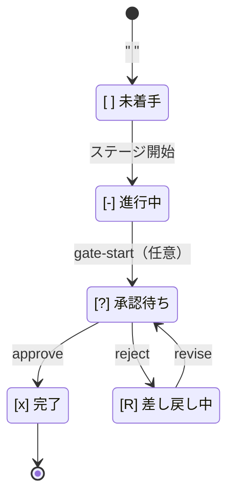

> **本記事の位置づけ** — 本記事は、`awslabs/aidlc-workflows` リポジトリの規範ルールおよび利用ガイドを素材として、筆者が AI を活用して読み解き、まとめた解釈です。AWS が公式に発表した方法論ではなく、一次資料の翻訳・要約でもありません。
>
> **シリーズ** — 本記事は [AIで紐解くAI-DLC v2](https://qiita.com/takeshishimada/items/2daa87896110603252ad) シリーズの一部です。
>
> **参照した版** — **Claude Code 実装**を対象に、2026 年 7 月 27 日時点のコミット `9f91454`（AIDLC_VERSION 2.5.11、`core/`）を参照しています。Claude Code 以外の実装（Kiro CLI／Kiro IDE／Codex CLI／opencode）は対象外で、記述が異なる場合があります。OSS 実装は更新が続いているため、最新の状態は公式リポジトリをご確認ください。

---

## 概要

承認ゲートは、各ステージ（初期化を除く）の末尾でワークフローをいったん止め、承認者に「承認するか、やり直す（差し戻す）か」を尋ねます。AI-DLC v2 でワークフローを止められるのは、この承認ゲートだけです。成果物の保存ごとに走るセンサーも、ステージを独立評価するレビュアーも、進行を止める権限は持ちません。止める力は承認ゲートに一点だけ集約されています。

本記事では、その「止める」がプロンプト規則とフックの両側からどう担保され、承認・差し戻し・再入がどんな状態マシンとして動くのかを読み解きます。あわせて、差し戻しが続いたときの逃げ道や、証拠のない完了を拒む2つのガード（宣言した成果物の実在と、人が動いた証拠）まで見ていきます。

## 承認ゲートとは

承認ゲートには、専用の常駐プロセスやサービスがあるわけではありません。その実体は、ステージごとのチェックリストに書き込まれた状態と、それを書き換える規則です。ステージの成果物が承認待ちの状態になると、ワークフローはそこで止まり、承認者の選択がその状態を次へ進めます。

止める権限はこのゲートだけに集約されている、というのが要点です。本記事では、その「止める」が一次資料のなかでどう実装されているかを掘り下げます。中心になる規則は `stage-protocol.md` の §1 Approval Gates で、状態の遷移は `aidlc-state.ts` のサブコマンドが担い、各遷移は監査ログにイベントを残します。

---

## 「止める」とは何か

承認ゲートが本当に止まるのは、§1 冒頭の **HARD STOP RULE**（non-negotiable＝交渉の余地なし）があるからです。承認ゲートの質問を出したら、コンダクターはその場でターンを終了し、承認者が新しいメッセージで選択を返すまで、いかなるツールも呼びません。推測・自動承認・スキップはいずれも禁じられ、例外はありません。

この「止める」は二段で担保されています。

1. **プロンプトの規則** … HARD STOP RULE が、コンダクター（LLM）にターンを手放させる。
2. **フックの挙動** … 転送ループの `Stop` フック（`aidlc-stop.ts`）が、現ステージのチェックボックスが `[?]`（承認待ち）または `[R]`（差し戻し中）なら停止を許可（allow）する。

AI-DLC v2 には、コンダクターが勝手に止まらないよう「まだ作業が残っている」と差し戻す転送ループがあります。これが承認待ちのステージにも働けば、人が選択を返すまでの間ずっと「作業を続けろ」と促されてしまいます。そこで `Stop` フックは、チェックボックスが `[?]`／`[R]`（ワークフローが人を待っているからこそ存在する状態）のときだけは、例外的に停止を通します。LLM 側の規則とフック側の挙動が組み合わさって、初めてゲートは人の選択を待てる状態になります。

---

## 状態マシン

承認ゲートの本体は、ステージのチェックボックスを書き換える状態マシンです。記号は6種あり、正本は別記事「[状態と監査](https://qiita.com/takeshishimada/items/72234648bb4400cedf53)」で扱います（マッピング実装は `aidlc-lib.ts` の `CHECKBOX_MAP`）。

| 記号 | 状態名 | 意味 |
|------|--------|------|
| `[ ]` | pending | 未着手 |
| `[-]` | in-progress | 進行中（成果物を作っている最中・未承認） |
| `[?]` | awaiting-approval | 承認待ち（ゲートが開いている） |
| `[R]` | revising | 差し戻し中（やり直しを指示された） |
| `[x]` | completed | 完了（承認された） |
| `[S]` | skipped | スキップ（スコープ外などで実行されない） |

承認ゲートが扱うのは、このうち `[-]`・`[?]`・`[R]`・`[x]` の4つです。遷移の実体は `aidlc-state.ts` のサブコマンドで、それぞれ監査イベントを発火します。ただし**これらを直接呼ぶことはできません**。ライフサイクルの遷移はエンジンの所有物で、`gate-start`／`approve`／`reject`／`revise` を含む11のサブコマンドは、呼び出し元がエンジン本体だと確認できないと拒否されます（検証はエンジンのプロセス ID に紐づくので、印だけ真似しても通りません）。コンダクターが呼ぶのは `aidlc-orchestrate.ts report` で、その背後でエンジンがこれらを起こします。

```mermaid
stateDiagram-v2
    [*] --> pending: " "
    pending --> in_progress: ステージ開始
    in_progress --> awaiting: gate-start（任意）
    awaiting --> completed: approve
    awaiting --> revising: reject
    revising --> awaiting: revise
    completed --> [*]

    state "[ ] 未着手" as pending
    state "[-] 進行中" as in_progress
    state "[?] 承認待ち" as awaiting
    state "[R] 差し戻し中" as revising
    state "[x] 完了" as completed
```

<!-- Text fallback: 未着手[ ] からステージ開始で進行中[-] へ。gate-start（任意）で承認待ち[?] へ。承認待ち[?] から approve で完了[x]、reject で差し戻し中[R] へ。差し戻し中[R] から revise で承認待ち[?] に再入する。 -->

各遷移には、対応するサブコマンドと発火イベントがあります。

- **`gate-start <slug>`** … `[-]`→`[?]`。`STAGE_AWAITING_APPROVAL` を発火し、ステータスを「承認待ち」に変える。§2 の手順上は任意で、省いてもかまわない（省いた場合は、次の承認／差し戻しが欠けたゲート行を埋める）。
- **承認（approve）** … `[?]`→`[x]`。`GATE_APPROVED`（人の判断）と `STAGE_COMPLETED`（状態遷移）を発火し、次のステージへ自動で前進する。コンダクターが呼ぶのは `aidlc-orchestrate.ts report --result approved` で、その背後でエンジン（状態遷移を駆動する実行系。詳しくは別記事「[進行の中核](https://qiita.com/takeshishimada/items/c3ac7c2223e5c7020d82)」）が遷移と前進をまとめて行う。
- **差し戻し（reject）** … `[?]`→`[R]`。`GATE_REJECTED` と `STAGE_REVISING` を発火し、差し戻し回数（Revision Count）を1つ増やす。
- **再入（revise）** … `[R]`→`[?]`。やり直しの作業を終えたあと、`STAGE_AWAITING_APPROVAL` を再発火してゲートに戻る。

以降の各項目に挙げるサブコマンドは、この「エンジンが起こす遷移」の名前です。コンダクターから見た入口は一貫して `report` の `--result` で、`awaiting-approval`／`approved`／`rejected`／`revised`／`completed`／`skipped` を渡します。

人の判断はゲートで終わり、その後は結果が一意に決まる機械的な記録処理になります。承認の `approve` は `[?]`→`[x]` と次ステージへの前進を一つの不可分な処理として持ち、コンダクターが「承認したのに前進を忘れる」事故を構造的に防ぎます。なお `gate-start` を省いたまま差し戻しや承認が来た場合は、欠けている `STAGE_AWAITING_APPROVAL` を `Recovered: true` タグ付きで先に補ってから記録します。これで「人の判断のために開かれたゲート」と「あとから帳尻を合わせて補われたゲート」が監査ログ上で区別できます。

---

## 止めない検証と止める承認ゲート

承認ゲートの輪郭は、止められない仕組みとの対比でもっともはっきりします。承認ゲートの前には、止めない検証が2つあります。

- センサー … 成果物の保存ごとに走る決定論的なチェック。引っかかっても止まらない。詳しくは別記事「[センサー](https://qiita.com/takeshishimada/items/5f8dbb62f25c1a09a257)」で扱います。
- レビュアー … 一部のステージで成果物を独立評価し、READY／NOT-READY を返す。NOT-READY でも止める権限はない。詳しくは別記事「[レビュアー](https://qiita.com/takeshishimada/items/624d83e946e86e4b1553)」で扱います。

どちらも結果を監査ログに積むだけで、ワークフローを止める権限は持ちません。レビュアーは承認ゲートの前に走りますが、上限まで往復しても NOT-READY のままなら、未解決の指摘を添えてそのまま人に渡されます。これらはあくまで助言（strictly advisory）で、最終判断は承認ゲートの人に残ります。

センサーやレビュアーの指摘は、承認ゲートで人が任意に参考にする材料です。止める判断を下せるのは、その材料を見た人だけです。だから、ワークフローを止められるのは承認ゲートだけなのです。

---

## 空承認を拒むアーティファクト・ガード

承認ゲートは「人が止められる」仕組みですが、裏を返せば「中身を見ずに承認を連打すれば、成果物ゼロのまま全ステージを `[x]` にできてしまう」余地があります（長尺の enterprise スコープで顕在化した空承認の罠）。これを決定論的なガードで塞ぎます。

ステージを完了させる遷移（`approve`／`advance`／`finalize`／`complete-workflow`）は、`[x]` を付ける前にディスク上の証拠を検査します（`aidlc-state.ts` の `verifyStageArtifacts`）。

1. **宣言した成果物の存在** … そのステージの `produces[]` のうち少なくとも1つが記録ディレクトリ 配下に実在しないと拒否（`produces` が空の初期化ステージは免除）。
2. **`workspace_requires` ステージの実作業** … `workspace_requires: true` を持つステージ（現状 code-generation のみ）は、`aidlc/` ワークスペース外に実ソースの作業があることも要求する。計画 markdown だけ書いてコードが無い、という状態を弾く。

これは「レビューして止める仕組み」ではありません。中身の良し悪しは判定せず、「宣言した出力が実在するか」という整合性のプリコンディションを課すだけです。空承認を拒むためのもので、止めるのは承認ゲートだけ、という構図そのものは変わりません。CI・自動テストでは環境変数 `AIDLC_SKIP_ARTIFACT_GUARD=1` で外せます。バイパスはこれ1つだけです。

---

## 捏造された承認を拒む仕組み

アーティファクト・ガードは「出力が実在するか」を確かめますが、「承認したのが本当に人か」は確かめません。ここに別の穴があり、2.1.6 はこれを塞ぎました。人がこのターンで実際に操作したかを、監査台帳で確かめます（上流の呼び名は human-presence gate）。

承認を記録する `report` を呼ぶのはコンダクターです。承認者の選択は `--user-input` という引数でコンダクターから渡され、ゲートはそれを逐語で記録していました。つまり**コンダクターが「Approve」という文字列を自分で組み立てて渡せば、承認が成立**します。自律的に動く IDE のモードで長いセッションを走らせると、エージェントがターンを終えずに承認と面談の回答を作り、そのままワークフローを先へ進められました。

塞ぎ方に、この仕組みらしさが出ています。マーカーファイルもターンのカウンタも使いません。**監査台帳そのものを、人が動いた証拠として使います。**

人がプロンプトを送ると、`UserPromptSubmit` フックが `HUMAN_TURN` イベントを台帳に追記します（承認の選択肢をクリックしたときも、`AskUserQuestion` の `PostToolUse` フックが同じイベントを記録します）。そして承認と面談の回答を確定させる `aidlc-state.ts approve` と `aidlc-log.ts answer` は、**直前のゲート解決（`GATE_APPROVED`／`GATE_REJECTED`／`QUESTION_ANSWERED`）より後ろに `HUMAN_TURN` があること**を要求します。無ければ確定を拒み、非ゼロで終了して状態を変えません。

境界が「このゲートが開いた時点」ではなく「**直前のゲート解決**」である点が要点です。実際の流れでは、人の1つのプロンプトがエージェントを動かしてゲートを開かせ、そのまま承認まで到達します。人のターンはゲート開放より**前**にあるので、「開放より後の人のターン」を求めると正当な承認をすべて誤って拒んでしまいます。一方で「直前の解決より後の人のターン」なら、いま新しく人が動いたことは証明できます。1回のターンで複数のゲートを連続承認しようとすると、2つ目のゲートから見て唯一の `HUMAN_TURN` は1つ目の `GATE_APPROVED` より前にあるので拒まれます。**1回の人のターンにつき1回の確定**が、フラグを立てずにイベントの順序だけで決まります。

台帳はクローン別のシャードに分かれるため、順序は**時刻順**（同時刻は追記順）で判定します。ファイル名順に連結した生の並びで見ると、別のクローンのシャードにある古い解決が、新しい `HUMAN_TURN` より後ろに見えてしまうからです。

逃げ道も設計されています。自律モードの Construction（swarm／Bolt）は対象外です。そこには人が居ないので、要求すれば無人のループが停止してしまいます。台帳が空のときも通します（まだ人の操作を記録していないハーネスで既存の流れを壊さないため）。自動テストのバイパスは環境変数 `AIDLC_SKIP_HUMAN_PRESENCE_GUARD=1` で、アーティファクト・ガードの `AIDLC_SKIP_ARTIFACT_GUARD=1` と対になっています。

なお Kiro の2つのハーネスには、さらに `preToolUse` フックが載ります。ゲートが `[?]` で開いていて、直前の解決より後に人が動いていない間は、ツール呼び出しそのものを異常終了で止めます。正当な承認が済めばこの遮断は解け、同じターンで次のステージへ進む通常の流れを妨げません。

これもアーティファクト・ガードと同じ性格の機構です。中身の良し悪しは判定せず、「人が動いた証拠が台帳にあるか」というプリコンディションを課すだけです。止めるのは承認ゲートだけ、という構図は変わりません。

---

## 一時停止という選択

空承認で `done` まで一気に進ませない仕組みが、もう一つあります。一時停止（park）です。長尺ワークフローを現在のステージ境界で一時停止し、別セッションから続けられます。`WORKFLOW_PARKED` を残し、`parked` 指示で `Stop` フックがターンを綺麗に終えます。ただし自律 Construction では park は拒否されます（無人ループは止めない）。機構の詳細は別記事「[進行の中核](https://qiita.com/takeshishimada/items/c3ac7c2223e5c7020d82)」で扱います。

---

## 例外となる初期化3ステージ

§1 は冒頭で、ゲートを必要としない例外を明記しています。初期化フェーズの3ステージ、すなわち workspace-scaffold（作業ツリーの生成）／workspace-detection（既存プロジェクトの検出）／state-init（状態ファイルの作成）だけは、承認ゲートを持ちません。土台を組む作業に人の承認を挟む意味がない（作業ツリーを半分だけ作ることはできない）ためです。実際、`core/aidlc-common/stages/initialization/` のステージファイルもこの3本だけです。それ以外の全ステージは、成果物を作るたびに承認ゲートで止まります。

---

## ゲートを通過する抜け道

人が必ず止まる仕組みに、抜け道は1つだけ用意されています。差し戻しが延々と続いたときのためのものです。

人が差し戻しを繰り返すと、ステージは `[?]`↔`[R]` を延々と往復しかねません。これを断つのが escape hatch（緊急脱出口）です（§1 Revision loop escape hatch）。同じステージで「Request Changes」が3周すると、以降の承認ゲートに第3の選択肢「Accept as-is（現状のまま受け入れる）」が現れます。選ぶと、監査ログに「N 周の差し戻しの末に現状で受け入れた」と記録し、ステージを完了扱いにして先へ進みます。2周目の時点で「あと1回やり直すと Accept as-is が出る」と予告も入ります。

ここに細かな例外があります。Construction（構築）と Operation（運用）のステージは、**NO EMERGENT BEHAVIOR RULE** により承認ゲートを「承認／やり直し」の2択固定に縛られています。escape hatch の「Accept as-is」は、構築ステージに限って、差し戻し3周という閾値に達したときだけこの2択固定を外します。

かつては、もう1つ抜け道がありました。CI・自動テスト向けの自動承認モード（`--test-run`）です。このフラグを付けるとゲートは構造化質問を出さず、自動で承認して次へ進み、差し戻しのループもまるごと飛ばせました。ところがこの抜け道は、対話セッション中のエージェントが自分の未完成の作業を承認するのにも使えてしまいます。上流はこれを環境変数で塞ぐのではなく、機構ごと削除しました。テストのドライバは通常の経路でゲートに答えればよく、自動承認のバイパスはそもそも要らなかった、という判断です。いまや HARD STOP RULE に例外はありません。

---

## 構築フェーズのゲートの違い

これまで見たのは、全ステージ共通のステージ単位（per-stage）のゲートです。Construction フェーズだけは、ゲートの形が変わります。ゲートの単位がステージではなく Bolt（成果物と生成コードをまとめた単位）になり、最初の Bolt は自律モードの設定によらず常にゲートで止まります。コード生成が失敗したときは、自律モードでも必ず止まる halt-and-ask が働きます。

もう一つ、作業単位（Unit of Work）ごとに走る per-unit ステージには、「全作業単位が揃ってから1回だけ承認」という規則があります。エンジンが per-unit の反復を駆動し、各作業単位の `run-stage` は承認ゲートを抑止（`gate: false`）したまま発行されます。最後の作業単位の成果物がディスクに出そろった再入で初めて、ステージ単一の承認ゲートが1回だけ提示されます。途中で早期に承認しようとしても、残っている作業単位名を挙げて決定論的に拒否されます。

これらは構築フェーズ固有の機構なので、本記事では深追いせず、別記事「[ウォーキングスケルトン](https://qiita.com/takeshishimada/items/7a24030b9d8905f379ed)」「成果物の流れ」で扱います。本記事の主役はあくまで、初期化を除く全ステージに共通するステージ単位の承認ゲートです。フェーズの節目で要件から設計へ鎖が通っているかを確かめるフェーズ境界検証や、この仕組みの限界・導入判断は、それぞれ別記事「[フェーズ境界検証](https://qiita.com/takeshishimada/items/f2f4e426dd542c5b6765)」「限界と注意点」「導入判断」で扱います。

ゲートが残す4つのイベント（`STAGE_AWAITING_APPROVAL`／`GATE_APPROVED`／`GATE_REJECTED`／`STAGE_REVISING`）は、本記事が機構として扱いました。監査ログ全体のイベント体系（全74種）は別記事「[状態と監査](https://qiita.com/takeshishimada/items/72234648bb4400cedf53)」で、各ステージの並びと担当エージェントは別記事「[工程とエージェント](https://qiita.com/takeshishimada/items/418d7b9e17192e8add85)」で扱います。

## 参照元

| ファイル | 内容 |
| --- | --- |
| [`core/aidlc-common/protocols/stage-protocol.md`](https://github.com/awslabs/aidlc-workflows/blob/9f91454/core/aidlc-common/protocols/stage-protocol.md) | §1 Approval Gates（HARD STOP RULE・NO EMERGENT・escape hatch・構築 Bolt ゲート）、§2 Completion Messages（Part 0 のゲート手順・gate-start 任意）、初期化3ステージ除外 |
| [`core/tools/aidlc-state.ts`](https://github.com/awslabs/aidlc-workflows/blob/9f91454/core/tools/aidlc-state.ts) | gate-start／approve／reject／revise の各サブコマンド、チェックボックス遷移・Revision Count・Recovered バックフィル・承認時の自動前進、`verifyStageArtifacts`（アーティファクト・ガード）、変異前に走る人の操作の検査と2つの carve-out |
| [`core/tools/aidlc-lib.ts`](https://github.com/awslabs/aidlc-workflows/blob/9f91454/core/tools/aidlc-lib.ts) | `CHECKBOX_MAP`／`CHECKBOX_REVERSE`（`[ ]`/`[-]`/`[?]`/`[R]`/`[x]`/`[S]` の正本マッピング）。`humanActedSinceGate`（直前のゲート解決を境界にした人の操作の判定・時刻順の並べ替え）、`hasOpenGate`、`isAutonomousMode`、`humanPresenceGuardDisabled` |
| [`core/tools/aidlc-log.ts`](https://github.com/awslabs/aidlc-workflows/blob/9f91454/core/tools/aidlc-log.ts) | 面談の回答を記録する `answer`。承認と同じ判定を共有し、`QUESTION_ANSWERED` 自体が次の境界になる |
| [`core/hooks/aidlc-mint-presence.ts`](https://github.com/awslabs/aidlc-workflows/blob/9f91454/core/hooks/aidlc-mint-presence.ts) | `HUMAN_TURN` を追記する UserPromptSubmit フック。プロンプト本文を読まない、状態ファイルが無ければ書かない、失敗しても人のターンを止めない |
| [`core/knowledge/aidlc-shared/audit-format.md`](https://github.com/awslabs/aidlc-workflows/blob/9f91454/core/knowledge/aidlc-shared/audit-format.md) | ゲート関連4イベントの発火条件・発火元、`HUMAN_TURN` の定義と発火元 |
| [`core/hooks/aidlc-stop.ts`](https://github.com/awslabs/aidlc-workflows/blob/9f91454/core/hooks/aidlc-stop.ts) | 転送ループ Stop フック、`[?]`/`[R]` のとき停止を許可する carve-out（HARD STOP のフック側担保） |
| [`core/aidlc-common/stages/initialization/`](https://github.com/awslabs/aidlc-workflows/tree/9f91454/core/aidlc-common/stages/initialization) | ゲートを持たない初期化3ステージ（workspace-scaffold／workspace-detection／state-init）の実ファイル |
| [`CHANGELOG.md`](https://github.com/awslabs/aidlc-workflows/blob/9f91454/CHANGELOG.md) | 承認ゲートの HARD STOP 明文化、Stop フックの `[?]`/`[R]` carve-out、レビュアー（助言）の追加、park／アーティファクト・ガード（2.1.3）、`--test-run` / Test Run Mode の全廃（2.1.4）、人の操作を確かめる検査の追加（2.1.6） |

---

## 関連記事

**前の記事**: [ブラウンフィールド](https://qiita.com/takeshishimada/items/0a22742c273797429aee)
**次の記事**: [センサー](https://qiita.com/takeshishimada/items/5f8dbb62f25c1a09a257)
**目次**: [AIで紐解くAI-DLC v2](https://qiita.com/takeshishimada/items/2daa87896110603252ad)
