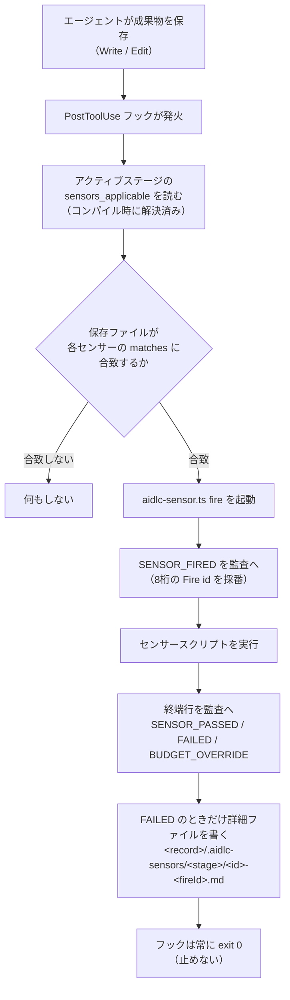

> **本記事の位置づけ** — 本記事は、`awslabs/aidlc-workflows` リポジトリの規範ルールおよび利用ガイドを素材として、筆者が AI を活用して読み解き、まとめた解釈です。AWS が公式に発表した方法論ではなく、一次資料の翻訳・要約でもありません。
>
> **シリーズ** — 本記事は [AIで紐解くAI-DLC v2](https://qiita.com/expensivegasprices/items/2daa87896110603252ad) シリーズの一部です。
>
> **参照した版** — **Claude Code 実装**を対象に、2026 年 6 月時点の v2.1.3（コミット `c95070e`、`core/`）を参照しています。Kiro・Codex 実装は対象外で、記述が異なる場合があります。OSS 実装は更新が続いているため、最新の状態は公式リポジトリをご確認ください。

---

## 概要

センサーは、エージェントが成果物を保存するたびに自動で走る決定論的なチェックです。コードの書式や型、文書の構成や上流成果物の参照といった点を機械的に確かめ、結果を監査ログに残します。ただし違反を見つけても作業は止めず、承認のタイミングで人が任意に参考にする助言にとどまります。出荷時は4本が用意されています。

本記事では、その4本が何を見るか、保存からどう発火して監査に積まれるか、そしてなぜ一貫して助言に徹するのかを読み解きます。

## センサーとは

出荷時のセンサーは4本です。コードの書式（linter）、型（type-check）、文書の必須項目（required-sections）、上流成果物の参照（upstream-coverage）で、いずれも「合っているか／いないか」をツールで機械的に判定します。

その判定は**助言にとどまります**。引っかかっても作業は止まらず、結果は監査ログに残るだけ。承認のタイミングで人が任意に参考にします。ワークフローを止められるのは承認ゲートだけで、センサーはそこに判断材料を一つ足すにすぎません。承認ゲートそのものは別記事「[承認ゲート](https://qiita.com/expensivegasprices/items/cd6827700443c9987fd7)」で扱います。

出荷時の4本がすべてではありません。学習の中でチームの気づきがセンサー化されることもあります。ただしその作られ方は別記事「[学習ループ](https://qiita.com/expensivegasprices/items/dd7f3d034ee2c137cff5)」で扱います。本記事は、すでにあるセンサーが**どう動くか**に集中します。

---

## 4本のセンサー

出荷時のセンサーは4本。すべて `kind: deterministic`・`default_severity: advisory` で、`matches:` グロブ（対象ファイルをワイルドカードで絞り込む指定）で「どのファイルの保存に反応するか」が決まります。

| id | category | matches | timeout | 何を見るか |
|---|---|---|---|---|
| **linter** | code-quality | `**/*.{ts,js}` | 30s | プロジェクト設定の linter（既定 eslint）をラップ。エラー0で合格（警告では落とさない） |
| **type-check** | code-quality | `**/*.{ts,tsx}` | 60s | 型チェッカ（既定 tsc）をラップ。型エラーがあれば不合格 |
| **required-sections** | document-shape | `**/{aidlc-docs,intents}/**` | 5s | 出力に H2 見出しが2本以上あるか（汎用の構成チェック） |
| **upstream-coverage** | document-shape | `**/{aidlc-docs,intents}/**` | 5s | ステージが「消費する」と宣言した上流成果物を、本文が実際に参照しているか |

4本は2系統に分かれます。**code-quality**（linter / type-check）はコードファイルを、**document-shape**（required-sections / upstream-coverage）は記録ツリー（成果物を置く aidlc-docs/intents の文書ツリー）の markdown を対象にします。

`matches:` の粒度は拡張子で分かれます。`.ts` は linter と type-check の両方、`.tsx` は type-check のみ、`.js` は linter のみが反応します。文書系2本は記録ツリーへの書き込みすべてに反応します。`matches:` のグロブは `**/{aidlc-docs,intents}/**` で、intent 別の記録ディレクトリ（`intents/` セグメント）も旧来のフラット配置も拾います。

- **linter** は警告では不合格にしません。実際の設定は `no-unused-vars: warn` のような警告を含むのが普通で、警告を不合格にすると保存ごとに `SENSOR_FAILED` が溢れるためです（`pass = errorCount === 0`）。
- **upstream-coverage** はステージのフロントマターの `consumes:` リストから純粋に導出され、ステージごとの設定を要しません。宣言した上流成果物のうち本文に名前もウィキリンクも現れないものを指摘します。
- **required-sections** は既定では「H2 が2本以上」だけを見ます。ただし `unit-of-work-dependency.md`（units-generation）に限り、ランタイムコンパイラが読む `units:` の DAG ブロックが**整形済みかつ非循環**であることも追加検査します。壊れた DAG ブロックがコンパイラに渡る前にゲートで止めるためです。
  - この既定の上に**テンプレート上書き層**があります。成果物 `X`（→ `X.md`）を書く前に、チームが置いた `aidlc/spaces/<space>/memory/templates/X.md` → フレームワーク既定テンプレ → 既定（H2≥2 のフロア）の順で解決し、テンプレートが当たればその `##` 見出し集合を期待値として `expected ⊆ output` で合否を出します（同じテンプレートが成果物生成側の骨格にもなるので、作る形と検査する形がズレません）。ただし **GA（正式版）ではフレームワーク既定テンプレを1つも出荷しない**ため、チームがテンプレートを書かない限り挙動は従来どおり（H2≥2）です。`*-questions` や `*-timestamp` はテンプレート対象外で、当たっても無視してフロアを保ちます。

---

## 走り方

センサーを起動するのは、ファイル保存（Write / Edit）に連動して自動で走る `aidlc-sensor-fire.ts` です。

**実行時に探索しない。** どのセンサーがどのステージに効くかは、ワークフロー開始時のコンパイルで解決され、各ステージのグラフノードに `sensors_applicable` として付与されます。フックはそれを読むだけで、ステージごとの解決計算を保存のたびに走らせることはしません。

**`matches` が唯一のフィルタ。** フックは保存ファイルのパスを各センサーの `matches` グロブと突き合わせ、合致したものだけを起動します。だから markdown を書いてもコードセンサーは動かず、`.ts` を書いても文書センサーは動きません。

**監査に対で残る。** 起動ごとに `SENSOR_FIRED` を出し、8桁hexの Fire id で対にして終端行（`SENSOR_PASSED` / `SENSOR_FAILED` / `SENSOR_BUDGET_OVERRIDE`）を出します。1回の保存で複数センサーが同時に発火するため、対応づけは位置ではなく Fire id で行います。不合格のときだけ、`<record>/.aidlc-sensors/<stage-slug>/<id>-<fireId>.md`（`<record>` ＝ アクティブ intent の記録ディレクトリ）に違反の詳細（ファイル・行・ルール・メッセージ等）を書き出します。

残った `SENSOR_FAILED` が監査ログ上でどう扱われるかは、別記事「[状態と監査](https://qiita.com/expensivegasprices/items/72234648bb4400cedf53)」で扱います。

---

## 助言に徹する設計

センサーが advisory だというのは「不合格でもゲートを止めない」だけの話ではありません。フックは**常に exit 0** で終わり（「センサー失敗 ≠ フック失敗」）、さらにディスパッチャの判定表も、**センサーが誤って進行を止めることはない**よう設計されています。

センサースクリプトの結果は、次のように監査の終端行へ写されます。

| スクリプトの結果 | 終端行 | ゲートへの影響 |
|---|---|---|
| 合格（`pass: true`） | SENSOR_PASSED | なし |
| **不合格（`pass: false`）** | **SENSOR_FAILED**（詳細ファイル付き） | なし（人が任意に参考にする情報） |
| ツール不在（exit 127） | SENSOR_PASSED（Note: tool-unavailable） | なし |
| 出力JSONが壊れ／不正 | SENSOR_PASSED（Note: script-error: bad-output） | なし |
| 起動失敗・想定外の異常終了 | SENSOR_PASSED（Note: script-error: …） | なし |
| タイムアウト | SENSOR_BUDGET_OVERRIDE | なし |

**本当に `pass: false` を返したときだけが FAILED** です。それ以外の不確かな事態（eslint や tsc が入っていない、スクリプトが壊れた出力を返した、起動に失敗した）は**すべて PASSED 扱いになります**。タイムアウトすら失敗ではなく BUDGET_OVERRIDE という別カテゴリで記録されます。

つまりセンサーは「環境の不備で偽陽性を出し、開発を邪魔する」ことがありません。確かな違反を見つけたときだけ静かに FAILED を残し、それでもゲートは止めない。こうして安全側に寄せる判定は、すべて助言に徹するための設計です。

> 現状センサーはどのフェーズでも止めません。保存時フックのソースは、ブロッキング判定を「将来のドライバに委ねる」と明記しており、advisory はいまの確定挙動です。

---

## レビュアーとの対比

AI-DLC v2 で止めない検証はもう一つあります。ステージの節目に品質を評価するレビュアーです。どちらも止めず、最終判断は承認ゲートの人に委ねますが、性質は対照的です。

| | センサー | レビュアー |
|---|---|---|
| 種類 | 決定論的（ツール実行） | LLM の判断 |
| 見るもの | 構造（書式・型・参照の有無） | 設計の穴・テスト可能性・暗黙の前提 |
| 粒度 | **保存ごと**（Write / Edit 単位） | **ステージごと**（成果物の完成後） |
| 強制力 | 止めない（advisory） | 止めない（READY / NOT-READY） |

センサーは「参照が解決するか」のような**構造の真偽**を保存のたびに即答し、レビュアーは「この設計で品質目標を達成できるか」のような**文脈の判断**をステージの節目に与えます。検証は決定論的なものと判断的なものに役割分担され、どちらも開発を止めるものではなく、人の判断材料を増やすために置かれています。レビュアー2体の往復や READY／NOT-READY の扱いは別記事「[レビュアー](https://qiita.com/expensivegasprices/items/624d83e946e86e4b1553)」で扱います。

## まとめ

センサーは、保存のたびに静かに走る決定論的なチェックです。4本が書式・型・必須項目・上流参照を確かめ、結果を監査へ積みます。確かな違反だけを FAILED に残し、環境の不備では偽陽性を出さず、それでも進行は止めません。止める力は承認ゲートだけが持ち、センサーはそこに渡す判断材料を、人が見落とさないかたちで蓄えていきます。

## 参照元

| ファイル | 内容 |
|---------|------|
| [`core/sensors/aidlc-linter.md`](https://github.com/awslabs/aidlc-workflows/blob/v2.1.3/core/sensors/aidlc-linter.md) | linter センサーの マニフェスト。`matches: **/*.{ts,js}`・category code-quality・既定 eslint・失敗時の詳細ファイル |
| [`core/sensors/aidlc-type-check.md`](https://github.com/awslabs/aidlc-workflows/blob/v2.1.3/core/sensors/aidlc-type-check.md) | type-check センサーの マニフェスト。`matches: **/*.{ts,tsx}`・既定 tsc |
| [`core/sensors/aidlc-required-sections.md`](https://github.com/awslabs/aidlc-workflows/blob/v2.1.3/core/sensors/aidlc-required-sections.md) | required-sections の マニフェスト。H2≥2 の汎用チェック、`unit-of-work-dependency.md` の `units:` DAG 追加検査、2.1.x のテンプレート上書き層（team → framework-default → フロア。GA は既定テンプレ空出荷）、`matches: **/{aidlc-docs,intents}/**` |
| [`core/sensors/aidlc-upstream-coverage.md`](https://github.com/awslabs/aidlc-workflows/blob/v2.1.3/core/sensors/aidlc-upstream-coverage.md) | upstream-coverage の マニフェスト。`consumes:` からの純導出 |
| [`core/hooks/aidlc-sensor-fire.ts`](https://github.com/awslabs/aidlc-workflows/blob/v2.1.3/core/hooks/aidlc-sensor-fire.ts) | 保存時フック（PostToolUse Write\|Edit）。`sensors_applicable` を読み、`matches` 合致分を起動。常に exit 0 |
| [`core/tools/aidlc-sensor.ts`](https://github.com/awslabs/aidlc-workflows/blob/v2.1.3/core/tools/aidlc-sensor.ts) | センサーディスパッチャ。Fire id 採番・`SENSOR_FIRED`／終端行の発行・結果の判定表・詳細ファイル書き出し |
| [`core/tools/aidlc-sensor-schema.ts`](https://github.com/awslabs/aidlc-workflows/blob/v2.1.3/core/tools/aidlc-sensor-schema.ts) | マニフェスト スキーマ。`kind: deterministic`・`default_severity: advisory` 以外を不許可、`matches:` は任意 |
| [`core/aidlc-common/protocols/stage-protocol.md`](https://github.com/awslabs/aidlc-workflows/blob/v2.1.3/core/aidlc-common/protocols/stage-protocol.md) | §13 学習ゲート。センサー化の two-write install（マニフェスト 生成＋ステージ `sensors:` への id 追記）と `SENSOR_PROPOSED` |

---

## 関連記事

**前の記事**: [承認ゲート](https://qiita.com/expensivegasprices/items/cd6827700443c9987fd7)
**次の記事**: [レビュアー](https://qiita.com/expensivegasprices/items/624d83e946e86e4b1553)
**目次**: [AIで紐解くAI-DLC v2](https://qiita.com/expensivegasprices/items/2daa87896110603252ad)
