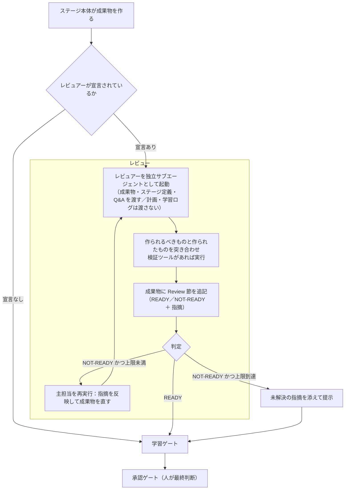

> **本記事の位置づけ** — 本記事は、`awslabs/aidlc-workflows` リポジトリの規範ルールおよび利用ガイドを素材として、筆者が AI を活用して読み解き、まとめた解釈です。AWS が公式に発表した方法論ではなく、一次資料の翻訳・要約でもありません。
>
> **シリーズ** — 本記事は [AIで紐解くAI-DLC v2](https://qiita.com/takeshishimada/items/2daa87896110603252ad) シリーズの一部です。
>
> **参照した版** — **Claude Code 実装**を対象に、2026 年 6 月時点の v2.1.3（コミット `c95070e`、`core/`）を参照しています。Kiro・Codex 実装は対象外で、記述が異なる場合があります。OSS 実装は更新が続いているため、最新の状態は公式リポジトリをご確認ください。

---

## 概要

レビュアーは、作り手とは別のエージェントです。ステージが成果物を作り終えた直後に、その出来栄えを READY か NOT-READY で判定し、指摘を返します。作り手の思考過程はあえて渡されず、初めて見る目で成果物だけを評価します。ただし強制力は持たず、NOT-READY を返してもワークフローは止まりません。最終判断は人が承認ゲートで下し、レビュアーはその手前で判断材料を増やすだけです。担当は専任2体で、出荷時点では11ステージに割り当てられています。

本記事では、なぜ作り手から切り離すのか、助言にとどめるのは何のためか、そして READY の基準と往復の収束のさせ方を読み解きます。

## レビュアーとは

成果物を作ったエージェント自身に「これで十分か」を尋ねても、自分の判断を肯定しがちです。レビュアーは、その出力を初めて見る目で評価する独立したエージェントです。機械的なチェックでは拾えない「設計の穴」「テストできない要件」を、人が承認ゲートで判断する前に洗い出します。

レビュアーは専任の2体です。成果物を作る11体に、レビューだけを担う2体が加わって計13体になります。

---

## 3つの原則

### 別の目で、独立して見る

レビュアーに渡されるのは、成果物・ステージ定義・Q&A（人との質疑）と、ステージ定義が挙げる検証ツールの一覧です。作り手の計画（`plan.md`）や学習ログ（`memory.md`）は**意図的に渡しません**。作り手がどう考えたかに引きずられず、出力だけを独立に評価させるためです。

レビュアーは作り手と直接やり取りもしません。指摘はすべてコンダクター経由で仲介されます。

### 助言どまり

レビュアーは強制力を持ちません。NOT-READY を返してもワークフローを止める権限はなく、**最終決定は必ず承認者が承認ゲートで下します**。レビュアー自身が承認することもありません。往復の上限を超えても NOT-READY のままなら、未解決の指摘を添えてそのまま人に提示されます。

止める力を持つのは人が判断する承認ゲートだけです。助言と停止の線引きと、助言にとどまるからこそ生じる見落としの余地は、それぞれ別記事「[承認ゲート](https://qiita.com/takeshishimada/private/cd6827700443c9987fd7)」「限界と注意点」で扱います。同じ助言でも、成果物の保存ごとに自動で走るセンサーとはタイミングが違い、レビュアーは成果物の完成後に、宣言された特定のステージでだけ走ります。センサーの仕組みは別記事「[センサー](https://qiita.com/takeshishimada/private/5f8dbb62f25c1a09a257)」で扱います。

### READY は「完璧」ではなく「迷わず実装できる」

両レビュアーの合格基準は同じ一文に集約されます。**「開発者がこの文書だけで、設計者に質問し直すことなく実装に着手できるか」**。完璧さではなく実装可能性が基準です。逆に「実装の前に作り手へ確認が要る」なら NOT-READY です。

---

## 全体像



順序は「成果物 → （宣言があれば）レビュー → 学習ゲート → 承認ゲート」です。レビューは学習ゲートよりも前に走ります。学習ゲートとの順序は別記事「[学習ループ](https://qiita.com/takeshishimada/private/dd7f3d034ee2c137cff5)」で扱います。

---

## ステージごとの担当レビュアー

レビュアーは、ステージの `reviewer:` フロントマターで宣言された場合だけ起動します。コンダクターが `Task` で独立サブエージェントとして呼び出します。出荷時点で**11ステージ**に宣言があり、担当は**2体**です。

| レビュアー | モデル | 担当ステージ |
|---|---|---|
| **architecture-reviewer**（設計者の目） | sonnet | application-design／units-generation／functional-design／infrastructure-design／nfr-requirements／nfr-design／code-generation（7ステージ） |
| **product-lead**（顧客の目） | sonnet | rough-mockups／refined-mockups／user-stories／requirements-analysis（4ステージ） |

`reviewer:` のないステージでは、レビュー自体が走りません。エージェント13体の編成と、どのステージを誰が担当するかは別記事「[工程とエージェント](https://qiita.com/takeshishimada/items/418d7b9e17192e8add85)」で扱います。

---

## レビューの観点

レビュアーは「設計者の目」「顧客の目」のどちらかで評価します。READY の意味は両者で共通（迷わず実装できる）で、見る観点が違います。

**architecture-reviewer**（設計者の目）

- 循環依存はないか（「必ずある。見つけろ」）
- すべての相互参照は解決するか（エンティティ ID・コンポーネント ID・API 参照が実在するか）
- 品質目標はこの設計で達成可能か（単一 DB で「99.99% 可用性」は嘘）
- 爆発半径（blast radius）は閉じ込められているか
- 開発者が設計者に質問せず実装できるか

**product-lead**（顧客の目）

- すべての要件はテスト可能か（pass/fail 基準があるか。「fast」ではなく「< 200ms p95」）
- 双方向にトレースできるか（要件↔ニーズ、ストーリー↔要件。孤児は指摘）
- 言外に前提を置いているだけの箇所はないか（暗黙の仮定はギャップ）
- スコープの境界は明確か（何が範囲外・先送りか）
- ストーリーは INVEST（良いユーザーストーリーの6条件）を満たし、エラー・空・境界のエッジケースを覆っているか

検証ツールがステージ定義に列挙されていれば、レビュアーはそれを実行し、結果を指摘に含めます。ツールが構造的な不備（壊れた参照など）を拾い、レビュアーが文脈と判断を加えます。

---

## 判定の記録形式

レビュアーは別ファイルを作らず、**成果物そのものに `## Review` 節を追記**します。形式は固定です。

```markdown
## Review

**Verdict:** READY | NOT-READY
**Reviewer:** <レビュアー名>
**Date:** <ISO タイムスタンプ>
**Iteration:** <1, 2, ...>

### Findings

| # | Severity | Location | Finding | Recommendation |
|---|---|---|---|---|
| 1 | Critical | FR-3 | 受け入れ基準が未定義 | 測定可能な pass/fail 基準を追加 |
| 2 | Major | Stories | S-4 と S-7 のスコープが重複 | 統合するか境界を明確化 |
| 3 | Minor | NFR-2 | 「高可用性」が曖昧 | 目標値を指定（例 99.9%）|

### Summary

[全体評価を1〜2文。合格を阻む主因、または READY の理由]
```

判定は指摘の重大度から機械的に決まります。

| Severity | 意味 | READY を阻むか |
|---|---|---|
| **Critical** | これでは実装できない（根本的な欠落・矛盾）| はい |
| **Major** | 実装はできるが下流で手戻り・混乱を招く | Major が3件以上ならはい |
| **Minor** | 改善余地。ブロックしない | いいえ |

- **READY** … Critical ゼロ かつ Major 2件以下
- **NOT-READY** … Critical が1件でもある、または Major が3件以上

---

## 往復の収束

NOT-READY のときは、レビュアー単独では完結せず、成果物を作る主担当（Lead）との往復になります（上限 `reviewer_max_iterations`、既定**2回**）。

1. NOT-READY かつ往復が上限未満 … カウンタを増やし、**主担当を再実行**して指摘を反映 → 成果物を更新 → レビュアー再起動
2. READY … 学習ゲート、続いて承認ゲートへ
3. NOT-READY のまま上限到達 … レビュアーは退き、未解決の指摘を添えて承認ゲートで人に提示。レビューを重ねても指摘が残った旨を伝え、最終判断は人に委ねる

再レビュー時は、前回の各指摘を「解決／一部解決／未解決」で確認し、`## Review` 節は**2つ目を追記せず置き換え**ます。修正から派生した新しい問題だけを追加で挙げ、ブロックしない Minor は再び指摘しません。

> テスト実行モード（`--test-run`）でもレビューは走ります（CI でも成果物の質を検証するため）。ただし上限到達後も NOT-READY なら、承認ゲートの自動承認と同様に自動で先へ進みます。

---

## 主担当・補佐との違い

ステージのエージェントには lead（主担当）と support（観点を貸す補佐）がありますが、レビュアーは**それらとは別の軸**です。

- lead／support は**作る側**。同じコンテキストで協働して成果物を作る
- レビュアーは**評価する側**。作り手の思考を渡されず、独立サブエージェントとして判定する

セキュリティやコンプライアンスといった観点に専任のレビュアーはおらず、devsecops／compliance エージェントが support として担当ステージに観点を持ち込みます。レビュアー2体は、品質の最終確認だけを担う独立した目です。

なお、起動時に各エージェントの役割定義を読み込む処理（ペルソナ読み込み）が列挙する「作る側」の編成は11体で、レビュアー2体はここに含まれません。評価専任のため別枠で、名簿（roster）上の総数は 11+2＝13 体になります。

## 参照元

| ファイル | 内容 |
|---------|------|
| [`aidlc-common/protocols/stage-protocol.md`](https://github.com/awslabs/aidlc-workflows/blob/v2.1.3/core/aidlc-common/protocols/stage-protocol.md) | ステージプロトコル。レビュアーの起動・往復・判定の全手順と、レビュー後の学習ゲート |
| [`core/agents/aidlc-architecture-reviewer-agent.md`](https://github.com/awslabs/aidlc-workflows/blob/v2.1.3/core/agents/aidlc-architecture-reviewer-agent.md) | 設計レビュアーの定義（視点・コアレビュー質問・READY の定義） |
| [`core/agents/aidlc-product-lead-agent.md`](https://github.com/awslabs/aidlc-workflows/blob/v2.1.3/core/agents/aidlc-product-lead-agent.md) | プロダクトレビュアーの定義 |
| [`core/knowledge/aidlc-architecture-reviewer-agent/reviewing.md`](https://github.com/awslabs/aidlc-workflows/blob/v2.1.3/core/knowledge/aidlc-architecture-reviewer-agent/reviewing.md) | 設計者の目で見るチェック項目。`## Review` 形式・重大度・判定ルール・検証ツール結果表 |
| [`core/knowledge/aidlc-product-lead-agent/reviewing.md`](https://github.com/awslabs/aidlc-workflows/blob/v2.1.3/core/knowledge/aidlc-product-lead-agent/reviewing.md) | 顧客の目で見るチェック項目。`## Review` 形式・重大度・判定ルール |
| [`core/aidlc-common/stages/inception/requirements-analysis.md`](https://github.com/awslabs/aidlc-workflows/blob/v2.1.3/core/aidlc-common/stages/inception/requirements-analysis.md) | `reviewer:` フロントマターの宣言例 |
| [`CHANGELOG.md`](https://github.com/awslabs/aidlc-workflows/blob/v2.1.3/CHANGELOG.md) | 2.0.0：レビュアー機構の追加（助言的品質ゲート、既定2往復、roster 11→13） |

---

## 関連記事

**前の記事**: [センサー](https://qiita.com/takeshishimada/private/5f8dbb62f25c1a09a257)
**次の記事**: [フェーズ境界検証](https://qiita.com/takeshishimada/private/f2f4e426dd542c5b6765)
**目次**: [AIで紐解くAI-DLC v2](https://qiita.com/takeshishimada/items/2daa87896110603252ad)
