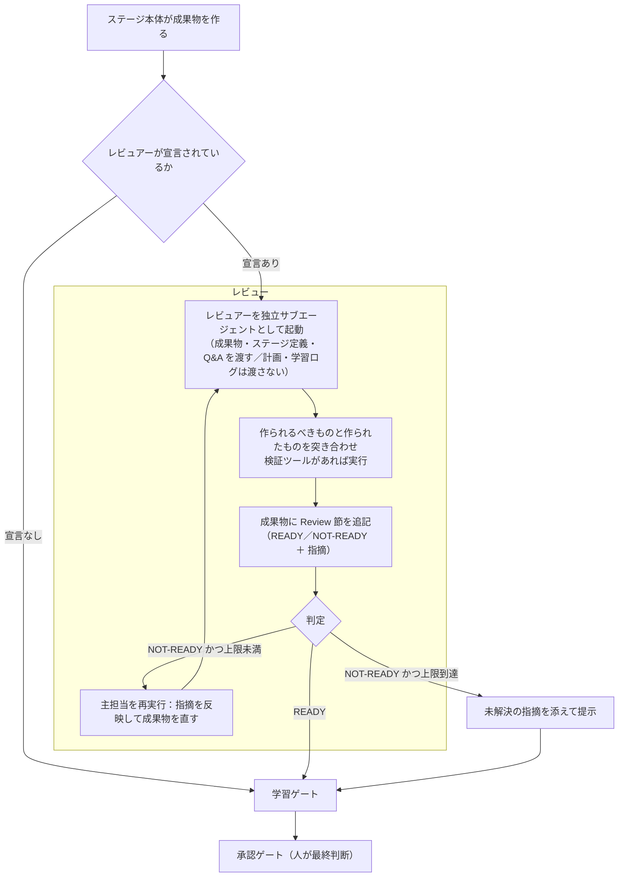

> **本記事の位置づけ** — 本記事は、`awslabs/aidlc-workflows` リポジトリの規範ルールおよび利用ガイドを素材として、筆者が AI を活用して読み解き、まとめた解釈です。AWS が公式に発表した方法論ではなく、一次資料の翻訳・要約でもありません。
>
> **シリーズ** — 本記事は [AIで紐解くAI-DLC v2](https://qiita.com/takeshishimada/items/2daa87896110603252ad) シリーズの一部です。
>
> **参照した版** — **Claude Code 実装**を対象に、2026 年 8 月 4 日時点のコミット `c73ee984`（AIDLC_VERSION 2.5.37、`core/`）を参照しています。Claude Code 以外の実装（Kiro CLI／Kiro IDE／Codex CLI／opencode）は対象外で、記述が異なる場合があります。OSS 実装は更新が続いているため、最新の状態は公式リポジトリをご確認ください。

---

## 概要

レビュアーは、作り手とは別のエージェントです。ステージが成果物を作り終えた直後に、その出来栄えを READY か NOT-READY で判定し、指摘を返します。作り手の思考過程はあえて渡されず、初めて見る目で成果物だけを評価します。ただし強制力は持たず、NOT-READY を返してもワークフローは止まりません。最終判断は人が承認ゲートで下し、レビュアーはその手前で判断材料を増やすだけです。担当は専任2体で、出荷時点では12ステージに割り当てられています。

本記事では、なぜ作り手から切り離すのか、助言にとどめるのは何のためか、そして READY の基準と往復の収束のさせ方を読み解きます。

## レビュアーとは

成果物を作ったエージェント自身に「これで十分か」を尋ねても、自分の判断を肯定しがちです。レビュアーは、その出力を初めて見る目で評価する独立したエージェントです。機械的なチェックでは拾えない「設計の穴」「テストできない要件」を、人が承認ゲートで判断する前に洗い出します。

レビュアーは専任の2体です。成果物を作る11体に、レビューだけを担う2体と、スコープを組むコンポーザー1体が加わって計14体になります。

---

## 3つの原則

### 別の目で、独立して見る

レビュアーに渡されるのは、成果物・ステージ定義・Q&A（人との質疑）と、ステージ定義が挙げる検証ツールの一覧です。作業単位ごとに回るステージでは、共有の上流成果物として解決済みの入力も渡ります。作り手の計画や推論を書いたファイル、そして学習ログ（`memory.md`）は**意図的に渡しません**。作り手がどう考えたかに引きずられず、出力だけを独立に評価させるためです。

レビュアーは作り手と直接やり取りもしません。指摘はすべてコンダクター経由で仲介されます。

### 助言どまり

レビュアーの**判定**に強制力はありません。NOT-READY を返しても進行は止まらず、**最終決定は必ず承認者が承認ゲートで下します**。ただし判定の中身が問われないだけで、レビューが走った記録そのものは完了の前提条件です（後述）。レビュアー自身が承認することもありません。往復の上限を超えても NOT-READY のままなら、未解決の指摘を添えてそのまま人に提示されます。

中身を見て止められるのは人が判断する承認ゲートだけです。助言と停止の線引きと、そこにとどまるからこそ生じる見落としの余地は、それぞれ別記事「[承認ゲート](https://qiita.com/takeshishimada/items/cd6827700443c9987fd7)」「限界と注意点」で扱います。同じ助言でも、成果物の保存ごとに自動で走るセンサーとはタイミングが違い、レビュアーは成果物の完成後に、宣言された特定のステージでだけ走ります。センサーの仕組みは別記事「[センサー](https://qiita.com/takeshishimada/items/5f8dbb62f25c1a09a257)」で扱います。

ここで一つ、混同しやすい仕組みがあります。レビュアーを宣言したステージは、**レビューが走った記録が無いと完了できません**。`REVIEW_REQUESTED` と `REVIEW_COMPLETED` が監査に残ります。ワークフローの再開始、関係するステージへのジャンプ、ゲートでの差し戻し、宣言した成果物への後からの書き込みが起きると、古い記録は無効になります。

これは判定でワークフローを止めているわけではありません。要求されているのは「**新鮮な判定が存在すること**」で、判定の中身は問われません。**NOT-READY でも完了できます。** 宣言した成果物がディスクに無いと完了を拒むアーティファクト・ガードと同じ性格の、証拠を求める前提条件です。レビュアーが止める側に回ったわけではない、という区別が要ります。

もう一つ、レビュアーの**読み取り範囲**は仕組みとして縛られています。作業単位ごとに走る構築ステージでは、渡された成果物と共有の上流契約の外、たとえば別の作業単位の設計ディレクトリへ手を伸ばそうとすると、フックがツール呼び出しを拒否します。範囲を絞らずに「全部を相互参照せよ」とすると、作業単位が増えるほどレビューの費用が超線形に膨らみます。フックで縛るのはこれを避けるためです。

### READY は「完璧」ではなく「迷わず実装できる」

両レビュアーの合格基準は同じ形をしています。**「開発者がこの文書だけで実装に着手できるか」**。完璧さではなく実装可能性が基準です。逆に「実装の前に作り手へ確認が要る」なら NOT-READY です。言い回しは役割で違い、アーキテクチャレビュアーは「推測せずに着手できるか」、プロダクトリードは「作り手に確認を戻さずに着手できるか」と置きます。

そして READY は、**出発点ではなく到達点**です。レビュアーの仕事は成果物を肯定することではなく**反証すること**だと規約に定められています。欠陥は存在するものと仮定して探し、壊そうとして壊せなかったときに初めて READY になります。

この姿勢には根拠の条件が付きます。**指摘は機械で確かめられる証拠に裏づけられていなければなりません。** レビュアーは起動時に渡された検証ツールを実際に走らせ、成果物を受け入れ基準・ステージ定義・消費した上流の契約と突き合わせます。意見だけを支えにした指摘は提案にとどまり、NOT-READY の根拠にはなりません。

---

## 全体像


```mermaid
flowchart TD
    BODY["ステージ本体が成果物を作る"]
    DECL{"レビュアーが宣言されているか"}
    BODY --> DECL

    DECL -->|"宣言なし"| GATE

    subgraph REV["レビュー"]
        direction TB
        INV["レビュアーを独立サブエージェントとして起動<br/>（成果物・ステージ定義・Q&A を渡す／計画・学習ログは渡さない）"]
        INV --> EVAL["作られるべきものと作られたものを突き合わせ<br/>検証ツールがあれば実行"]
        EVAL --> WRITE["成果物に Review 節を追記<br/>（READY／NOT-READY ＋ 指摘）"]
        WRITE --> VERDICT{"判定"}
        VERDICT -->|"NOT-READY かつ上限未満"| FIX["主担当を再実行：指摘を反映して成果物を直す"]
        FIX --> INV
    end

    DECL -->|"宣言あり"| INV
    VERDICT -->|"READY"| GATE
    VERDICT -->|"NOT-READY かつ上限到達"| GATEX["未解決の指摘を添えて提示"]

    GATEX --> GATE
    GATE["学習ゲート"] --> APPROVE["承認ゲート（人が最終判断）"]
```

順序は「成果物 → （宣言があれば）レビュー → 学習ゲート → 承認ゲート」です。レビューは学習ゲートよりも前に走ります。学習ゲートとの順序は別記事「[学習ループ](https://qiita.com/takeshishimada/items/dd7f3d034ee2c137cff5)」で扱います。

---

## ステージごとの担当レビュアー

レビュアーは、ステージの `reviewer:` フロントマターで宣言された場合だけ起動します。コンダクターが `Task` で独立サブエージェントとして呼び出します。出荷時点で**12ステージ**に宣言があり、担当は**2体**です。

| レビュアー | モデル（Claude Code での投影） | 担当ステージ |
|---|---|---|
| **architecture-reviewer**（設計者の目） | sonnet | application-design／units-generation／functional-design／infrastructure-design／nfr-requirements／nfr-design／code-generation（7ステージ） |
| **product-lead**（顧客の目） | sonnet | intent-capture／rough-mockups／refined-mockups／user-stories／requirements-analysis（5ステージ） |

このモデル名は、レビュアーごとに書かれているものではありません。エージェントには仕事の性質を表す階層だけが宣言されていて（レビュアー2体は `balanced`）、ハーネスごとの投影でモデル名に変換されます。その仕組みは別記事「[エージェント階層](https://qiita.com/takeshishimada/items/6d7e524276eb7cd72052)」で扱います。

`reviewer:` のないステージでは、レビュー自体が走りません。エージェント14体の編成と、どのステージを誰が担当するかは別記事「[工程とエージェント](https://qiita.com/takeshishimada/items/418d7b9e17192e8add85)」で扱います。

---

## レビューの観点

レビュアーは「設計者の目」「顧客の目」のどちらかで評価します。READY の意味は両者で共通（迷わず実装できる）で、見る観点が違います。

**architecture-reviewer**（設計者の目）

- 循環依存はないか（「必ずある。見つけろ」）
- すべての相互参照は解決するか（エンティティ ID・コンポーネント ID・API 参照が実在するか）
- 品質目標はこの設計で達成可能か（単一 DB で「99.99% 可用性」は成り立たない）
- 爆発半径（blast radius）は閉じ込められているか
- 開発者が設計者に質問せず実装できるか

**product-lead**（顧客の目）

- すべての要件はテスト可能か（pass/fail 基準があるか。「fast」ではなく「< 200ms p95」）
- 双方向にトレースできるか（要件↔ニーズ、ストーリー↔要件。上流を持たない成果物は指摘）
- 言外に前提を置いているだけの箇所はないか（暗黙の仮定はギャップ）
- スコープの境界は明確か（何が範囲外・先送りか）
- ストーリーは INVEST（良いユーザーストーリーの6条件）を満たし、エラー・空・境界のエッジケースを覆っているか

検証ツールがステージ定義に列挙されていれば、レビュアーはそれを実行し、結果を指摘に含めます。ツールが構造的な不備（壊れた参照など）を拾い、レビュアーが文脈と判断を加えます。

---

## 判定の記録形式

レビュアーは別ファイルを作らず、**成果物そのものに `## Review` 節を追記**します。形式は固定です。

```markdown
## Review

**Verdict:** READY | NOT-READY
**Reviewer:** <レビュアー名>
**Date:** <ISO タイムスタンプ>
**Iteration:** <1, 2, ...>

### Findings

| # | Severity | Location | Finding | Recommendation |
|---|---|---|---|---|
| 1 | Critical | FR-3 | 受け入れ基準が未定義 | 測定可能な pass/fail 基準を追加 |
| 2 | Major | Stories | S-4 と S-7 のスコープが重複 | 統合するか境界を明確化 |
| 3 | Minor | NFR-2 | 「高可用性」が曖昧 | 目標値を指定（例 99.9%）|

### Summary

[全体評価を1〜2文。合格を阻む主因、または READY の理由]
```

判定は指摘の重大度から機械的に決まります。

| Severity | 意味 | READY を阻むか |
|---|---|---|
| **Critical** | これでは実装できない（根本的な欠落・矛盾）| はい |
| **Major** | 実装はできるが下流で手戻り・混乱を招く | Major が3件以上ならはい |
| **Minor** | 改善余地。判定を左右しない | いいえ |

- **READY** … Critical ゼロ かつ Major 2件以下
- **NOT-READY** … Critical が1件でもある、または Major が3件以上

---

## 往復の収束

NOT-READY のときは、レビュアー単独では完結せず、成果物を作る主担当（Lead）との往復になります（上限 `reviewer_max_iterations`、既定**2回**）。

1. NOT-READY かつ往復が上限未満 … カウンタを増やし、**主担当を再実行**して指摘を反映 → 成果物を更新 → レビュアー再起動
2. READY … 学習ゲート、続いて承認ゲートへ
3. NOT-READY のまま上限到達 … レビュアーは退き、未解決の指摘を添えて承認ゲートで人に提示。レビューを重ねても指摘が残った旨を伝え、最終判断は人に委ねる

再レビュー時は、前回の各指摘を「解決／一部解決／未解決」で確認し、`## Review` 節は**2つ目を追記せず置き換え**ます。修正から派生した新しい問題だけを追加で挙げ、READY を阻まない Minor は再び指摘しません。

---

## 主担当・補佐との違い

ステージのエージェントには lead（主担当）と support（観点を貸す補佐）がありますが、レビュアーは**それらとは別の軸**です。

- lead／support は**作る側**。成果物を仕上げることに責任を持つ
- レビュアーは**評価する側**。作り手の思考を渡されず、独立サブエージェントとして判定する

support がどう働くかは、ステージの `mode` によって変わります。32ステージのうち28は `inline` で、コンダクターが補佐の役も自分で引き受けます。`mob` と、補佐を宣言した `subagent` では補佐が独立に起動され、自分の書いたものを `contributions/` 配下の自分のファイルに残します。`pipeline` では流れ作業の各段が成果物を直接書き換えます。ただし**いずれの場合も support は成果物を仕上げる側**で、評価する側ではありません。協働のかたちの詳細は別記事「[工程とエージェント](https://qiita.com/takeshishimada/items/418d7b9e17192e8add85)」で扱います。

セキュリティやコンプライアンスといった観点に専任のレビュアーはおらず、DevSecOps とコンプライアンスの各エージェントが support として担当ステージに観点を持ち込みます。レビュアー2体は、品質の最終確認だけを担う独立した目です。

なお、起動時に各エージェントの役割定義を読み込むとき、そこに並ぶ「作る側」は11体で、レビュアー2体は含まれません。評価専任のため別枠です。これにスコープを組むコンポーザー1体を加えて、名簿（roster）上は合わせて14体になります。

## 参照元

| ファイル | 内容 |
|---------|------|
| [`aidlc-common/protocols/stage-protocol.md`](https://github.com/awslabs/aidlc-workflows/blob/c73ee984/core/aidlc-common/protocols/stage-protocol.md) | ステージプロトコル。レビュアーの起動・往復・判定の全手順と、レビュー後の学習ゲート |
| [`core/agents/aidlc-architecture-reviewer-agent.md`](https://github.com/awslabs/aidlc-workflows/blob/c73ee984/core/agents/aidlc-architecture-reviewer-agent.md) | 設計レビュアーの定義（視点・コアレビュー質問・READY の定義） |
| [`core/agents/aidlc-product-lead-agent.md`](https://github.com/awslabs/aidlc-workflows/blob/c73ee984/core/agents/aidlc-product-lead-agent.md) | プロダクトレビュアーの定義 |
| [`core/knowledge/aidlc-architecture-reviewer-agent/reviewing.md`](https://github.com/awslabs/aidlc-workflows/blob/c73ee984/core/knowledge/aidlc-architecture-reviewer-agent/reviewing.md) | 設計者の目で見るチェック項目。`## Review` 形式・重大度・判定ルール・検証ツール結果表 |
| [`core/knowledge/aidlc-product-lead-agent/reviewing.md`](https://github.com/awslabs/aidlc-workflows/blob/c73ee984/core/knowledge/aidlc-product-lead-agent/reviewing.md) | 顧客の目で見るチェック項目。`## Review` 形式・重大度・判定ルール |
| [`core/aidlc-common/stages/inception/requirements-analysis.md`](https://github.com/awslabs/aidlc-workflows/blob/c73ee984/core/aidlc-common/stages/inception/requirements-analysis.md) | `reviewer:` フロントマターの宣言例 |
| [`core/hooks/aidlc-reviewer-scope.ts`](https://github.com/awslabs/aidlc-workflows/blob/c73ee984/core/hooks/aidlc-reviewer-scope.ts) | 読み取り範囲を決定論的に縛る PreToolUse フック。作業単位をまたぐ読み書きと grep/glob を拒否し、渡された契約のパスへ差し戻す |
| [`core/tools/aidlc-log.ts`](https://github.com/awslabs/aidlc-workflows/blob/c73ee984/core/tools/aidlc-log.ts) | `review` サブコマンド。`REVIEW_REQUESTED`／`REVIEW_COMPLETED` の記録 |

---

## 関連記事

**前の記事**: [センサー](https://qiita.com/takeshishimada/items/5f8dbb62f25c1a09a257)
**次の記事**: [フェーズ境界検証](https://qiita.com/takeshishimada/items/f2f4e426dd542c5b6765)
**目次**: [AIで紐解くAI-DLC v2](https://qiita.com/takeshishimada/items/2daa87896110603252ad)
