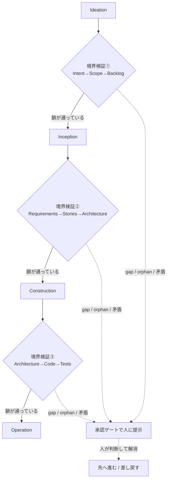

> **本記事の位置づけ** — 本記事は、`awslabs/aidlc-workflows` リポジトリの規範ルールおよび利用ガイドを素材として、筆者が AI を活用して読み解き、まとめた解釈です。AWS が公式に発表した方法論ではなく、一次資料の翻訳・要約でもありません。
>
> **シリーズ** — 本記事は [AIで紐解くAI-DLC v2](https://qiita.com/takeshishimada/items/2daa87896110603252ad) シリーズの一部です。
>
> **参照した版** — **Claude Code 実装**を対象に、2026 年 6 月時点の v2.1.3（コミット `c95070e`、`core/`）を参照しています。Kiro・Codex 実装は対象外で、記述が異なる場合があります。OSS 実装は更新が続いているため、最新の状態は公式リポジトリをご確認ください。

---

## 概要

フェーズ境界検証は、ワークフローがフェーズを切り替える継ぎ目で、前フェーズの成果物から次フェーズへ鎖が通っているか（トレーサビリティ）を点検する仕組みです。各フェーズは固有の成果物を作りますが、要件のない設計や設計に遡れないコードのように鎖が切れていては意味がありません。こうした「鎖の切れ目」を、フェーズが変わるタイミングで洗い出します。

ただし、これは進行をせき止めるものではありません。境界をまたぐと `PHASE_VERIFIED` という監査マーカーが無条件に記録される一方、合否そのものはコンダクター（ワークフローを回す進行役）がプロトコル規約に沿って判定し、問題が見つかれば承認ゲートに合流します。本記事では、3つの境界、確かめる鎖、そして監査マーカーと停止機構の関係を読み解きます。

---

## フェーズ境界検証とは

AI-DLC v2 のワークフローは 発想 → 構想 → 構築 → 運用 と進みます。各フェーズは固有の成果物を生み出しますが、それらが互いに孤立していては意味がありません。要件のない設計、設計に遡れないコード、ストーリーに対応しないアーキテクチャ。フェーズ境界検証は、こうした上流から下流への鎖の整合を、フェーズが変わる継ぎ目で確かめます。

検証が走るのは、この境界だけです。境界は3つあり、それぞれ確かめる鎖が違います。

---

## 3つの境界

| 境界 | 遷移点 | 確かめる鎖 |
|------|--------|-----------|
| Ideation → Inception | approval-handoff → reverse-engineering | Intent → Scope → Intent Backlog の一貫性。scope 項目すべてに feasibility の裏付けがあるか |
| Inception → Construction | delivery-planning → functional-design | Requirements → Stories → Architecture の整合。全ストーリーが要件に遡れ、アーキテクチャが全ストーリーをカバーするか |
| Construction → Operation | ci-pipeline → deployment-pipeline | Architecture → Code → Tests の整合。全コードが設計に遡れ、テストが受け入れ基準に対応するか |

Initialization → Ideation には境界検証がありません。ここはワークスペースを用意するブートストラップ段階で、検証すべき上流成果物がまだ存在しないためです。

---

## たどる鎖と、見つかる問題

検証はフェーズをまたぐ1本の鎖をたどります。

```
Intent → Requirement → Story → Architecture Component → Code Module → Test Suite
```

この鎖をたどり、各成果物に次の状態を付けます。

- **Fully traced** — Intent からテストまで鎖が完全に通っている
- **Partially traced** — 鎖に欠落がある（どこが切れているかを具体的に示す）
- **Orphan** — 上流リンクを持たない孤児成果物

検証が拾う問題は、突き詰めると次の3種類です。

1. **gap（欠落リンク）** — 要件はあるのに対応する設計がない、など鎖の途中が切れている
2. **orphan（孤児成果物）** — 設計はあるのに対応する要件がない、上流を持たない成果物
3. **contradiction（矛盾）** — フェーズ間で出力が食い違っている

なお、成果物が互いにどう連結しているか（slug による参照・1つの成果物に生産者は1つ）という鎖の土台は、別記事「[成果物の流れ](https://qiita.com/takeshishimada/items/46feb553f907f9eedd14)」で扱います。

---

## 走るタイミング

| タイミング | 内容 |
|-----------|------|
| フェーズ最終ステージの承認後 | そのフェーズの全成果物が揃った直後 |
| 次フェーズの初手の前 | 次フェーズが始まる前に鎖を確認する |
| オンデマンド | 人が `/aidlc --status` で随時要求できる |
| 各ステージ完了時（別機構・軽量） | このステージの出力が前ステージの出力を参照しているかのセルフチェック |

最後の「各ステージ完了時の軽量チェック」はフェーズ境界検証とは別物で、ステージ単位で走る `upstream-coverage` センサーが担います。ステージ定義のフロントマター（ファイル冒頭のメタ情報）に宣言された `consumes:`（消費する上流成果物）が、出力の本文で実際に参照されているかを見る助言です。センサーが成果物の保存時に何を見ているかは、別記事「[センサー](https://qiita.com/takeshishimada/private/5f8dbb62f25c1a09a257)」で扱います。

---

## 検証の出力

検証結果は、アクティブな intent の記録ディレクトリ（`aidlc/spaces/<space>/intents/<YYMMDD>-<label>/`、以下 `<record>`）配下の `<record>/verification/` に残ります。

- **`traceability.md`** — Intent → Requirement → Story → Architecture → Code → Test のマッピング。各成果物の状態（Fully traced / Partially traced / Orphan）を一覧する
- **`phase-check-[phase].md`** — フェーズ境界ごとのチェック結果。カバレッジ率（対応ストーリーのある要件の割合、対応コンポーネントのあるストーリーの割合など）、警告（不完全なマッピング）、整合性チェック、そして人の承認チェックボックス

---

## 「検証ゲート」との違い

フェーズ境界検証でいちばん誤解されやすいのは、これを進行を止める仕組みだと思い込むことです。実装を読むと、そうではありません。

境界をまたぐと `PHASE_VERIFIED` という監査イベントが記録されますが、これは事後の監査マーカーです。記録は無条件で、合否で分岐しません。イベントに載るデータ（ペイロード）は境界名の文字列（例: `inception → construction`）だけで、検証の成否そのものはこのイベントに含まれません。

では合否はどこで判定されるのか。それはコンダクター（LLM）がプロトコル規約に沿って行う知識作業です。`stage-protocol-governance.md` §13 が「成果物を読み、鎖を組み立て、gap・orphan・矛盾を洗い出し、レポートを書き、人に提示する」という手順を定義しています。検証が失敗したときは、承認ゲートに合流します。

止める権限で機構を切り分けると、AI-DLC v2 には2つしかありません。

| 機構 | 止める権限 | 実体 |
|----|---------|------|
| センサー | 止めない（助言のみ） | 全センサーが `advisory`。`upstream-coverage` などステージ単位で走り、欠落を報告するが進行は止めない |
| 承認ゲート | 人が止める | 人が成果物を確認して承認する。フェーズ境界検証の失敗もここに合流する |

フェーズ境界の `PHASE_VERIFIED` はこのどちらでもなく、境界を越えた事実を記録する監査マーカーです。検証の判定は規約に沿ってコンダクターが担い、失敗時は承認ゲートが受け止めます。承認ゲートの差し戻しや「現状で承認」の仕組みは、別記事「[承認ゲート](https://qiita.com/takeshishimada/private/cd6827700443c9987fd7)」で扱います。この検証が現実にどこまで効くか（LLM 規約に委ねた判定の限界）は、別記事「[限界と注意点](https://qiita.com/takeshishimada/private/7b7582e2dfac5d942eda)」で扱います。

---

## 全体像



図の3つの境界は、どれも同じ分岐をたどります。鎖が通っていれば次フェーズへ進み、gap・orphan・矛盾が見つかれば人に提示して承認ゲートに合流します。`PHASE_VERIFIED` の記録は、この分岐とは別に、境界を越えるたび無条件に行われます。

---

## 参照元

| ファイル | 内容 |
|---------|------|
| [`core/aidlc-common/protocols/stage-protocol-governance.md`](https://github.com/awslabs/aidlc-workflows/blob/v2.1.3/core/aidlc-common/protocols/stage-protocol-governance.md) | §13 フェーズ境界検証の規約。3境界・検証手順・失敗時の合流を定義 |
| [`core/knowledge/aidlc-shared/verification.md`](https://github.com/awslabs/aidlc-workflows/blob/v2.1.3/core/knowledge/aidlc-shared/verification.md) | 検証方法論。トレーサビリティ鎖・状態指標・出力ファイルの定義 |
| [`core/tools/aidlc-state.ts`](https://github.com/awslabs/aidlc-workflows/blob/v2.1.3/core/tools/aidlc-state.ts) | `PHASE_VERIFIED` 監査イベントの発行（無条件・境界名のみのペイロード） |
| [`core/tools/aidlc-audit.ts`](https://github.com/awslabs/aidlc-workflows/blob/v2.1.3/core/tools/aidlc-audit.ts) | `PHASE_VERIFIED` を含む監査イベント定義 |
| [`core/aidlc-common/protocols/stage-protocol.md`](https://github.com/awslabs/aidlc-workflows/blob/v2.1.3/core/aidlc-common/protocols/stage-protocol.md) | 承認ゲート。検証失敗時の合流先 |
| [`core/sensors/aidlc-upstream-coverage.md`](https://github.com/awslabs/aidlc-workflows/blob/v2.1.3/core/sensors/aidlc-upstream-coverage.md) | ステージ単位の助言センサー。`consumes:` 参照チェック（`default_severity: advisory`） |
| [`core/tools/aidlc-sensor.ts`](https://github.com/awslabs/aidlc-workflows/blob/v2.1.3/core/tools/aidlc-sensor.ts) | センサー実装。全センサーの結果は advisory で進行を止めない |

---

## 関連記事

**前の記事**: [レビュアー](https://qiita.com/takeshishimada/private/624d83e946e86e4b1553)
**次の記事**: [ルールとナレッジ](https://qiita.com/takeshishimada/private/33f3b2b401d4d3c1c266)
**目次**: [AIで紐解くAI-DLC v2](https://qiita.com/takeshishimada/items/2daa87896110603252ad)
