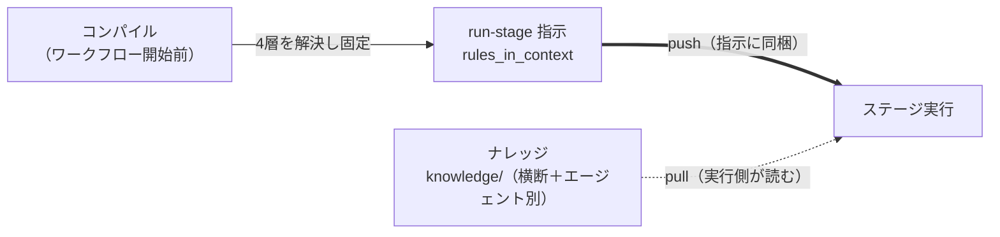

> **本記事の位置づけ** — 本記事は、`awslabs/aidlc-workflows` リポジトリの規範ルールおよび利用ガイドを素材として、筆者が AI を活用して読み解き、まとめた解釈です。AWS が公式に発表した方法論ではなく、一次資料の翻訳・要約でもありません。
>
> **シリーズ** — 本記事は [AIで紐解くAI-DLC v2](https://qiita.com/expensivegasprices/items/2daa87896110603252ad) シリーズの一部です。
>
> **参照した版** — **Claude Code 実装**を対象に、2026 年 6 月時点の v2.1.3（コミット `c95070e`、`core/`）を参照しています。Kiro・Codex 実装は対象外で、記述が異なる場合があります。OSS 実装は更新が続いているため、最新の状態は公式リポジトリをご確認ください。

---

## 概要

AI-DLC v2 のエージェントは、ステージを実行するとき2種類の「決められたもの」を文脈に取り込みます。守る義務のある**ルール**（組織・チーム・プロジェクト・フェーズの4層からなる規律）と、参照するだけの**ナレッジ**（ドメイン設計や脅威分析といった専門分野の手法）です。同じ「あらかじめ用意されたもの」でありながら、この2つは正反対の経路で届きます。ルールはエンジンが指示に載せ（push）、ナレッジは指示に載らず、実行する側が自分でたどります（pull）。

本記事では、この push と pull の非対称がどこに根拠を持つのか、そして「どのルールを読むか」がいつ確定するのかを、一次資料のコードと規約から読み解きます。

## ルールとナレッジの違い

まず、2つは効力が違います。ルールは従う義務があり、その最上位には破ってはいけない一線であるガードレールが含まれます。ナレッジは参照用で、従う義務はありません。ドメイン設計や脅威分析の進め方といった、ステージをうまくこなすための手法の集まりです。

効力が違うだけなら、置き場所を分ければ済む話です。ところが AI-DLC v2 は、**届け方そのものを変えています**。ルールはエンジンが指示に同梱してエージェントへ届けます。ナレッジは指示に載らず、ステージを実行する側が必要なときに自分で読みにいきます。前者を push、後者を pull と呼びます。

## 対照的な2つの届き方

2つの違いを整理すると、次のようになります。

| | ルール | ナレッジ |
| --- | --- | --- |
| 効力 | 従う義務（ガードレールを含む） | 参照用（従う義務はない） |
| 届き方 | **push** ― 指示に同梱されて届く | **pull** ― 実行側が自分で読みにいく |
| 源泉 | `rules_in_context`（パスのリスト） | §5「ナレッジ読み込み順」 |

push の根拠は、エンジンがコンダクターに返す `run-stage` 指示（directive）の型そのものにあります。指示には、効くルールのパス列 `rules_in_context` が**フィールドとして載っている**一方、ナレッジに当たるフィールドは**ありません**。

```ts
export interface RunStageDirective {
  kind: "run-stage";
  // ...
  rules_in_context: string[];    // ← ルールは指示に同梱（push）
  sensors_applicable: string[];
  // ...                            ナレッジに当たるフィールドは無い
}
```

— `core/tools/aidlc-directive.ts`

ではナレッジはどこから来るのか。ステージプロトコル §5 の「ナレッジ読み込み順（Knowledge loading order）」が、実行する側が**自分で**たどる手順を定めています。

```
### Knowledge loading order (for all stage types):
1. {{HARNESS_DIR}}/rules/ — organization and project guardrails (always)
2. {{HARNESS_DIR}}/knowledge/aidlc-shared/ — shared methodology principles
3. {{HARNESS_DIR}}/knowledge/[agent-name]/ — agent-specific methodology
4. aidlc/knowledge/aidlc-shared/ — team shared knowledge (if exists)
5. aidlc/knowledge/[agent-name]/ — team agent-specific knowledge (if exists)
6. Prior stage artifacts as required by the current stage
```

— `core/aidlc-common/protocols/stage-protocol.md` §5

ナレッジの本体は **2〜5段目**です。横断のナレッジ（`aidlc-shared/`、9本）と、エージェント別の方法論（13体それぞれに1〜7本。例：アーキテクトの `ddd-patterns`、DevSecOps の `threat-modelling-stride`）が並びます。4・5段目の `aidlc/knowledge/` は、チームが独自のナレッジを加える拡張点です（存在すれば読まれる。空・自由形式で出荷され、チームが必要に応じて埋めます）。

1段目に `{{HARNESS_DIR}}/rules/` が現れるのは、push で届くルールを実行側がここでも参照する規定だからです。ルールは指示に同梱されたうえで、§5 でも各ステージが読みます。

## 「どれを読むか」のコンパイル時確定

「このステージではどのルールファイルが効くか」は、ワークフロー開始前のコンパイルで各ステージごとに確定し、`rules_in_context` として書き込まれます。実行中に解決し直すことはありません。

解決のチェーンは **`org → team → project → phase` の4層**です。`org` / `team` / `project` はファイル名の規約で全ステージに付き、`phase` ルールはステージ側の `phase:` 宣言が引き込みます。優先順位はコンパイラの定数で決まります。

```ts
const SCOPE_PRIORITY: Record<string, number> = {
  "org": 0, "team": 1, "project": 2, "phase": 3,
};
```

— `core/tools/aidlc-graph.ts`

結果は、効くルールファイルのパス列として各ステージに固定されます。

```json
"rules_in_context": [
  { "path": "aidlc/spaces/default/memory/org.md",                 "scope": "org" },
  { "path": "aidlc/spaces/default/memory/team.md",                "scope": "team" },
  { "path": "aidlc/spaces/default/memory/project.md",             "scope": "project" },
  { "path": "aidlc/spaces/default/memory/phases/construction.md", "scope": "phase" }
]
```

ルール階層は org→team→project→phase の4層です。確定した学習は独立ファイルではなく `team.md` ／ `project.md` に **practice（確定した学習をルールとして書いた項目）として直接書かれる**ため、learnings 用の層は要りません。学習でルールが増えていく仕組みは、別記事「[学習ループ](https://qiita.com/expensivegasprices/items/dd7f3d034ee2c137cff5)」で扱います。

ここで固定されるのは「**どのファイルを読むか**」（パス）であって、「その中身」ではありません。中身は実行時にそのパスから読まれます。なお、解決済みのルールを `run-stage` 指示に載せてエージェントへ届ける機構そのものは、別記事「[進行の中核](https://qiita.com/expensivegasprices/items/c3ac7c2223e5c7020d82)」で扱います。

## 本文を読むタイミングの未確定

一次資料で確実に言えるのは2点です。「どのルールを読むか」はコンパイルで一度固定されること、そして §5 が「各ステージでルールを読む」と定めること。どちらも `core/` で確認できます。

一方、解決済みの**本文を読み直す正確な瞬間**については、AI-DLC v2 は明確な裁定を持っていません。解説ドキュメント側の記述が、ワークフロー開始時・セッション開始時・各ステージと揺れています。ただしこれは実装ではなくドキュメント間の不整合なので、本記事では断定しません（後述の補足）。

それでも実害は出にくい構造です。この曖昧さが表面化しうるのは、ワークフローの途中でルールが書き換わる場面です。ところが学習は「いま直す」ためでなく「次に繰り返さない」ために設計されていて、確定した学習が効くのは次のワークフローからです。だから同一ワークフロー内で本文がいつ読み直されても、その実行の結果はほとんど変わりません。学習をいつ・どこに反映するかは、別記事「[学習ループ](https://qiita.com/expensivegasprices/items/dd7f3d034ee2c137cff5)」で扱います。

## 全体像



ルールは押し込まれ、ナレッジは引き寄せられる。この非対称が、AI-DLC v2 の「決められたもの」の届き方を形づくっています。ルールには確定の手続き（コンパイル時の4層解決）があり、ナレッジには各ステージでたどる読み込み順がある。届け方が違うのは、守らせるものと参照させるものを構造で区別しているからです。

## 参照元

| ファイル | 内容 |
| --- | --- |
| [`core/tools/aidlc-directive.ts`](https://github.com/awslabs/aidlc-workflows/blob/v2.1.3/core/tools/aidlc-directive.ts) | `RunStageDirective` に `rules_in_context` が載り、ナレッジに当たるフィールドは無い（push の根拠） |
| [`core/aidlc-common/protocols/stage-protocol.md`](https://github.com/awslabs/aidlc-workflows/blob/v2.1.3/core/aidlc-common/protocols/stage-protocol.md) | §5 ナレッジ読み込み順（1段目がルール、2〜5段目がナレッジ、全ステージで always）。pull 側の機構 |
| [`core/tools/aidlc-graph.ts`](https://github.com/awslabs/aidlc-workflows/blob/v2.1.3/core/tools/aidlc-graph.ts) | `SCOPE_PRIORITY` による `org→team→project→phase` の4層解決、`rules_in_context` のコンパイル時固定 |
| [`core/memory/`](https://github.com/awslabs/aidlc-workflows/tree/v2.1.3/core/memory) | ルールファイル本体（`org.md` / `team.md` / `project.md` ＋ `phases/<phase>.md`） |
| [`core/knowledge/`](https://github.com/awslabs/aidlc-workflows/tree/v2.1.3/core/knowledge) | pull されるナレッジの本体（横断 `aidlc-shared/` 9本＋エージェント別13体×1〜7本） |
| [`core/tools/aidlc-learnings.ts`](https://github.com/awslabs/aidlc-workflows/blob/v2.1.3/core/tools/aidlc-learnings.ts) | 確定学習を practice として `team.md` ／ `project.md` に追記（4層が増えない理由） |

> 補足（読込タイミングの不整合）：解決済みルールの本文を読み直す瞬間について、ハーネス向けの解説ドキュメントは「ワークフロー開始時」「セッション開始時」と互いに違う形で記し、§5 の「各ステージで読む」とも揃いません。加えて、ルールの実体ディレクトリは `memory/`（`aidlc/spaces/<space>/memory/`）ですが、§5 や用語集などハーネス向けの記述は依然 `{{HARNESS_DIR}}/rules/` のままです。いずれも実装（`core/` のコード）ではなくドキュメント側の不整合なので、本記事はコードを正とし、断定の根拠にしていません。

---

## 関連記事

**前の記事**: [フェーズ境界検証](https://qiita.com/expensivegasprices/items/f2f4e426dd542c5b6765)
**次の記事**: [学習ループ](https://qiita.com/expensivegasprices/items/dd7f3d034ee2c137cff5)
**目次**: [AIで紐解くAI-DLC v2](https://qiita.com/expensivegasprices/items/2daa87896110603252ad)
