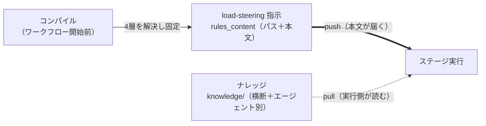

> **本記事の位置づけ** — 本記事は、`awslabs/aidlc-workflows` リポジトリの規範ルールおよび利用ガイドを素材として、筆者が AI を活用して読み解き、まとめた解釈です。AWS が公式に発表した方法論ではなく、一次資料の翻訳・要約でもありません。
>
> **シリーズ** — 本記事は [AIで紐解くAI-DLC v2](https://qiita.com/takeshishimada/items/2daa87896110603252ad) シリーズの一部です。
>
> **参照した版** — **Claude Code 実装**を対象に、2026 年 8 月 4 日時点のコミット `c73ee984`（AIDLC_VERSION 2.5.37、`core/`）を参照しています。Claude Code 以外の実装（Kiro CLI／Kiro IDE／Codex CLI／opencode）は対象外で、記述が異なる場合があります。OSS 実装は更新が続いているため、最新の状態は公式リポジトリをご確認ください。

---

## 概要

AI-DLC v2 のコンダクターは、ステージを実行するとき2種類の「決められたもの」を文脈に取り込みます。守る義務のある**ルール**（組織・チーム・プロジェクト・フェーズの4層からなる規律）と、参照するだけの**ナレッジ**（ドメイン設計や脅威分析といった専門分野の手法）です。同じ「あらかじめ用意されたもの」でありながら、この2つは正反対の経路で届きます。ルールはエンジンが本文ごと指示に載せ（push）、ナレッジはパスだけが載り、本文は実行する側が自分でたどります（pull）。

本記事では、この push と pull の非対称がどこに根拠を持つのか、「どのルールを読むか」がいつ確定するのか、そして本文が届ききるまでステージを始めさせない仕組みを、一次資料のコードと規約から読み解きます。

## ルールとナレッジの違い

まず、2つは効力が違います。ルールは従う義務があり、禁止と必須を言い切る形で書かれたガードレールもその一種です。ナレッジは参照用で、従う義務はありません。ドメイン設計や脅威分析の進め方といった、ステージをうまくこなすための手法の集まりです。

効力が違うだけなら、置き場所を分ければ済む話です。ところが AI-DLC v2 は、**届け方そのものを変えています**。ルールはエンジンが指示に同梱して届けます。ナレッジは指示に載らず、ステージを実行する側が必要なときに自分で読みにいきます。前者を push、後者を pull と呼びます。

## 対照的な2つの届き方

| | ルール | ナレッジ |
| --- | --- | --- |
| 効力 | 従う義務（ガードレールを含む） | 参照用（従う義務はない） |
| 届き方 | **push** ― 本文が指示で届く | **pull** ― 実行側が自分で読みにいく |
| 出どころ | `load-steering` 指示の `rules_content` | §5「ナレッジ読み込み順」 |

push の根拠は、エンジンがコンダクターに返す指示（directive）の型そのものにあります。エンジンはステージ本体を走らせる `run-stage` の**前に**、効くルールを `load-steering` 指示として送ります。この指示はパスの列ではなく、**パスと本文の組**を運びます。

```ts
export interface LoadSteeringDirective {
  kind: "load-steering";
  stage: string;
  bundle: string;
  part: number;
  parts: number;
  rules_content: Array<{ path: string; text: string }>;  // ← 本文そのもの
  continue_token: string;
}
```

— `core/tools/aidlc-directive.ts`

一方、ナレッジの本文を運ぶフィールドはどの指示にもありません。`run-stage` の `inline_context_paths` にペルソナとナレッジのパスは載りますが、載るのはパスまでです。ルールだけが本文を伴って届く。この非対称は、指示の型の定義にそのまま書かれています。

ではナレッジはどこから来るのか。ステージプロトコル §5 の「ナレッジ読み込み順（Knowledge loading order）」が、実行する側が**自分で**たどる手順を定めています。ここに並ぶ6段のうち、ルールが占めるのは1段目だけです。

```
### Knowledge loading order (for all stage types):
1. aidlc/spaces/<active-space>/memory/{org,team,project}.md — active-space method
   and guardrails (always; most-specific non-empty statement wins)
2. {{HARNESS_DIR}}/knowledge/aidlc-shared/ — shared methodology principles
3. {{HARNESS_DIR}}/knowledge/[agent-name]/ — agent-specific methodology
4. aidlc/spaces/<active-space>/knowledge/aidlc-shared/ — team shared knowledge (if exists)
5. aidlc/spaces/<active-space>/knowledge/[agent-name]/ — team agent-specific knowledge (if exists)
6. Prior stage artifacts as required by the current stage
```

— `core/aidlc-common/protocols/stage-protocol.md` §5

ナレッジの本体は **2〜5段目**です。横断のナレッジ（`aidlc-shared/`、9本）と、エージェント別の方法論（14体それぞれに1〜7本。例：アーキテクトの `ddd-patterns`、DevSecOps の `threat-modelling-stride`）が並びます。4・5段目の `aidlc/spaces/<space>/knowledge/` は、チームが独自のナレッジを加える拡張点です（存在すれば読まれます。出荷物には含まれず、最初の `/aidlc` がディレクトリを空のまま作ります）。

1段目だけはナレッジではなくルールそのものです。ここは配送側に寄せられています。§5 のうち inline のステージ向けに書かれた手順は「`run-stage` の前に `load-steering` の `rules_content` を順に適用する」から始まり、実行側はパスを開いて回るのではなく、届いた本文を当てます。2段目以降のナレッジは、いまもパスを渡されて自分で読みにいきます。一次資料は、これを必要なナレッジを検索して取り出す仕組み（retrieval）が入るまでの暫定措置だと明記しています。

## 「どれを読むか」のコンパイル時確定

「このステージではどのルールファイルが効くか」は、ワークフロー開始前のコンパイルで各ステージごとに確定し、`rules_in_context` として書き込まれます。実行中に解決し直すことはありません。

解決のチェーンは **`org → team → project → phase` の4層**です。`org` / `team` / `project` はファイル名の規約で全ステージに付き、`phase` ルールはステージ側の `phase:` 宣言が引き込みます。優先順位はコンパイラの定数で決まります。

```ts
const SCOPE_PRIORITY: Record<string, number> = {
  "org": 0, "team": 1, "project": 2, "phase": 3,
};
```

— `core/tools/aidlc-graph.ts`

結果は、効くルールファイルのパスの一覧として各ステージに固定されます。

```json
"rules_in_context": [
  { "path": "aidlc/spaces/default/memory/org.md",                 "scope": "org" },
  { "path": "aidlc/spaces/default/memory/team.md",                "scope": "team" },
  { "path": "aidlc/spaces/default/memory/project.md",             "scope": "project" },
  { "path": "aidlc/spaces/default/memory/phases/construction.md", "scope": "phase" }
]
```

確定した学習は独立ファイルではなく `team.md` ／ `project.md` に **practice（ルールとして書き下した一行）として直接書かれる**ため、学習のための層は要りません。学習でルールが増えていく仕組みは、別記事「[学習ループ](https://qiita.com/takeshishimada/items/dd7f3d034ee2c137cff5)」で扱います。

ここで固定されるのは「**どのファイルが効くか**」であって、「その中身」ではありません。中身はステージに入る時点でエンジンが読み、`load-steering` に載せて送ります。コンパイルが決めるのは対象、配送が運ぶのは本文、という分担です。指示を出す機構そのものは、別記事「[進行の中核](https://qiita.com/takeshishimada/items/c3ac7c2223e5c7020d82)」で扱います。

## 本文を届けきる仕組み

ルールの本文をそのまま指示に載せると、量の問題が出ます。ルールは4層あり、組織方針が育っているプロジェクトでは1ファイルが長くなります。そこで `load-steering` は分割して送られます。分割の目安は 1回あたり 20KiB です。組み上げた指示はさらに 28KiB の上限で検査され、超えるものは出力されずエラーになります。刻む基準と、出してよい上限が別々に置かれている形です。何分の何かは `part` と `parts` で分かります。切れ目はまず Markdown の見出しで、それでも収まらないときは文字境界を壊さない位置で割ります。

分割したぶん、途中で止まると中途半端になります。これを防ぐのが `continue_token` です。コンダクターは受け取った本文を当てたら、すぐ `continue` サブコマンドにこのトークンを渡します。最後の継続を辿り終えたところで、エンジンは初めて `run-stage` を出します。トークンは、実行中のステージ、ワークフローの状態、ルール束（`bundle`）の内容、経路、次の `part` を束ねて署名されています。そのため、別の場面のトークンを持ち込んでも通りません。

**サイズを理由にパス渡しへ引き返す仕組みはありません。** 必須のルールファイルが見つからない、読めない、文字コードが壊れているといった場合、エンジンはステージの作業に入る前に止まり、直し方を示します。ルールが届かないまま先へ進んでしまうことを避けるためです。止めないものもあります。ペルソナやナレッジのように自分で読みにいくファイルが欠けていたり読めなかったりしたときは、`context_warnings` という警告に落ちるだけで、ステージは進みます。ルールは全件が必須で「任意のルール」という区分はないので、この警告に混ざることはありません。

届け先はコンダクターだけではありません。ステージがエージェントを起動するとき、フック（`aidlc-dispatch-rules.ts`）が同じルール本文を各ブリーフに追記します。主担当も補佐もレビュアーも対象で、外れるのはスコープを組むコンポーザー1体だけです。このとき本文は、中身から計算したハッシュ値（ダイジェスト）付きの目印で挟まれます。フックは目印を含めて一致するかを見るので、要約や書き換えでは配送済みと認められません。コンダクターが読んだルールを起動された側が読んでいない、という食い違いは起こりません。

## 全体像


```mermaid
flowchart LR
  C["コンパイル<br/>（ワークフロー開始前）"] -->|"4層を解決し固定"| D["load-steering 指示<br/>rules_content（パス＋本文）"]
  D ==>|"push（本文が届く）"| EX["ステージ実行"]
  K["ナレッジ<br/>knowledge/（横断＋エージェント別）"] -.->|"pull（実行側が読む）"| EX
```

ルールは押し込まれ、ナレッジは引き寄せられる。押し込む側には、本文が届ききるまでステージを始めさせない手続きと、起動された補佐にも同じ本文を渡す経路が付いています。引き寄せる側にあるのは、各ステージでたどる読み込み順だけです。届け方をここまで変えているのは、守らせるものと参照させるものを構造で区別しているからです。

## 参照元

| ファイル | 内容 |
| --- | --- |
| [`core/tools/aidlc-directive.ts`](https://github.com/awslabs/aidlc-workflows/blob/c73ee984/core/tools/aidlc-directive.ts) | `LoadSteeringDirective` の `rules_content`（パス＋本文）と `continue_token`。ナレッジに当たるフィールドはどの指示にも無い（push の根拠）。`RunStageDirective` の `rules_in_context` は配送済みのルール束のパスの一覧、`context_warnings` はペルソナ・ナレッジ側の警告 |
| [`core/tools/aidlc-steering.ts`](https://github.com/awslabs/aidlc-workflows/blob/c73ee984/core/tools/aidlc-steering.ts) | ルール束の解決と読み取り。アクティブ空間へのパス解決、UTF-8 の厳格な読み込み、中身の無いテンプレートの除外。エンジンと配送フックが共用する |
| [`core/hooks/aidlc-dispatch-rules.ts`](https://github.com/awslabs/aidlc-workflows/blob/c73ee984/core/hooks/aidlc-dispatch-rules.ts) | エージェントの起動時に同じルール本文をブリーフへ追記するフック（コンポーザー1体のみ除外）。ダイジェストの目印を含めて揃っていなければ配送済みとみなさない |
| [`core/aidlc-common/protocols/stage-protocol.md`](https://github.com/awslabs/aidlc-workflows/blob/c73ee984/core/aidlc-common/protocols/stage-protocol.md) | §5 ナレッジ読み込み順（1段目がルール、2〜5段目がナレッジ、全ステージで always）と、inline のステージ向け手順（`load-steering` の適用から始まる）。pull 側の機構 |
| [`core/tools/aidlc-orchestrate.ts`](https://github.com/awslabs/aidlc-workflows/blob/c73ee984/core/tools/aidlc-orchestrate.ts) | 分割（`markdownSections` → `splitRuleText` → `steeringChunks`）と継続トークンの署名・検証（`steeringTokenMac` / `encodeSteeringToken`）。1指示あたりの上限 `DIRECTIVE_MAX_BYTES` |
| [`core/tools/aidlc-graph.ts`](https://github.com/awslabs/aidlc-workflows/blob/c73ee984/core/tools/aidlc-graph.ts) | `SCOPE_PRIORITY` による `org→team→project→phase` の4層解決、`rules_in_context` のコンパイル時固定 |
| [`core/memory/`](https://github.com/awslabs/aidlc-workflows/tree/c73ee984/core/memory) | ルールファイル本体（`org.md` / `team.md` / `project.md` ＋ `phases/<phase>.md`） |
| [`core/knowledge/`](https://github.com/awslabs/aidlc-workflows/tree/c73ee984/core/knowledge) | pull されるナレッジの本体（横断 `aidlc-shared/` 9本＋エージェント別14体×1〜7本） |
| [`core/tools/aidlc-learnings.ts`](https://github.com/awslabs/aidlc-workflows/blob/c73ee984/core/tools/aidlc-learnings.ts) | 確定学習を practice として `team.md` ／ `project.md` に追記（4層が増えない理由） |

> 補足（解決チェーンの層数の食い違い）：ルールの解決チェーンについては、実装とドキュメントに食い違いが残っています。コードは4層ですが、`rules-reading.md` と `core/templates/onboarding.md` の2ファイルは「`org → team → project → phase → stage` の5層」と書いています。`stage` 層は予約されているだけで実体がなく、コンパイラの定数にも含まれません。本記事はコードを正としています。

---

## 関連記事

**前の記事**: [フェーズ境界検証](https://qiita.com/takeshishimada/items/f2f4e426dd542c5b6765)
**次の記事**: [学習ループ](https://qiita.com/takeshishimada/items/dd7f3d034ee2c137cff5)
**目次**: [AIで紐解くAI-DLC v2](https://qiita.com/takeshishimada/items/2daa87896110603252ad)
