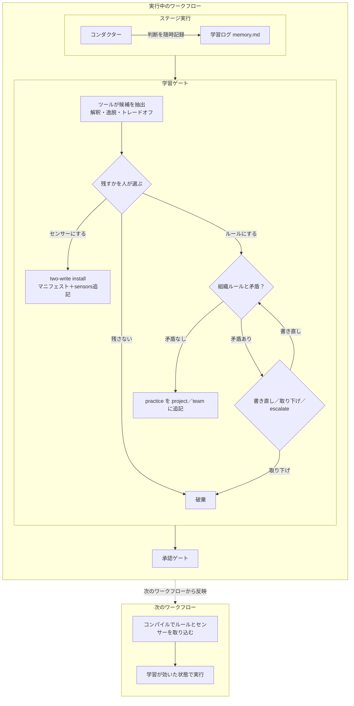

> **本記事の位置づけ** — 本記事は、`awslabs/aidlc-workflows` リポジトリの規範ルールおよび利用ガイドを素材として、筆者が AI を活用して読み解き、まとめた解釈です。AWS が公式に発表した方法論ではなく、一次資料の翻訳・要約でもありません。
>
> **シリーズ** — 本記事は [AIで紐解くAI-DLC v2](https://qiita.com/takeshishimada/items/2daa87896110603252ad) シリーズの一部です。
>
> **参照した版** — **Claude Code 実装**を対象に、2026 年 6 月時点の v2.1.3（コミット `c95070e`、`core/`）を参照しています。Kiro・Codex 実装は対象外で、記述が異なる場合があります。OSS 実装は更新が続いているため、最新の状態は公式リポジトリをご確認ください。

---

## 概要

学習ループは、ワークフロー中にコンダクターが下した判断を書きためておき、そのうち人が残すと決めたものを恒久的なルールやセンサーに変えて、次のワークフローに効かせる仕組みです。AIと組んで開発していると、「この用語はこの意味で使って」「この手順は省いていい」と同じ修正を何度も伝えがちです。その修正は会話が切れると消えます。学習ループは、この「修正の使い捨て」を止め、一度正したことを次から前提にします。

中心にあるのは、ステージ完了と承認の間に置かれた学習ゲートです。コンダクターが気づきを学習ログに書きため、ゲートで人が残すものを選び、確定した学習が方法を記すファイルに保存されます。本記事では、何が記録され、人がどう選び、確定した学習がどこにどう保存されて次にどう効くのかを読み解きます。

## 学習ループとは

AIエージェントに作業を任せると、仕様の曖昧さを埋めたり、手順を一部省いたり、複数の選択肢から一つを選んだりと、その場その場で判断が積み重なっていきます。判断そのものは避けられません。問題は、人が「そこはこう直して」と正しても、その修正がセッションをまたぐと残らないことです。

学習ループは、この修正を恒久ルールに変えて次に活かす仕組み全体を指します。原語は learning loop、ソース上の正式名は `Learnings Ritual` です。記録・選別・保存の三段で成り立ち、選別の段階が学習ゲート（学習ループ内の取り込み口）にあたります。以下、この三段を順に追います。

## エージェントによる記録

コンダクターは、ステージ作業中に下した判断を学習ログ（`memory.md`）へ随時書き留めます。ステージ開始時に作られ、作業の進行とともに追記されていく作業メモです。記録を人が担うとコストがかかるので、書き留めるのはコンダクターに任せ、何を残すかだけ人が判断します。

記録は次の4カテゴリに分けて残します。

| カテゴリ | 意味 | 例 |
| --- | --- | --- |
| Interpretations | 曖昧な箇所をこう解釈した | 「トランザクション」を決済取引と解釈 |
| Deviations | 手順にあるが、あえて外した | データ量が小さくキャッシュ層を省略 |
| Tradeoffs | 複数の選択肢から一つ選んだ | 消費側がCRUDのみなので REST を選択 |
| Open questions | まだ答えが出ていない | 保持期間をコンプライアンスに要確認 |

学習ログはコンダクターが自分で書く数少ないファイルです。状態や監査ログがツール任せで積み上がるのに対し、ここだけはコンダクターが中身を書きます。誰がどのファイルを書くかという書き分けは、別記事「[状態と監査](https://qiita.com/takeshishimada/private/72234648bb4400cedf53)」で扱います。

## 学習ゲートの手順

各ステージの作業が終わると、承認ゲートの直前に学習ゲートが走ります。次の順で進みます。

1. **候補の抽出** — ツール（`aidlc-learnings.ts surface`）が学習ログを読み、Interpretations・Deviations・Tradeoffs の各エントリを候補として原文のまま提示します。Open questions は未解決の調べ物なので、候補にはなりません。多くのワークフローでは残すべき候補が出ないのが普通です。
2. **選択** — 人が候補ごとに残すか捨てるかを選び、必要なら文言を直します。保存先の範囲（後述の project／team）もここで選びます。
3. **矛盾検査** — 残すと決めたルール候補について、コンダクターが組織ルール（`org.md`）の同じ話題の節と1行ずつ照合します（`conflict-check`）。矛盾があれば、その組織ルールを示したうえで、人が書き直す・取り下げる・人の判断で押し通す（`escalate`）のいずれかを選びます。センサー候補には照合の対象がないので、この検査を経ずに進みます。
4. **保存** — ツール（`aidlc-learnings.ts persist`）が、矛盾のない候補を保存します。書き込みはすべてロックの中でツールを通して行われ、`RULE_LEARNED` などの監査イベントが記録されます。同じ候補の二重書き込みは自動で防がれます。

学習ゲートは助言であって、承認ゲートを止めません。候補が出なければ、そのまま承認へ進みます。

## 確定学習の保存先

確定した学習は **practice** として扱われます。方法を記す `memory/project.md`（または `memory/team.md`）の話題見出しの下に、一行の practice として追記されます。

行の形は `- 本文 (learned YYYY-MM-DD)` です。話題見出しは内容に合わせてコンダクターが振り分けます。一般的な是正は既定の `## Corrections`、テスト方針なら `## Testing Posture`、禁則なら `## Forbidden` です。人が指定するのは元の4カテゴリのどれかだけで、保存先の見出しは振り分けに任せます。

重要なのは、この保存先がルールを読む側と同じファイルだという点です。学習を書き込む側と、次回ステージがルールを読み込む側が分かれていません。だから学習はそのまま次回の前提に積み上がります。

保存先の範囲は project と team に分かれます。

- **project** — このプロジェクト内の次回以降にのみ効く（`memory/project.md`）
- **team** — プロジェクトを越えてチーム全体に効く（`memory/team.md`）

候補はすべて project で提案され、チーム全体に広げたいときだけ team への昇格を選べます。あるプロジェクトの学びが意図せず別のプロジェクトに及ぶことはありません。組織（org）への昇格経路はありません。

## ルールとセンサーへの振り分け

確定した学習は、次への効かせ方によってルールとセンサーに分かれます。

- **ルール** — 「次からこう判断して」という事前の指示。前述の practice として方法ファイルに積まれ、次回ステージの開始時にコンダクターへ読み込まれます。
- **センサー** — 「次からこれを満たしているか確かめて」という事後の検証。成果物の保存時に自動で走る助言的なチェックで、機構そのものは別記事「[センサー](https://qiita.com/takeshishimada/private/5f8dbb62f25c1a09a257)」で扱います。

どちらで活かすかは、コンダクターが候補の性質から提案し、人が確認のうえ決めます。

## センサーの取り込み

学習をセンサーにするとき、ステージのチェックは **two-write install** という二つの書き込みで取り付けられます。一つはセンサーの本体で、project 範囲のマニフェスト `aidlc-<id>.md` を新しく作ります。これは対象成果物を `matches:` のグロブ（ファイル名のパターン指定／ワイルドカード）で絞ります。もう一つが結びつけで、そのセンサーの id を、元になったステージの `sensors:` フロントマター一覧へ追記します。

二つの書き込みは同じロックの中でまとめて行われ、監査イベント `SENSOR_PROPOSED` が記録されます。取り付けられたセンサーは、次のワークフローのコンパイル（ステージ定義やルールを事前にグラフへ固定する処理）時に束ねられ、そこから走りはじめます。

このときステージファイルの本文（`## Steps` など）は書き換えません。増えるのはフロントマターの取り込み一覧だけです。ステージ本体を不変に保つのは、フレームワークの更新と現場の追記がぶつからないようにするためです。同じステージが多くのプロジェクトで走るので、本体に手を入れると方法論が各所でばらばらに枝分かれしてしまいます。

## 次のワークフローからの反映

学習は、設計上「次のワークフローから」効きます。書き込み自体は学習ゲートで即座に行われますが、反映は次回からです。ルールは前述のとおり次回ステージの開始時に読み込まれ、センサーも次のコンパイルから束ねられます。

実行中のワークフローに途中からルールを差し込まないのは、すでに承認したステージの前提が崩れてしまうからです。「書き込みは即座、反映は次回」という規律が、走っているワークフローの安定を支えています。なお、ルールがいつ読み込まれるか（事前同梱のルールと、実行側が自分で読むナレッジの違い）は、別記事「[ルールとナレッジ](https://qiita.com/takeshishimada/private/33f3b2b401d4d3c1c266)」で扱います。

## 全体像

## まとめ

学習ループは、記録・選別・保存の三段で「一度の是正」を「次からの前提」に変えます。コンダクターが学習ログに気づきを書きため、学習ゲートで人が残すものを選び、確定した学習が方法ファイルの practice か、ステージに束ねたセンサーとして保存されます。保存先はルールを読む側と同じなので、学びはそのまま積み上がります。そして反映は常に次のワークフローから始まり、走っている案件の前提は崩れません。

## 参照元

| ファイル | 内容 |
| --- | --- |
| [`aidlc-common/protocols/stage-protocol.md`](https://github.com/awslabs/aidlc-workflows/blob/v2.1.3/core/aidlc-common/protocols/stage-protocol.md) | §13 学習ゲートの全手順・practice 保存・two-write install |
| [`aidlc-common/conductor.md`](https://github.com/awslabs/aidlc-workflows/blob/v2.1.3/core/aidlc-common/conductor.md) | コンダクターの行動規範。`memory.md` への記録責務 |
| [`tools/aidlc-learnings.ts`](https://github.com/awslabs/aidlc-workflows/blob/v2.1.3/core/tools/aidlc-learnings.ts) | 学習ループツール実装（`surface`／`persist` サブコマンド） |
| [`knowledge/aidlc-shared/memory-template.md`](https://github.com/awslabs/aidlc-workflows/blob/v2.1.3/core/knowledge/aidlc-shared/memory-template.md) | `memory.md` のテンプレート。4カテゴリの定義 |
| [`core/memory/`](https://github.com/awslabs/aidlc-workflows/tree/v2.1.3/core/memory)（`org.md`／`project.md`／`team.md`） | 矛盾検査の対象と practice の保存先（project／team） |

---

## 関連記事

**前の記事**: [ルールとナレッジ](https://qiita.com/takeshishimada/private/33f3b2b401d4d3c1c266)
**次の記事**: [状態と監査](https://qiita.com/takeshishimada/private/72234648bb4400cedf53)
**目次**: [AIで紐解くAI-DLC v2](https://qiita.com/takeshishimada/items/2daa87896110603252ad)
