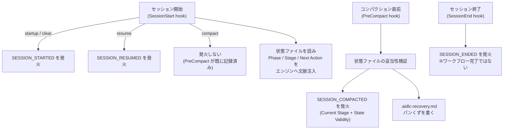

> **本記事の位置づけ** — 本記事は、`awslabs/aidlc-workflows` リポジトリの規範ルールおよび利用ガイドを素材として、筆者が AI を活用して読み解き、まとめた解釈です。AWS が公式に発表した方法論ではなく、一次資料の翻訳・要約でもありません。
>
> **シリーズ** — 本記事は [AIで紐解くAI-DLC v2](https://qiita.com/takeshishimada/items/2daa87896110603252ad) シリーズの一部です。
>
> **参照した版** — **Claude Code 実装**を対象に、2026 年 6 月時点の v2.1.3（コミット `c95070e`、`core/`）を参照しています。Kiro・Codex 実装は対象外で、記述が異なる場合があります。OSS 実装は更新が続いているため、最新の状態は公式リポジトリをご確認ください。

---

## 概要

進行を司るエンジンは、状態（記憶）を持ちません。だから「次に何をするか」を判断するたびに、外部のファイルを読み直します。AI-DLC v2 がそのよりどころにするのが、性質が正反対の2つのファイルです。ひとつは **状態**（state）。いま工程のどこまで進んだかを記録した現在地のスナップショットで、報告のたびに上書きされます。もうひとつは **監査ログ**（audit）。何がいつ起きたかを消さずに積み上げる、追記専用の履歴です。「今どこにいるか」と「どうやって来たか」を別々のファイルが受け持つので、会話が切れても文脈が圧縮されても、別の会話から続きを再開できます。

本記事では、この2つがそれぞれ何をどう持つのか、誰が書くのか、セッションをまたいでどう再開を支えるのか、そしてなぜ役割を2つに分けるのかを読み解きます。

## エンジンが毎回読み直すもの

AI-DLC v2 のワークフローは、ひとつの会話（セッション）の中だけで完結するとは限りません。途中で会話が切れても、コンパクションで文脈が圧縮されても、別の日に続きから再開できます。それを支えているのが2つのファイルです。

- **状態ファイル**（state） ― 今どこまで進んだかを記録した、現在地のスナップショット。報告のたびに上書きされる。
- **監査ログ**（audit） ― 何がいつ起きたかを並べた、消さずに積み上げる履歴。

進行を司るエンジンは状態を持ちません。だから毎回この状態ファイルを読み直して「次は何か」を判断します。なぜエンジンが状態を持たない設計なのか、その理由とエンジン本体の仕組みは別記事「[進行の中核](https://qiita.com/takeshishimada/items/c3ac7c2223e5c7020d82)」で扱います。この記事はその一段下、**state と audit が「なに」を、どう持っているか** に集中します。

---

## 状態ファイル

状態は `<record>/aidlc-state.md` というマークダウン1枚です（`<record>` ＝ アクティブ intent の記録ディレクトリ `aidlc/spaces/<space>/intents/<YYMMDD>-<label>/`。単一チームなら `spaces/default/`）。報告のたびにツールが上書きするので、履歴は持ちません。常に「今この瞬間」だけが書かれています。ファイルとして残るので、会話をまたいでも、別の会話からでも、ここを読めば現在地が分かります。

先頭の Project Information 節には **State Version: 7** が記されています。これは状態ファイルの **スキーマのバージョン番号** で、節やフィールドの構成が変わるたびに上がります。古い版の状態ファイルを新しいツールが読むときの食い違いを検知するための目印です。

ファイルは9つの節（`##` 見出し）でできています。

| 節 | 役割 |
| --- | --- |
| Project Information | プロジェクト概要・種別（Greenfield/Brownfield）・スコープ・開始日時・**State Version**・現在のリード agent など |
| Scope Configuration | 実行するステージ番号／スキップするステージ（理由つき）／**Depth**（Minimal/Standard/Comprehensive） |
| Workspace State | 検出した言語・フレームワーク・ビルドシステム |
| Execution Plan Summary | 総ステージ数・完了数・進行中ステージ |
| Runtime State | Revision Count（差し戻し回数）・Skeleton Stance・`Parked`/`Parked At Stage`（一時停止のマーカー）などの実行時メタデータ |
| Phase Progress | フェーズ単位の粗い進捗 |
| Stage Progress | ステージ単位のチェックボックス進捗 |
| Current Status | Lifecycle Phase・Current Stage・Next Stage・Status・Last Updated |
| Session Resume Point | Last Completed Stage・Next Action・Pending Artifacts |

進捗は2つの粒度で記録します。**Phase Progress** はフェーズ全体を `Pending / Active / Verified / Skipped` の4状態で粗く示し、**Stage Progress** は各ステージをチェックボックスで細かく追います。チェックボックスは6状態あります。

| 記法 | 意味 |
| --- | --- |
| `[ ]` | 未着手 |
| `[-]` | 進行中（現在のステージ、まだ承認前） |
| `[?]` | 承認待ち（ゲートが開いている） |
| `[R]` | 改訂中（人が差し戻した） |
| `[x]` | 完了（人が承認した） |
| `[S]` | スキップ（スコープ除外、`skip`、`--stage`/`--phase` ジャンプによる迂回） |

最後の **Session Resume Point** 節が、再開のための足がかりです。「最後に完了したステージ」「次にやること」「未完成の成果物」を書いておき、再開時にここから文脈を立て直します。

スコープと深さ（Scope Configuration / Depth）が状態ファイルに保持される点は、それぞれ別記事「[スコープ](https://qiita.com/takeshishimada/items/c232fb2e994e7b567a5c)」と別記事「[深さ](https://qiita.com/takeshishimada/items/f2246466b9e3bdef570b)」で扱います。本記事では「状態ファイルに住んでいる」ことだけ述べます。

> 補足：ステージプロトコル（stage-protocol.md §4）の記法一覧は `[ ] / [-] / [x] / [S]` の4つに省略されていますが、状態ファイルのテンプレートと状態ツールの実装はそろって上記の **6状態** を持ちます。本記事はテンプレートと実装を一次として6状態で記述しています。

---

## 監査ログ

監査ログは記録ディレクトリ 配下に住みます。状態ファイルが「上書きされる現在地」なら、こちらは正反対で、**追記専用・改変禁止** の履歴です。一度書いたエントリは決して書き換えず、消さず、ただ末尾に積み上げます。人の判断（承認のひと言など）は要約せず逐語で残します。後から「いつ・何が起き、なぜそう決めたか」をたどり直すための記録だからです。

監査ログは **クローン別のシャード** `<record>/audit/<host>-<clone-id>.md` に分かれます（clone-id は gitignore された `aidlc/.aidlc-clone-id` の安定12桁トークン）。複数のクローンや worktree が並行して書いても履歴（trail）が衝突（merge-conflict）しないための設計です。読む側は `<record>/audit/*.md` を glob し、**タイムスタンプで時系列マージ** します（ファイルの連結順＝新しさ、ではない点に注意）。シャード自体は **版管理（コミット対象）** で、gitignore されるのは per-user カーソルや clone-id・runtime-graph など機械固有のものだけです。なお並行書き込みは intent 単位の監査ロックで直列化されますが、stale-lock 回収には実装コメントが認める残存レースがあります（別記事「[限界と注意点](https://qiita.com/takeshishimada/private/7b7582e2dfac5d942eda)」で扱います）。

イベントには命名規約があります。すべて `SUBJECT_PAST_VERB`、つまり過去形で「何が起きたか」に答える形（`STAGE_COMPLETED`、`GATE_APPROVED` など）。そして登録済みのイベントは **69種、18カテゴリ** に整理されています（`WORKFLOW_PARKED`/`WORKFLOW_UNPARKED` などを含む）。

| カテゴリ | 主なイベント例 |
| --- | --- |
| Workflow Lifecycle | `WORKFLOW_STARTED` / `WORKFLOW_COMPLETED` / `WORKFLOW_PARKED` / `WORKFLOW_UNPARKED` |
| Phase Lifecycle | `PHASE_STARTED` / `PHASE_COMPLETED` / `PHASE_VERIFIED` |
| Stage Lifecycle | `STAGE_STARTED` / `STAGE_COMPLETED` / `STAGE_SKIPPED` |
| Session Events | `SESSION_STARTED` / `SESSION_RESUMED` / `SESSION_COMPACTED` / `SESSION_ENDED` |
| Initialization | `WORKSPACE_SCAFFOLDED` / `WORKSPACE_INITIALISED` |
| Navigation | `SCOPE_CHANGED` / `DEPTH_CHANGED` / `SCOPE_DETECTED` |
| Interaction | `DECISION_RECORDED` / `GATE_APPROVED` / `GATE_REJECTED` / `QUESTION_ANSWERED` |
| Artifact | `ARTIFACT_CREATED` / `ARTIFACT_UPDATED` / `ARTIFACT_REUSED` |
| Subagent | `SUBAGENT_COMPLETED` |
| Utility | `HEALTH_CHECKED` |
| Error/Recovery | `ERROR_LOGGED` / `RECOVERY_COMPLETED` |
| Construction Bolt | `BOLT_STARTED` / `BOLT_COMPLETED` / `AUTONOMY_MODE_SET` |
| Worktree | `WORKTREE_CREATED` / `STATE_FORKED` / `AUDIT_MERGED` |
| Practices | `PRACTICES_DISCOVERED` / `PRACTICES_AFFIRMED` |
| Merge Dispatch | `MERGE_DISPATCH_INVOKED` / `MERGE_DISPATCH_FALLBACK` |
| Sensor | `SENSOR_FIRED` / `SENSOR_PASSED` / `SENSOR_FAILED` |
| Learning Loop | `MEMORY_EMPTY` / `RULE_LEARNED` / `SENSOR_PROPOSED` |
| Swarm | `SWARM_STARTED` / `SWARM_UNIT_CONVERGED` / `SWARM_COMPLETED` |

表は各カテゴリの代表例で、18カテゴリの全体像を示します。

もうひとつ、「**新しいイベントを発明しない**」という規律があります。ステージが完了したら、どのステージであっても固定名の `STAGE_COMPLETED` を使う。「Requirements Analysis Complete」のようなステージ固有の名前を勝手に作ってはいけません。名前が増殖すると、後から履歴を機械的に集計・検証できなくなるからです。

この規律は単なるお願いではなく、**コードで強制** されています。監査追記の入口 `appendAuditEntry` は、登録済み69種を集めた `VALID_EVENT_TYPES` の集合に無いイベント名を渡されると `Invalid event type` で拒否します。台帳に載っていない名前は、そもそも書き込めません。

> ささいですが効果的な工夫として、フィールド値に紛れ込んだ改行（CR/LF）はエスケープしてから書き込みます。ファイルパスに `\n**Event**: FAKE\n` のような文字列が混じっても、偽のエントリを差し込めないようにするためです。監査ログはセキュリティ上も重要な記録なので、こうした防御が入っています。

---

## 誰が何を書くか

state も audit も、**コンダクター（進行役の AI）は直接手を出しません**。書くのは2種類の主体です。

- **ツールが書く** ― 状態遷移にともなうイベント。ステージの開始・完了・ゲートの承認/差し戻し・ワークフロー完了などは `aidlc-state.ts` が、人への設問・回答は `aidlc-log.ts` が、Construction の Bolt は `aidlc-bolt.ts` が、それぞれ状態を書き換えると同時に対応する監査イベントを発火（emit）します。
- **フックが書く** ― 会話の流れに紐づくイベント。成果物ファイルの作成・更新（`ARTIFACT_CREATED` / `ARTIFACT_UPDATED`）は PostToolUse フックが、サブエージェントの完了（`SUBAGENT_COMPLETED`）は専用フックが、セッションの開始・終了・コンパクション（`SESSION_*`）はライフサイクルフックが拾います。

監査の各イベントには「発火元（emitter）」が定められていて、ツール発火とフック発火が混在します。たとえば `STAGE_COMPLETED` は `aidlc-state.ts` の `approve`/`advance` から、`ARTIFACT_CREATED` はフックから、というように、**誰が発火させるかが固定** されています。

コンダクターが触らない、という設計の例外がひとつだけあります。`memory.md`（学習ログ）です。state と audit がツール任せなのに対し、memory.md だけはコンダクターが判断を手で書き留める唯一のファイルです。この対比は別記事「[学習ループ](https://qiita.com/takeshishimada/private/dd7f3d034ee2c137cff5)」で扱います。

---

## セッションをまたいだ再開

再開の機構は、3つのライフサイクルフックと、セッションの4イベントが担います。

**開始時。** `SessionStart` フックは、セッションの始まり方（source）をイベントに変換します。`startup` と `clear` は `SESSION_STARTED`、`resume` は `SESSION_RESUMED`。ただし `compact`（コンパクション後の再開）では **何も発火しません**。コンパクション自体は直前に別フックが記録済みで、二重に記録すると履歴が濁るからです。さらにこのフックは状態ファイルを読み、現在のフェーズ・ステージ・ステータス・次のアクションをエンジンへ文脈として注入し、再開を助けます。状態ファイルが無ければ（＝進行中のワークフローが無ければ）何もしません。

**コンパクション直前。** `PreCompact` フックが状態ファイルの妥当性を確かめます。必須節（`## Stage Progress` と `## Current Status`）がそろっているかを検証し、`.aidlc-recovery.md` というパンくずを書き残し、`SESSION_COMPACTED`（現在ステージと妥当性の判定つき）を発火します。圧縮で文脈が失われる直前に、現在地のスナップショットが壊れていないかを点検する仕組みです。

**終了時。** `SessionEnd` フックが `SESSION_ENDED` を発火します。**セッションの終了はワークフローの完了ではありません**。両者のライフサイクルは独立していて、このイベントはあくまで観測用です。会話が切れてもワークフローは中断されただけで、状態ファイルは残り、次回そこから再開します。

再開時には、状態ツールの `resume`（読み取り専用）が監査ログの末尾を見て、「直近の `SESSION_COMPACTED` のあとにステージ活動が無い」状態を検出します。これが見つかると、コンダクターはユーザーにコンパクション後の選択肢を提示し、ユーザーが応えると `RECOVERY_COMPLETED` が記録され、「圧縮を検知したが未対応」の状態が解消されます。

---

## 2つに分ける理由

state と audit は、性質が正反対です。

| | 状態（state） | 監査（audit） |
| --- | --- | --- |
| 持つもの | 現在地 | 履歴 |
| 書き方 | 上書き（可変） | 追記（不変） |
| 形 | 1ファイル、常に最新だけ | 積み上がる時系列 |
| 読み手 | 毎回読み直すエンジン | 経緯をたどる人・ツール |

現在地を知るのに、過去の全イベントを再生する必要はありません。だから state は1点に上書きして軽く保ちます。逆に、経緯をたどるには1点では足りません。だから audit は何も捨てずに積み上げます。**「今どこか」と「どうやって来たか」は別の問いで、別のファイルが答える**。この役割分担が、記憶を持たないエンジンが毎回現在地を読み直せること、そして後から全工程を監査できることを、同時に成り立たせています。

そして両方とも、ツールとフックが書きます。コンダクターは現在地も履歴も自分の手では触りません。進行役は判断に専念し、記録は機構に委ねる ― この切り分けが、AI-DLC v2 の進捗管理を「再現でき、監査できる」ものにしています。ワークフロー全体の中でこの2つがどこに位置するかは別記事「[工程とエージェント](https://qiita.com/takeshishimada/items/418d7b9e17192e8add85)」、全体の俯瞰は別記事「[概念マップ](https://qiita.com/takeshishimada/items/6391a320609276d0cfb6)」で扱います。

---

## 参照元

| ファイル | 内容 |
| --- | --- |
| [`core/knowledge/aidlc-shared/state-template.md`](https://github.com/awslabs/aidlc-workflows/blob/v2.1.3/core/knowledge/aidlc-shared/state-template.md) | 状態ファイルの構造。State Version=7、9つの節、Phase Progress の4状態、Stage Progress の6状態記法、Session Resume Point |
| [`core/knowledge/aidlc-shared/audit-format.md`](https://github.com/awslabs/aidlc-workflows/blob/v2.1.3/core/knowledge/aidlc-shared/audit-format.md) | 監査イベントのタクソノミー。「69 events / 18 categories」の Event Registry、`SUBJECT_PAST_VERB` 命名規約、各イベントの発火元、追記専用・逐語の原則 |
| [`core/tools/aidlc-state.ts`](https://github.com/awslabs/aidlc-workflows/blob/v2.1.3/core/tools/aidlc-state.ts) | 状態の読み書きと遷移（`advance`/`approve`/`reject`/`skip`/`complete-workflow` など）。`VALID_CHECKBOX_STATES`（6状態）、遷移と同時の監査発火 |
| [`core/tools/aidlc-audit.ts`](https://github.com/awslabs/aidlc-workflows/blob/v2.1.3/core/tools/aidlc-audit.ts) | 監査ログの追記。`VALID_EVENT_TYPES`（69種）による未登録イベントの拒否、追記専用、CR/LF エスケープ |
| [`core/hooks/aidlc-session-start.ts`](https://github.com/awslabs/aidlc-workflows/blob/v2.1.3/core/hooks/aidlc-session-start.ts) | セッション開始フック。source→`SESSION_STARTED`/`SESSION_RESUMED` 変換（compact は発火しない）、状態ファイルの文脈注入 |
| [`core/hooks/aidlc-validate-state.ts`](https://github.com/awslabs/aidlc-workflows/blob/v2.1.3/core/hooks/aidlc-validate-state.ts) | PreCompact フック。状態ファイルの妥当性検証、`.aidlc-recovery.md` パンくず、`SESSION_COMPACTED` 発火 |
| [`core/hooks/aidlc-session-end.ts`](https://github.com/awslabs/aidlc-workflows/blob/v2.1.3/core/hooks/aidlc-session-end.ts) | SessionEnd フック。`SESSION_ENDED` 発火（ワークフロー完了とは独立な観測用） |
| [`core/hooks/aidlc-audit-logger.ts`](https://github.com/awslabs/aidlc-workflows/blob/v2.1.3/core/hooks/aidlc-audit-logger.ts) | PostToolUse フック。記録ディレクトリ（`<record>/`）への書き込みを `ARTIFACT_CREATED`/`ARTIFACT_UPDATED` として発火 |
| [`core/aidlc-common/protocols/stage-protocol.md`](https://github.com/awslabs/aidlc-workflows/blob/v2.1.3/core/aidlc-common/protocols/stage-protocol.md) | §4 State Tracking。コンダクター側の手順、「Event emission is tool-owned」（監査追記はツール任せ） |
| [`CHANGELOG.md`](https://github.com/awslabs/aidlc-workflows/blob/v2.1.3/CHANGELOG.md) | バージョン履歴。監査タクソノミーが版を追って 69 events に至る経緯（2.1.3 の `WORKFLOW_PARKED`/`WORKFLOW_UNPARKED` 追加・`SWARM_*` の追加を含む）、状態遷移11サブコマンドの lost-update 安全化（read→decide→audit→write を監査ロックで囲う）を記載 |

---

## 関連記事

**前の記事**: [学習ループ](https://qiita.com/takeshishimada/private/dd7f3d034ee2c137cff5)
**次の記事**: [限界と注意点](https://qiita.com/takeshishimada/private/7b7582e2dfac5d942eda)
**目次**: [AIで紐解くAI-DLC v2](https://qiita.com/takeshishimada/items/2daa87896110603252ad)
