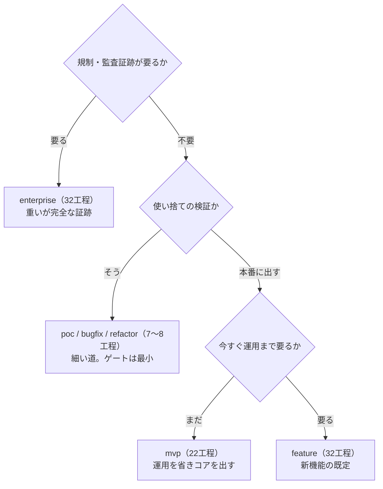

> **本記事の位置づけ** — 本記事は、`awslabs/aidlc-workflows` リポジトリの規範ルールおよび利用ガイドを素材として、筆者が AI を活用して読み解き、まとめた解釈です。AWS が公式に発表した方法論ではなく、一次資料の翻訳・要約でもありません。
>
> **シリーズ** — 本記事は [AIで紐解くAI-DLC v2](https://qiita.com/takeshishimada/items/2daa87896110603252ad) シリーズの一部です。
>
> **参照した版** — **Claude Code 実装**を対象に、2026 年 6 月時点の v2.1.3（コミット `c95070e`、`core/`）を参照しています。Kiro・Codex 実装は対象外で、記述が異なる場合があります。OSS 実装は更新が続いているため、最新の状態は公式リポジトリをご確認ください。

---

## 概要

AI-DLC v2 を自分のチームと案件に入れるべきか。この問いに、一次資料（`core/`）は直接の答えを持ちません。core で裏取りできるのは「何を・どこまで・どんな前提でできるか」という能力と制約までで、そこから先の「だから誰に向くか」は読み手が引く推論です。ただ一つ、想定用途を公式が一語で明言した一次資料があります。9種あるスコープそれぞれの `description` です。

本記事では、このスコープの想定用途を軸に据え、導入で引き受けるものと引き換えに得るものを並べて、どんなチーム・案件に素直に向くのかを読み解きます。

## 判断の出発点

導入判断は、リード／アーキテクト／EM が「この案件に AI-DLC v2 を通すか」を決める場面です。ところが一次資料を読んでも、「導入すべき／すべきでない」と述べた箇所は見当たりません。core が示すのは、機構の能力と制約までです。

そこで本記事は、事実が示す能力と制約を判断の材料へ読み替える役に徹します。機構そのものは説明せず、各論は深掘り記事へ送ります。他の進め方との優劣も論じません。扱うのは、core が実際に支える範囲から見た案件・チームとの相性だけです。

幸い、判断の手がかりになる一次資料が一つだけあります。スコープ定義の `description` です。これを最初の判断軸にします。

## 案件タイプという判断軸

最初に効くのは「今回はどの種類の案件か」です。AI-DLC v2 は案件の種類を9つのスコープで表し、各スコープのファイルがフロントマターの `description` に「何のためのものか」を一語で書いています。これは推論ではなく、公式が置いた一次の表明です。

この `description` を手がかりとして読み替えたのが次の表です。EXECUTE 列は、そのスコープが全32ステージのうち実際に何本を走らせるかを表します。

| スコープ | description（原文）| EXECUTE | 向く案件 |
|---|---|:-:|---|
| `enterprise` | Regulated enterprise feature, full audit trail | 32 / 32 | 規制・監査証跡が要る本番機能 |
| `feature` | Default for new features, practical depth | 32 / 32 | 新機能全般。迷ったらここ（既定）|
| `workshop` | Facilitated group session with mandatory gates | 25 / 32 | 研修・ハンズオン・集合演習 |
| `mvp` | Skip operations, ship the core | 22 / 32 | 運用を後回しにコアを最短で出す案件 |
| `infra` | Infrastructure changes | 13 / 32 | インフラ変更 |
| `security-patch` | CVE response | 9 / 32 | 脆弱性に急いで対応する案件 |
| `poc` | Prove feasibility fast | 8 / 32 | 実現可能性を素早く確かめる検証 |
| `refactor` | Clean up existing code | 8 / 32 | 振る舞いを変えない整理 |
| `bugfix` | Fix a specific bug | 7 / 32 | 特定バグの修正 |

読み方は二つです。description は公式が想定する案件像をそのまま言い当てているので、手元の案件がどれに近いかで最初の見当がつきます。EXECUTE 数は通す工程の重さで、同じ「導入する」でも `enterprise` の32工程と `bugfix` の7工程では引き受ける手間がまるで違います。案件タイプを選ぶことは、通す工程数を選ぶことでもあります。

スコープを選ぶ機構そのもの（自動推定・`--scope`・深さの既定）は別記事「[スコープ](https://qiita.com/takeshishimada/items/c232fb2e994e7b567a5c)」で、各工程をどこまで作り込むかの深さは別記事「[深さ](https://qiita.com/takeshishimada/items/f2246466b9e3bdef570b)」で扱います。

## 導入で引き受けるもの

導入すると何を背負うのか。core から読み取れる負担は次のとおりです。

### 毎ステージの承認

初期化の3工程を除く全29ステージに承認ゲートがあり、人が「承認」と言うまでワークフローは進みません。しかもこの承認権限は持ち越されません。あるステージで「おすすめで進めて」と答えても、それはそのステージ限りで、次のステージには引き継がれません。自律で走らせるには、対象ステージごとに人が明示で許可する必要があります。

放置に近づけられる唯一の場所は、構築フェーズの Bolt（構築の実行単位）ループです。最初の Bolt は設定に関わらず常にゲート付きで、その直後の問いかけで「自律（autonomous）」か「Bolt ごとに承認（gated）」かを一度だけ選びます。autonomous を選んでも、コード生成が失敗したときは必ず止まって人に確認します。導入するチームは、各工程で成果物を確認・承認する運用を引き受けます。承認の差し戻しや「現状で承認」の仕組みは別記事「[承認ゲート](https://qiita.com/takeshishimada/private/cd6827700443c9987fd7)」で、最初の Bolt が常に止まる理由は別記事「[ウォーキングスケルトン](https://qiita.com/takeshishimada/items/7a24030b9d8905f379ed)」で扱います。

### 助言どまりの機械検証

AI-DLC v2 の機械検証（センサー4種）は、すべて助言（advisory）として出荷されます。成果物を独立に評価するレビュアーも同じく助言にとどまり、NOT-READY を返してもワークフローは止まりません。止められるのは承認ゲートの人だけです。つまり「ツールが品質を保証する」とは読めません。センサーもレビュアーも穴を可視化して人を助ける第二の目で、品質の最終責任は人に残ります。導入しても、レビュー工数はそのまま要ります。レビュアーの往復判定は別記事「[レビュアー](https://qiita.com/takeshishimada/private/624d83e946e86e4b1553)」で、保存ごとに走るセンサーは別記事「[センサー](https://qiita.com/takeshishimada/private/5f8dbb62f25c1a09a257)」で扱います。

### 破壊的変更に追随する成熟度

ワークフローの進行を記録する状態ファイルについて、その形式の移行ツールは出さない方針が core 自身に書かれています。古い形式を検出すると、診断コマンドは「ワークスペースをアーカイブして始め直せ」と促します。コード中のコメントはこれを「1.0 前は移行を出さない方針（pre-1.0 no-migration policy）」と明言します。宣言した成果物がディスクに無いと完了を拒むアーティファクト・ガードがあり、自動化スクリプトが止まりうる破壊的変更です。

加えて、実用には能力の高いモデルが前提です。core 側で確認できるのは、13体のエージェントのうち8体に `modelOverride: opus` が付くところまでですが、弱いモデルはレビューや学習の手順を省きがちです。導入は「一度入れて固定」ではなく、破壊的変更に追随し、進行中のワークフローを作り直す覚悟を含みます。成熟度の限界は別記事「[限界と注意点](https://qiita.com/takeshishimada/private/7b7582e2dfac5d942eda)」で扱います。

## 引き換えに得るもの

引き受けるものの裏返しが、得るものです。AI-DLC v2 が設計の根に据えるのは、人の主権（重要な決定はすべて承認ゲートを通る）、予測可能性（次にやることは決定論的なエンジンが決め、LLM には委ねない）、学習の蓄積（人の修正を永続ルールにして次のワークフローから効かせる）です。

| 得るもの | 何が嬉しいか |
|---|---|
| 主権 | AI の速度を使いつつ、意思決定は人が握り続けられる |
| 予測可能性 | 同じスコープなら同じ工程・同じ承認の形で進む |
| 学習の蓄積 | チームの修正が一箇所に溜まり、次の案件は前回より賢く始まる |

これらが効くのは、「AI に速く書かせたいが、人が置いていかれるのは困る」チームです。逆に小さな使い捨てスクリプトを最速で出したいだけなら、29ゲートの主権設計はそのぶん重くなります（その用途には `poc` や `bugfix` の細い道が用意されています）。なぜこの三つを根に置くのかは別記事「[設計思想](https://qiita.com/takeshishimada/items/4c8c4ae93b4184588ee6)」で扱います。

## 導入判断のフレーム

ここまでを一枚にすると、導入判断は「案件タイプ → 通す工程の重さ → 引き受けるもの」の対応で読めます。

そのうえで、入れる前に自問することがあります。

1. 毎ステージの承認の手間を払えるか。払えないなら、放置自動化を期待した導入は噛み合いません。
2. 人のレビュー工数を残せるか。センサーもレビュアーも助言にとどまり、品質の最終責任は人に残ります。
3. 動く標的に追随できるか。破壊的変更と作り直しを許容できる、実験・パイロット的な座組みか。

三つに「はい」と言えるチームの、`description` に合う案件。そこが AI-DLC v2 の素直な導入先です。

## まとめ

導入判断は、core の事実を三段で読み替える作業です。案件タイプ（スコープの `description`）で向きを見当づけ、通す工程数で重さを測り、承認・レビュー・成熟度という引き受けるものと、主権・予測可能性・学習という得るものを天秤にかけます。一次資料に「導入すべき」の一語はありませんが、判断軸の材料はすべて core の中にあります。全体像は別記事「[概念マップ](https://qiita.com/takeshishimada/items/6391a320609276d0cfb6)」で扱います。

## 参照元

| ファイル | 内容 |
| --- | --- |
| [`core/scopes/`](https://github.com/awslabs/aidlc-workflows/tree/v2.1.3/core/scopes)（9ファイル）| スコープ9種の定義。各フロントマター `description`（想定用途の一次表明）と EXECUTE/SKIP の散文。判断軸テーブルの源泉 |
| [`core/aidlc-common/stages/`](https://github.com/awslabs/aidlc-workflows/tree/v2.1.3/core/aidlc-common/stages)（32ファイル）| 全32ステージ。各フロントマター `scopes:` の集計が EXECUTE 実数（32/32/25/22/13/9/8/8/7）の源泉 |
| [`knowledge/aidlc-shared/ai-dlc-principles.md`](https://github.com/awslabs/aidlc-workflows/blob/v2.1.3/core/knowledge/aidlc-shared/ai-dlc-principles.md) | 「Not every task requires all 32 stages…」と、主権・予測可能性・学習の三原則 |
| [`aidlc-common/protocols/stage-protocol.md`](https://github.com/awslabs/aidlc-workflows/blob/v2.1.3/core/aidlc-common/protocols/stage-protocol.md) | 初期化3工程を除く全ステージの承認ゲート、自律は推論しない（遵守チェックリスト項目7）、autonomous/gated、ウォーキングスケルトンとラダープロンプト、失敗時の halt-and-ask |
| [`core/sensors/`](https://github.com/awslabs/aidlc-workflows/tree/v2.1.3/core/sensors) | センサー4種すべて助言（advisory・止めない）|
| [`core/agents/`](https://github.com/awslabs/aidlc-workflows/tree/v2.1.3/core/agents)（13ファイル）| エージェント13体のうち8体に `modelOverride: opus` |
| [`tools/aidlc-version.ts`](https://github.com/awslabs/aidlc-workflows/blob/v2.1.3/core/tools/aidlc-version.ts) | `AIDLC_VERSION = "2.1.3"` |
| [`tools/aidlc-utility.ts`](https://github.com/awslabs/aidlc-workflows/blob/v2.1.3/core/tools/aidlc-utility.ts) | 旧版検出時の archive-and-reinit 促しと「pre-1.0 no-migration policy」 |
| [`tools/aidlc-lib.ts`](https://github.com/awslabs/aidlc-workflows/blob/v2.1.3/core/tools/aidlc-lib.ts) | 配布ハーネス3種（Claude Code・Kiro CLI・Codex CLI）|
| [`CHANGELOG.md`](https://github.com/awslabs/aidlc-workflows/blob/v2.1.3/CHANGELOG.md) | （core では裏取り不可の補足）2.1.3 のアーティファクト・ガード（破壊的変更）、能力の高いモデル前提 |

---

## 関連記事

**前の記事**: [限界と注意点](https://qiita.com/takeshishimada/private/7b7582e2dfac5d942eda)
**次の記事**: [並列実行](https://qiita.com/takeshishimada/private/d179ca1bde4b047adf6f)
**目次**: [AIで紐解くAI-DLC v2](https://qiita.com/takeshishimada/items/2daa87896110603252ad)
