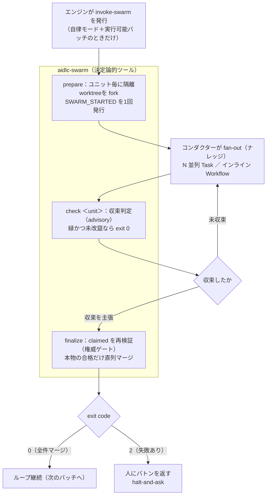

> **本記事の位置づけ** — 本記事は、`awslabs/aidlc-workflows` リポジトリの規範ルールおよび利用ガイドを素材として、筆者が AI を活用して読み解き、まとめた解釈です。AWS が公式に発表した方法論ではなく、一次資料の翻訳・要約でもありません。
>
> **シリーズ** — 本記事は [AIで紐解くAI-DLC v2](https://qiita.com/takeshishimada/items/2daa87896110603252ad) シリーズの一部です。
>
> **参照した版** — **Claude Code 実装**を対象に、2026 年 6 月時点の v2.1.3（コミット `c95070e`、`core/`）を参照しています。Kiro・Codex 実装は対象外で、記述が異なる場合があります。OSS 実装は更新が続いているため、最新の状態は公式リポジトリをご確認ください。

---

## 概要

swarm は、Construction（構築）の自律モード下で複数の Bolt（構築の実行単位）を並列に走らせる仕組みです。互いに依存しないビルドユニットを隔離した git worktree へ分配し、それぞれが「テストが緑（合格）かつ未改竄」になったものだけを、直列に base へ統合し戻します。各ユニットの収束を権威として判定するのが、審判役のレフェリーです。

ここは自律モードまで踏み込んだ任意の深掘りです。並列に走らせ、しかも人がその場で見ていない、という状況は本来リスクを伴うものですが、AI-DLC v2 はこれを三者分担という設計で安全側に寄せています。コンダクター・ツール・人がそれぞれ性質の違う関心を持ち、合格したという自己申告を最後にもう一度検証してから統合します。この分担と検証の仕組みが、並列実行を成り立たせています。

## 並列実行とは

ウォーキングスケルトン（最初の Bolt）が承認され、人が「残りの Bolt は自律で走らせてよい」と決めると、互いに依存しない Bolt をまとめて並列に進められるようになります。これを担うのが swarm です。

エンジンが `invoke-swarm` 指示（directive）を発行するのは、自律モードが付与され、code-generation ステージにいて、コンパイル済みのユニット DAG（依存関係のグラフ）に実行可能な並列バッチが揃っているとき**だけ**です。自律モードが `gated`（承認ゲート経由＝自律では走らせない）や未設定のうちは、エンジンは通常どおり `run-stage` を発行し続け、何も並列化しません。最初の Bolt は設定に関わらず必ず承認ゲートを通るため、swarm の経路には乗りません。`invoke-swarm` が指示の一つであることや指示の定義そのものは、別記事「[進行の中核](https://qiita.com/takeshishimada/items/c3ac7c2223e5c7020d82)」で扱います。

`invoke-swarm` の形は意図的に最小で、分配するバッチを表す `units` だけを持ちます。残りのバッチ文脈はコンダクターがコンパイル済みのグラフから読むため、指示側はこれ以上膨らみません。複数リポジトリを束ねる場合に限り、対象リポを一意に解決できるときだけ任意の `repo` フィールドが加わります。

## 三者の分担

swarm の設計の正本は、ツール本体 `aidlc-swarm.ts` 冒頭コメントの一文に凝縮されています。

> THE SPLIT (three concerns): the conductor owns fan-out + loop drive (knowledge); this tool owns the convergence verdict + merge + audit (determinism); the human grants autonomy and takes the baton on the envelope (judgement).

一つの仕事に見えるものを、性質の違う三つの関心に割っています。

| 担い手 | 持つもの | 性質 |
| --- | --- | --- |
| コンダクター | ワーカーの起動（N 並列の `Task`、または `AIDLC_USE_SWARM=1` でインライン Workflow）とリトライループの駆動 | ナレッジ（もう一度試すか、本質的に作れないかを判断する） |
| ツール `aidlc-swarm.ts` | 収束判定・anti-tamper・直列マージ・監査・型付きの失敗エンベロープ | 決定論（同じ入力なら何度呼んでも同じ結論） |
| 人 | 自律モードの付与と、失敗エンベロープを受け取り、バトンを引き継ぐこと | 判断（judgement） |

ワーカーを起動する層が、なぜツールの中に**ない**のか。ツールの実体である bun のサブプロセスは `Task` 呼び出しを発行できないからです。そこで「動かすナレッジ」はコンダクターに置き、決定論的でなければならない部分だけをツールに残します。ツールは状態を持たない3つのサブコマンド（`prepare` / `check` / `finalize`）だけを公開します。

## 隔離されたworktree

並列に走る複数のユニットが互いの作業を踏まないよう、`prepare` はユニット毎に隔離された git worktree を切ります（`.aidlc/worktrees/bolt-<slug>/`、ブランチ `bolt-<slug>`）。ここに状態・監査・グラフのフラグメントが fork され、ワーカーはそれぞれの worktree の中だけで作業します。完了したユニットは、スカッシュマージで base に畳み込まれて統合されます。

改竄検知（anti-tamper）の基準値を、どこかに別途保存することはありません。保護対象ファイルの「正本」は、その worktree 自身の git fork（HEAD）における内容そのものです。ワーカーが保護ファイルを書き換えれば、それは作業ツリーの変更として現れ、`git diff --quiet HEAD` が変更ありを返します。`check` も `finalize` も、この元のバイト列を毎回その場で導出し直すので、状態を共有せずに必ず一致します。

検証対象のテストファイルに `../` を含み worktree の外を指すパスが渡された場合は、未改竄とは扱わず、設定エラーとして弾きます。これを許すと改竄検知が黙って無効化されてしまうからです。

## check は助言、finalize は確定

収束の合図は、プロジェクトのテストコマンドの exit 0 だけが権威です。ワーカー自身の「成功しました」という申告は、合格を偽装できるので決して信じません。ここに2段の役割分担があります。

- **`check <unit>` は助言（advisory）**。`{unit, converged, tampered, reason}` を出力し、本物の収束（緑かつ未改竄）のときだけ exit 0 を返します。監査は何も発行せず、何も統合しません。これはコンダクターの「もう一度回すか」というリトライ判断（ナレッジ）に使われるだけです。
- **`finalize` が権威ゲート＝レフェリー**。コンダクターが「収束した」と申告した集合（`--claimed`）を唯一の信頼入力としつつ、マージの直前に各ユニットを再検証します。

lying-conductor guard が成り立つのは、この再検証があるからです。`--claimed` に名前があっても、ディスク上で赤い（再検証でテストが通らない、または改竄が検知された）ユニットはマージを拒否され、失敗エンベロープに落ちます。だからコンダクターが「収束した」と偽っても、あるいは取り違えても、赤いユニットが base に入ることはありません。`finalize` が必ず再検証するからこそ、`check` を助言にとどめておけます。

失敗の理由は型で返されます（typed envelope）。コンダクターが収束を主張しなかったユニットには、型付きの理由を添えられます（`unsatisfiable`＝本質的に作れない、`budget-exhausted`＝トークン上限、`cap-exhausted`＝収束しないまま打ち切り）。一方 `error` はツール自身の再検証による判定専用で、コンダクター側から付けることはできません。ガードを欺けないようにするためです。

## 直列マージとバトン

マージは一度に一つだけです。`finalize` は本物の合格だけを、slug 順という決定論的な順序で一つずつ base へ統合します。最後に監査証跡を残し、型付きエンベロープを返して exit code で締めます。

- **exit 0** … claimed の全ユニットが本物に収束しマージされた状態。コンダクターはループを続け、次のバッチへ進みます。
- **exit 2** … いずれかのユニットが失敗、またはマージが失敗した状態。コンダクターがバトンを受け、halt-and-ask の継ぎ目で人に問い合わせます。

halt-and-ask は、自律モードでも失敗したら必ず止まって人に問い合わせる安全弁です。並列に自律で走っていても、失敗は人に戻ります。ワーカーを起動するのもバトンを受け取るのもコンダクター側なので、swarm がその外で勝手に進むことはありません。自律モードや最初の Bolt の扱いは別記事「[ウォーキングスケルトン](https://qiita.com/takeshishimada/items/7a24030b9d8905f379ed)」で扱います。

## 監査が残すもの

エンジンは状態を読むだけで、コンダクター（プロンプト）は監査を発行しません。そのため swarm の監査イベント一式を発行するのは、決定論的なツールだけです。`aidlc-audit.ts` の登録配列で実在を確認できる SWARM_* イベントは6種です。

| イベント | 発行元 | 意味 |
| --- | --- | --- |
| `SWARM_STARTED` | `prepare` | バッチ開始。バッチ毎に1回、ユニット名と並列上限を記録 |
| `SWARM_UNIT_CONVERGED` | `finalize` | 再検証で緑かつ未改竄だったユニット |
| `SWARM_UNIT_FAILED` | `finalize` | 未申告、申告したが赤、または改竄。型付きの理由を併記 |
| `SWARM_BATON_RETURNED` | `finalize` | 失敗ユニット毎に1行。バトンが人へ戻る印 |
| `SWARM_COMPLETED` | `finalize` | バッチ終了。収束数と失敗数の集計 |
| `SWARM_DEGRADED` | `prepare` | `AIDLC_USE_SWARM=1` を要求したが Workflow ツールが不在で、並列サブエージェントに格下げした記録 |

`SWARM_DEGRADED` が示すのは、収束判定にとって実行基盤の違い（インライン Workflow か並列サブエージェントか）は見えないが、その格下げ自体は監査に残す、という設計です。レフェリーは実行基盤の差を収束の結果から消しますが、起きた事実は記録します。`STATE_FORKED` や `AUDIT_MERGED` を含む監査イベント全体の体系は、別記事「[状態と監査](https://qiita.com/takeshishimada/private/72234648bb4400cedf53)」で扱います。Bolt や code-generation ステージそのものの位置づけは、別記事「[工程とエージェント](https://qiita.com/takeshishimada/items/418d7b9e17192e8add85)」で扱います。

## 参照元

| ファイル | 内容 |
| --- | --- |
| [`core/tools/aidlc-swarm.ts`](https://github.com/awslabs/aidlc-workflows/blob/v2.1.3/core/tools/aidlc-swarm.ts) | 収束レフェリー本体。冒頭コメントが設計の正本（THE SPLIT＝三者分担、lying-conductor guard）。`prepare` / `check` / `finalize` の3サブコマンド、anti-tamper、直列マージ、型付きエンベロープ |
| [`core/tools/aidlc-worktree.ts`](https://github.com/awslabs/aidlc-workflows/blob/v2.1.3/core/tools/aidlc-worktree.ts) | ユニット毎の隔離 git worktree の作成・マージ・破棄。`.aidlc/worktrees/bolt-<slug>/`、兄弟 worktree からの実行拒否 |
| [`core/tools/aidlc-directive.ts`](https://github.com/awslabs/aidlc-workflows/blob/v2.1.3/core/tools/aidlc-directive.ts) | `InvokeSwarmDirective`（最小形・`units` ＋任意の `repo`）。エンジンが自律モードの付与下で発行し、コンダクターが取り込む旨のコメント |
| [`core/tools/aidlc-bolt.ts`](https://github.com/awslabs/aidlc-workflows/blob/v2.1.3/core/tools/aidlc-bolt.ts) | `start --worktree`（状態・監査・グラフを fork）、`complete --merge`（base への統合）、`release-merge`（直列マージのロック解放） |
| [`core/tools/aidlc-audit.ts`](https://github.com/awslabs/aidlc-workflows/blob/v2.1.3/core/tools/aidlc-audit.ts) | 監査イベント登録配列。`SWARM_STARTED` / `SWARM_UNIT_CONVERGED` / `SWARM_UNIT_FAILED` / `SWARM_BATON_RETURNED` / `SWARM_COMPLETED` / `SWARM_DEGRADED` の実在と見出し |

---

## 関連記事

**前の記事**: [導入判断](https://qiita.com/takeshishimada/private/cef6755e8e23a557f4de)
**目次**: [AIで紐解くAI-DLC v2](https://qiita.com/takeshishimada/items/2daa87896110603252ad)
